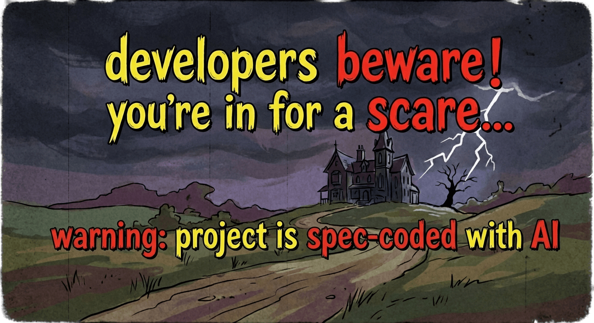

<p align="center">
  
</p>

# bevy_pixel_world

A modular pixel simulation engine for [Bevy 0.17](https://bevyengine.org/). Build Noita-style falling sand games without reinventing the wheel.

**Status:** Experimental, actively in development. The API is unstable but the core systems work.

## What This Is

A Bevy plugin that handles the hard parts of pixel simulation games:

- **Infinite streaming worlds** that load chunks around the camera
- **Cellular automata simulation** with four aggregate states: solid, powder, liquid, gas
- **Data-driven materials** - define physics and interactions in TOML
- **Automatic collision meshes** generated from pixel data via marching squares
- **Destructible pixel bodies** - rigid bodies made of pixels that take damage
- **Full persistence** - save and load worlds on native and WASM (via OPFS)

## Physics Backends

Supports both [Avian2D](https://github.com/Jondolf/avian) and [Rapier2D](https://rapier.rs/). Collision meshes generate automatically, and pixel bodies integrate directly with your chosen physics engine.

## Modular Plugins

The engine is composed of opt-in plugins you can mix and match.

### Pixel Awareness

Detects what surrounds your entities in the pixel world. Add the `Submergent` marker to any physics body and the plugin handles the rest:

- Perimeter sampling determines what fraction of the body is submerged in liquid
- `Submerged` and `Surfaced` events fire on state transitions
- Automatic drag modification when entering/exiting liquids

Use it for drowning mechanics, splash effects, aquatic AI, or as a foundation for buoyancy.

### Buoyancy

Realistic floating behavior for pixel bodies. Two modes available:

- **Simple mode** - single upward force at body center, cheap and good enough for basic floating
- **Density-sampling mode** - distributed force grid that creates corrective torque, supports variable liquid densities

Bodies naturally bob at the surface, tilt to self-right, and sink or float based on their density relative to the liquid.

## Material System

Materials are defined in TOML. Each material has an aggregate state that determines its simulation behavior, plus additional parameters:

```toml
[[materials]]
name = "Sand"
state = "powder"
density = 160
air_resistance = 8
air_drift = 4

[materials.effects]
blast_resistance = 0.3
```

```toml
[[materials]]
name = "Water"
state = "liquid"
density = 100
dispersion = 5
air_resistance = 16

[materials.effects]
blast_resistance = 0.1
```

Materials can transform on events like burning:

```toml
[[materials]]
name = "Wood"
state = "solid"
density = 80
ignition_threshold = 40

[materials.effects]
blast_resistance = 1.0

[materials.effects.on_burn]
chance = 0.005

[materials.effects.on_burn.effect]
transform = "Ash"
```

## Quick Start

```bash
# Run the painting demo
cargo run -p bevy_pixel_world --example painting

# Release mode
cargo run -p bevy_pixel_world --example painting --release
```

### Controls

| Input | Action |
|-------|--------|
| LMB | Paint |
| RMB | Erase |
| Scroll | Brush size |
| WASD | Move camera |
| Space | Spawn physics body |
| Ctrl+S | Save |

## Project Structure

```
crates/
├── bevy_pixel_world/   # Core plugin
├── game/               # Example game
└── sim2d_noise/        # Noise utilities
```

## Documentation

See [docs/arhitecture/](docs/arhitecture/README.md) for how things work internally.

## License

MIT
