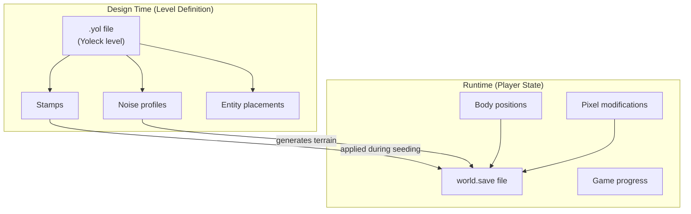
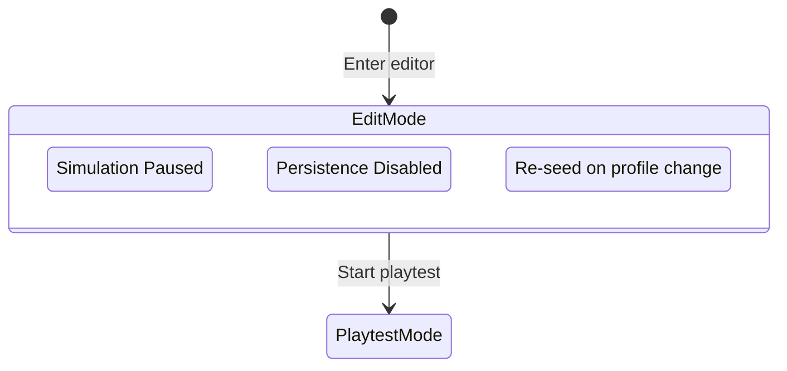
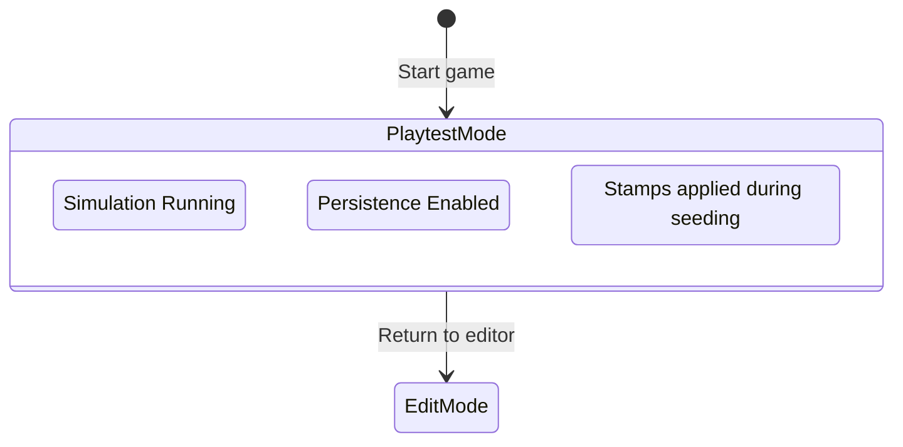
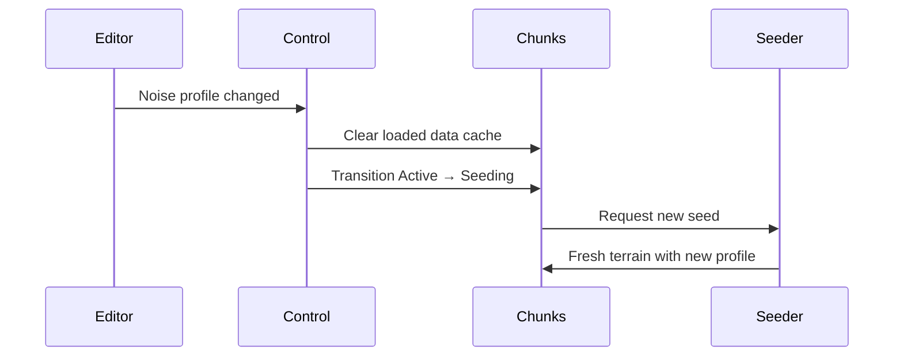
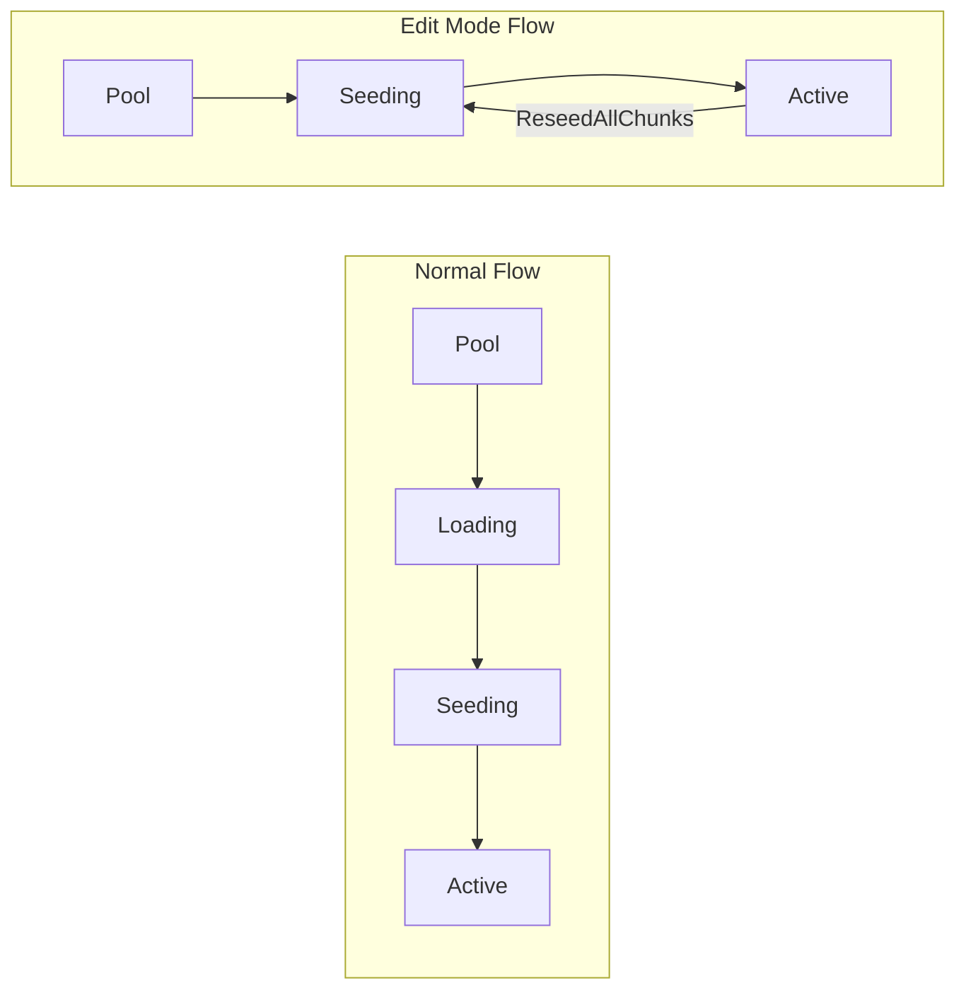
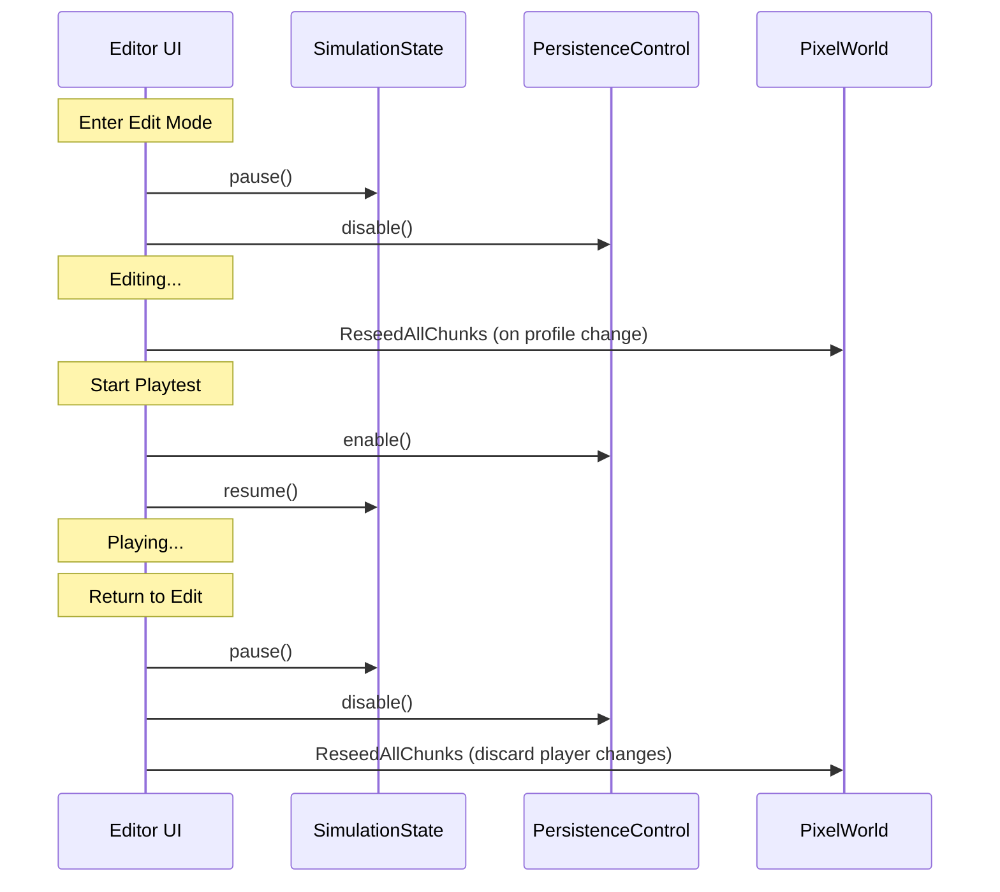

# Level Editor Mode

Runtime control over simulation and persistence for level editing.

## Overview

The level editor mode provides:

- **Non-destructive editing** - Level definitions remain separate from player state
- **Live preview** - Re-seed chunks to visualize noise profile changes
- **Mode switching** - Toggle between edit mode and playtest mode

## Storage Layer Separation

Two distinct storage layers serve different purposes:



| Layer | Storage | Content | Lifecycle |
|-------|---------|---------|-----------|
| **Level Definition** | `.yol` file | Stamps, noise profiles, entities | Authored at design time |
| **Player State** | `world.save` file | Pixel modifications, body positions | Runtime persistence |

This separation ensures level definitions are never corrupted by player actions.

## Operating Modes

### Edit Mode



| Behavior | State |
|----------|-------|
| Simulation | Paused |
| Persistence | Disabled |
| Chunk loading | Skips persistence, goes straight to seeding |
| Player modifications | Discarded on re-seed |

### Playtest Mode



| Behavior | State |
|----------|-------|
| Simulation | Running |
| Persistence | Enabled |
| Chunk loading | Checks save file, applies stamps during seeding |
| Player modifications | Saved to `world.save` |

## Chunk Re-seeding

When noise profiles change in edit mode, all active chunks must regenerate:



### Re-seed Trigger Flow

1. Editor detects noise ENT change
2. `ReseedAllChunks` event dispatched
3. `LoadedChunkDataStore` cleared (no stale persistence data)
4. Active chunks transition to `Seeding` lifecycle state
5. Seeding system generates fresh content with new noise profile

## Chunk Lifecycle Integration

The editor mode integrates with the existing chunk lifecycle:



In edit mode:
- Loading state is **skipped** (no persistence to check)
- Active chunks can **regress** to Seeding state on re-seed request

## Control Resources

### SimulationState (Existing)

Controls cellular automata execution:

| Method | Effect |
|--------|--------|
| `pause()` | Stops simulation updates |
| `resume()` | Continues simulation updates |
| `is_running()` | Query current state |

### PersistenceControl (Extended)

Controls save file I/O:

| Method | Effect |
|--------|--------|
| `disable()` | Prevents all persistence I/O |
| `enable()` | Allows persistence I/O |
| `is_enabled()` | Query enabled state |
| `is_active()` | Returns `enabled && path.is_some()` |

### ReseedAllChunks (New)

Event to trigger global chunk regeneration:

```
Event dispatch → Clear cache → Active→Seeding transition → Fresh seeding
```

## Mode Transition Workflow



## Persistence Guard Locations

Systems that require persistence guards:

| System | Guard Behavior |
|--------|----------------|
| `dispatch_chunk_loads` | Skip if `!is_enabled()` |
| `save_pixel_bodies_on_chunk_unload` | Skip if `!is_enabled()` |
| `save_pixel_bodies_on_request` | Skip if `!is_enabled()` |
| `update_streaming_windows` | Skip Loading state if `!is_enabled()` |

## Related Documentation

- [Streaming Window](../streaming/streaming-window.md) - Chunk lifecycle management
- [Chunk Persistence](../persistence/chunk-persistence.md) - Save file format
- [Chunk Seeding](../chunk-management/chunk-seeding.md) - Procedural generation
- [Architecture Overview](../README.md)
