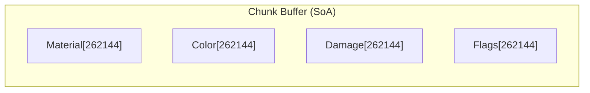

# Pixel Format

> **Status: Current Implementation / Demo Reference**
>
> This describes the current hardcoded format. With planned radical modularity, games will define their own pixel structures. This format becomes one possible example, not a requirement.

The base layer and common opt-in layers for per-pixel data.

## Overview

Each pixel in the simulation is composed of layers. The only mandatory layer is the **Material ID**. Additional layers (Color, Damage, Flags) are opt-in but included in the Default Bundle for backward compatibility.

The format is designed to be:

- **Modular** - Only pay for layers you use
- **Cache-friendly** - SoA layout for efficient access patterns
- **Backward compatible** - Default Bundle matches traditional "4-byte pixel" model

## Base Layer (Always Present)

| Field    | Type | Purpose                                         |
|----------|------|-------------------------------------------------|
| Material | u8   | Type identifier, indexes into material registry |

**Total: 1 byte per pixel (minimum)**

The Material ID is the only data that every pixel must have. It indexes into the material registry (up to 256 materials). Material ID 0 is reserved for **void** (empty space).

See [Materials](../simulation/materials.md) for property definitions and interaction system.

## Common Layers (Default Bundle)

The Default Bundle includes these layers for standard falling sand behavior:

| Field    | Type | Purpose                                                                           |
|----------|------|-----------------------------------------------------------------------------------|
| Color    | u8   | Palette index, allows per-pixel color variation within material                   |
| Damage   | u8   | Accumulated damage, increments on interactions, triggers destruction at threshold |
| Flags    | u8   | Packed boolean states for simulation and rendering                                |

See [Pixel Layers](../modularity/pixel-layers.md) for the full layer system and bundle configurations.

## Color Layer

Palette-based coloring for rendering (requires Color layer):

- Indexes into a color palette (up to 256 colors)
- Allows visual variation independent of material type
- Seeders can apply noise-driven color variation within material constraints

**Note:** Without the Color layer, rendering derives color directly from the material definition.

## Damage Layer

Accumulated damage tracking (requires Damage layer):

- Starts at zero (pristine state)
- Increments from interactions (burning, impact, corrosion)
- At material-defined threshold: pixel is destroyed or transforms (stone → rubble, wood → ash)
- Some materials may be indestructible (damage ignored)

See [Materials](../simulation/materials.md) for `damage_threshold` and `destruction_product` properties.

**Note:** Without the Damage layer, destruction-based interactions are disabled.

## Flags Layer (Bitmask)

> **Note:** With planned radical modularity, games define their own flags. The framework uses optional traits (`PixelCollision`, `PixelDirty`) rather than mandating specific bits. Games implement these traits however they choose.

```
Bit layout (u8) - Demo/Current Format:
┌───────┬───────┬───────┬───────┬───────┬───────┬───────┬───────┐
│   7   │   6   │   5   │   4   │   3   │   2   │   1   │   0   │
├───────┴───────┼───────┼───────┼───────┼───────┼───────┼───────┤
│   reserved    │ body  │  wet  │burning│falling│ solid │ dirty │
└───────────────┴───────┴───────┴───────┴───────┴───────┴───────┘
```

### Framework-Relevant Flags (Used by Optional Traits)

| Flag      | Bit | Trait | Description |
|-----------|-----|-------|-------------|
| `dirty`   | 0   | `PixelDirty` | Pixel needs simulation this tick. Used for scheduling optimization. |
| `solid`   | 1   | `PixelCollision` | Pixel is solid for collision purposes. Used for mesh generation. |

### Game-Defined Flags (Demo Format)

| Flag      | Bit | Description                                                                                                                                                                                                                                                                        |
|-----------|-----|------------------------------------------------------------------------------------------------------------------------------------------------------------------------------------------------------------------------------------------------------------------------------------|
| `falling` | 2   | Pixel has downward momentum. Cheaper than storing a velocity vector. Cleared when pixel comes to rest, set when displaced. Used by collision system: only stable pixels (`falling=0`) are included in collision mesh.                                                              |

### State Modifier Flags

| Flag      | Bit | Description                                                                                                                                                           |
|-----------|-----|-----------------------------------------------------------------------------------------------------------------------------------------------------------------------|
| `burning` | 3   | Pixel is on fire. Propagates to flammable neighbors. Increments damage each tick. Clears when damage threshold reached or no fuel remains.                            |
| `wet`     | 4   | Pixel is saturated with liquid. Modifies material behavior: wet sand clumps instead of flowing, wet materials may conduct electricity, fire cannot ignite wet pixels. |

### Pixel Body Flag

| Flag         | Bit | Description                                                                                                                                                                                                           |
|--------------|-----|-----------------------------------------------------------------------------------------------------------------------------------------------------------------------------------------------------------------------|
| `pixel_body` | 5   | Pixel belongs to a pixel body, not terrain. Set during blit, cleared during clear. Excluded from terrain collision mesh generation. Prevents terrain systems from treating body pixels as world terrain. See [Pixel Bodies](../physics/pixel-bodies.md). |

### Reserved Bits

Bits 6-7 are reserved for future use:

- Potential: `frozen`, `emissive`, `supported`, `conductive`

## Memory Layout

Memory is dynamic based on registered layers. With Default Bundle (SoA layout):



| Configuration | Bytes per Pixel | Chunk Memory (512×512) |
|---------------|-----------------|------------------------|
| Minimal Bundle | 1 | 256 KB |
| Default Bundle | 4 | 1 MB |
| Default + Heat | 4 + (1/16) | ~1 MB |

See [Pixel Layers](../modularity/pixel-layers.md) for detailed memory calculations and bundle configurations.

## System Interactions

| System     | Fields Used                    | Purpose                                                  |
|------------|--------------------------------|----------------------------------------------------------|
| Simulation | Material, Damage, Flags        | Applies cellular automata rules, updates state           |
| Rendering  | Material, Color, Damage, Flags | Draws pixels to chunk texture with visual state feedback |

Both systems consume all pixel data. Rendering uses Damage to visually indicate wear (darkening, cracks) and Flags for
state visualization (fire glow for `burning`, sheen for `wet`). Rendering uses whole-chunk texture upload -
see [Rendering](../rendering/rendering.md).

## Related Documentation

- [Pixel Layers](../modularity/pixel-layers.md) - Full layer system, bundles, and builder API
- [Materials](../simulation/materials.md) - Material properties, tags, and interaction system
- [Spatial Hierarchy](spatial-hierarchy.md) - World, chunk, tile, pixel organization
- [Simulation](../simulation/simulation.md) - How pixels are processed each tick
- [Collision](../physics/collision.md) - How solid flag drives collision mesh generation (requires Flags layer)
- [Pixel Bodies](../physics/pixel-bodies.md) - Dynamic objects using the pixel_body flag
- [Rendering](../rendering/rendering.md) - Texture upload strategy
- [Chunk Seeding](../chunk-management/chunk-seeding.md) - How pixel data is initialized
- [Configuration Reference](configuration.md) - Memory configuration
- [Architecture Overview](../README.md)
