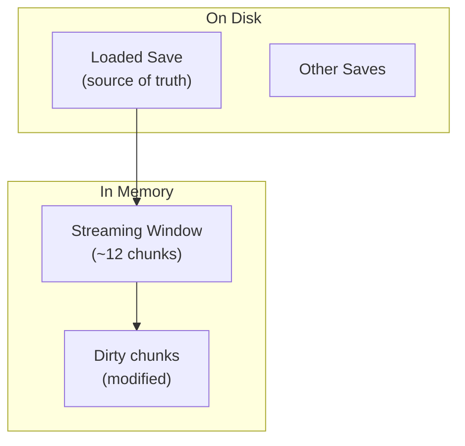
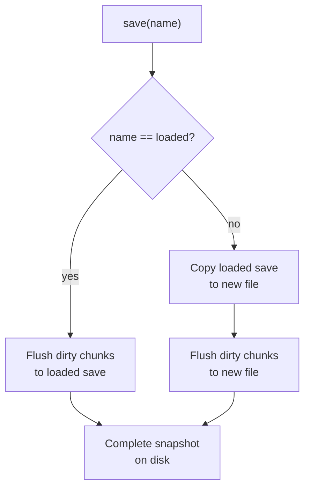
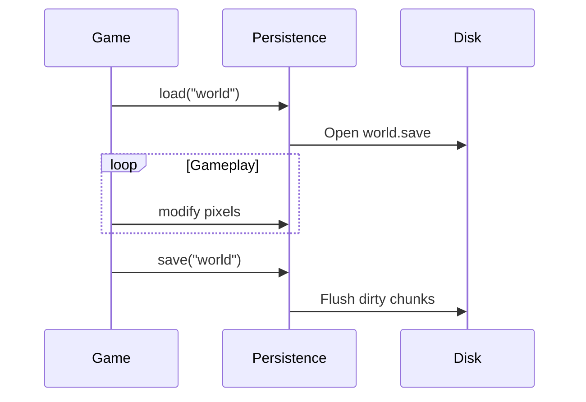
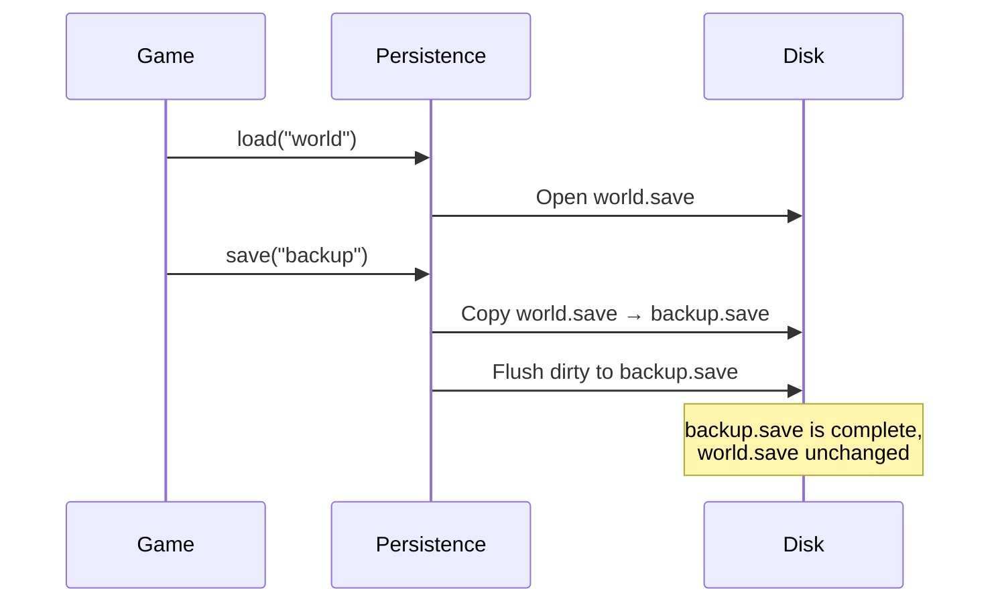
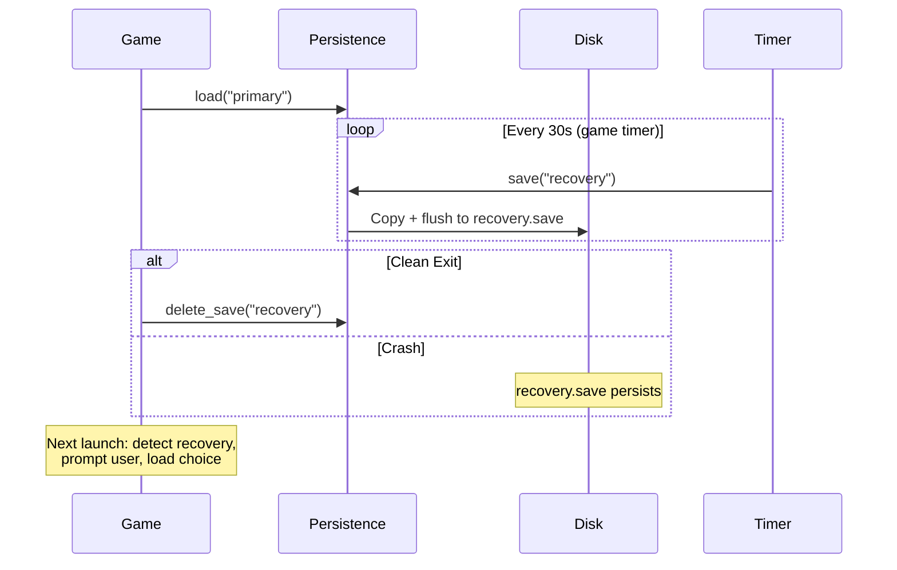

# Named Saves

Consumer-controlled save management with complete world snapshots.

## Overview

The named save system provides:

- **Named save files** - Save to `"primary"`, `"backup"`, `"recovery"`, etc.
- **Complete snapshots** - Every save contains the entire world state
- **Consumer control** - No embedded timers; game code manages save timing
- **Copy-on-write** - Saves to new names copy from the loaded save

## File Layout

```
~/.local/share/<app_name>/saves/
├── primary.save    # Main game save
├── backup.save     # Player-created backup
└── recovery.save   # Crash recovery (managed by game)
```

## Save Semantics



When `save("name")` is called:



## World State Composition

| Location | Contents | Persistence |
|----------|----------|-------------|
| Streaming window | ~12 active chunks | In memory until saved |
| Loaded save file | All previously saved chunks | On disk |
| Other save files | Independent snapshots | On disk |

A complete save = loaded save contents + dirty in-memory chunks

## Public API

### Saving

| Method | Description |
|--------|-------------|
| `save("name")` | Complete world snapshot to `<name>.save` |
| `save_chunks("name")` | Chunks only (no pixel bodies) |

### Utilities

| Method | Description |
|--------|-------------|
| `save_path("name")` | Returns full path for save name |
| `list_saves()` | Returns available save names |
| `delete_save("name")` | Removes save file |

### Loading

| Method | Description |
|--------|-------------|
| `PersistenceConfig::new("app").load("name")` | Load specific save at startup |

## Usage Patterns

### Single Save



### Multiple Saves (Backup)



### Recovery Pattern



## Copy-on-Write Guarantees

| Operation | Source File | Target File |
|-----------|-------------|-------------|
| `save("loaded")` | Unchanged | Updated in place |
| `save("other")` | Unchanged | Created/overwritten |
| Crash during copy | Intact | Partial (recoverable) |

The copy-then-flush order ensures the source save is never corrupted.

## Related Documentation

- [Chunk Persistence](chunk-persistence.md) - Save file format
- [Recovery Persistence](recovery-persistence.md) - Crash recovery pattern
- [Streaming Window](../streaming/streaming-window.md) - In-memory chunk management
- [Architecture Overview](../README.md)
