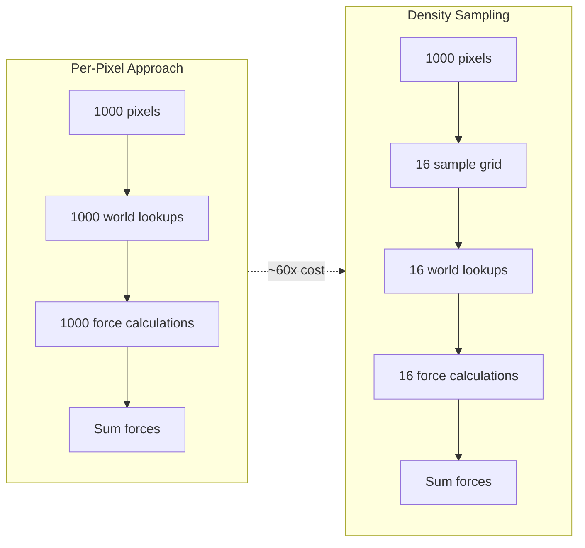
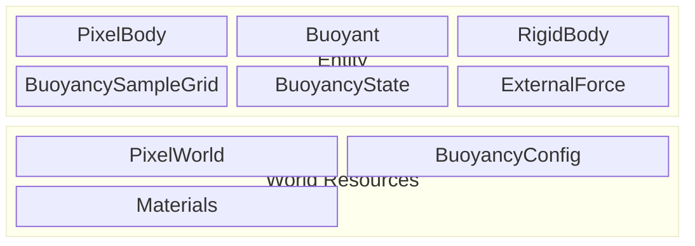
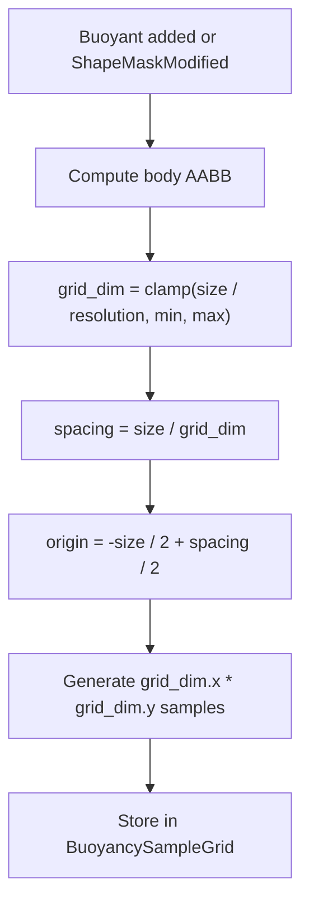
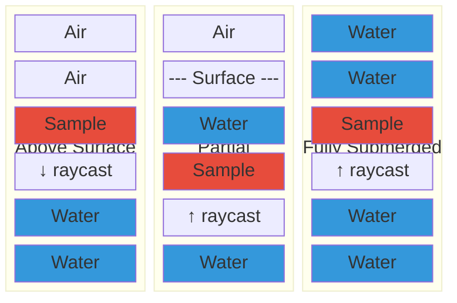
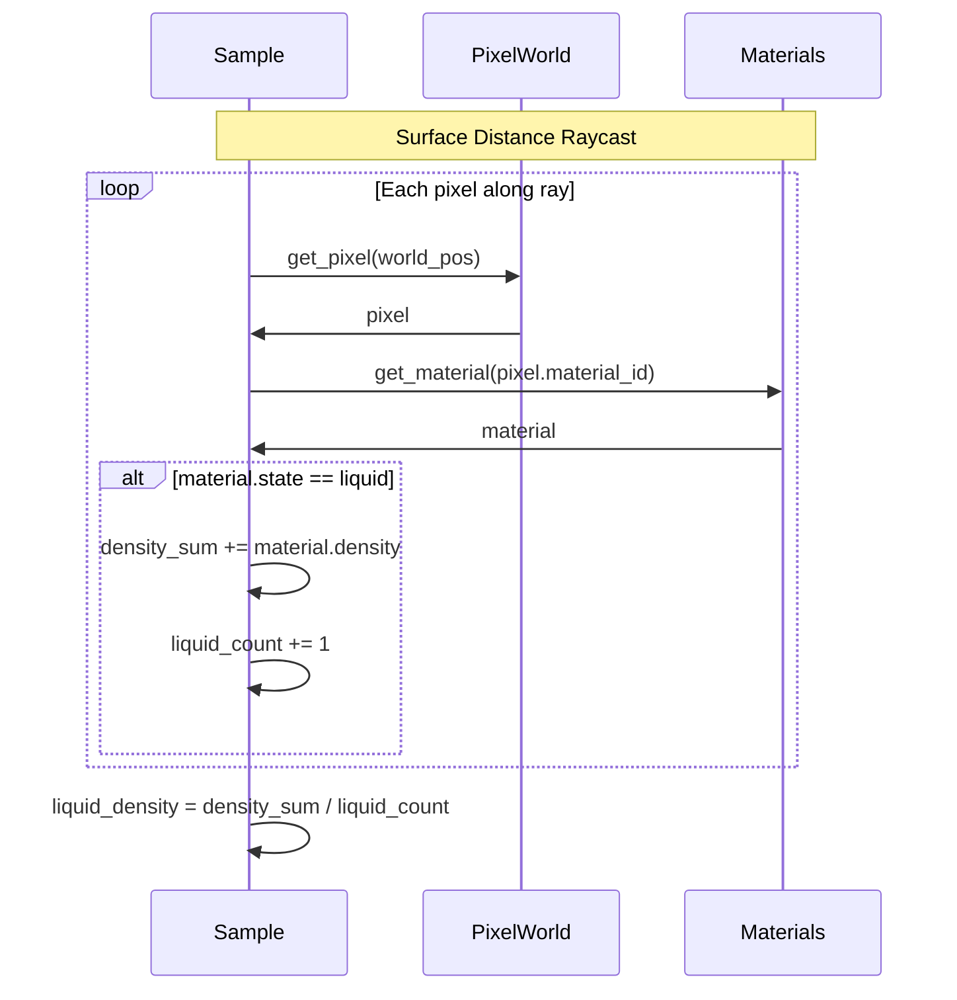
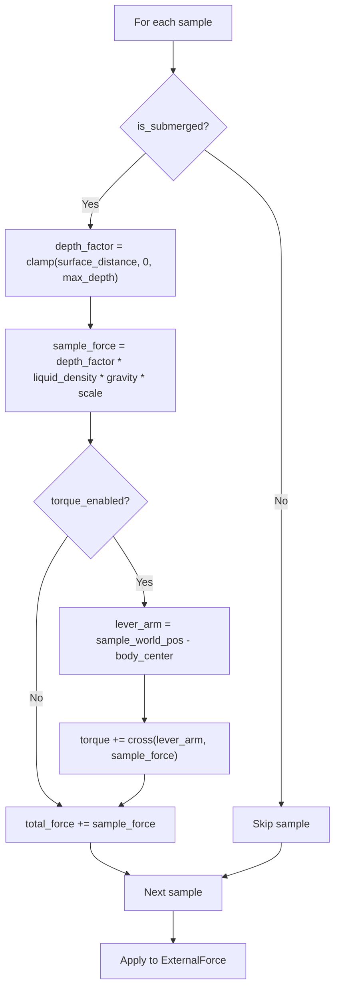

# Buoyancy

Physics force simulation for rigid bodies submerged in liquid.

## Overview

Buoyancy applies upward forces to pixel bodies based on their submersion in liquid materials. Unlike
[displacement](pixel-displacement.md), which conserves pixels during movement, buoyancy applies physics forces that
affect rigid body dynamics through external physics engines (avian2d/rapier2d).

The system is built in layers:

```
Submergence Detection (core)
    ├── Simple Buoyancy Mode
    │     └── Single-point force at body center
    └── Density-Sampling Mode
          └── Multi-point sampling with depth-scaled forces
```

**[Submergence detection](../pixel-awareness/submergence.md)** is the foundation - a perimeter-sampling system that
determines how much of a body is submerged and fires events on state transitions. Both buoyancy modes depend on this
shared detection layer.

**Buoyancy modes** determine how forces are calculated and applied. Simple mode is cheaper and suitable for basic
floating. Density-sampling mode provides accurate torque and variable liquid support at higher cost.

## Buoyancy Modes

| Mode | Force Application | Submergence Check | Use When |
|------|-------------------|-------------------|----------|
| Simple | Single point at body center | Perimeter sample grid | Basic floating, uniform liquid, performance-critical |
| Density-Sampling | Multi-point grid with depth scaling | Same grid used for force | Variable liquids, accurate torque, realistic behavior |

### Simple Mode

Force applied at body center-of-mass only:

- Magnitude: `liquid_density * gravity * submerged_fraction * body_volume`
- No torque from buoyancy (body orientation unaffected by liquid)
- Drag/damping still applied when submerged (via [submergence](../pixel-awareness/submergence.md))
- Computational cost: O(perimeter samples) for detection only

### Density-Sampling Mode

Force distributed across a grid of sample points:

- Each sample contributes force proportional to its depth below the surface
- Deeper samples contribute more force (hydrostatic pressure)
- Off-center samples create corrective torque
- Computational cost: O(grid samples) for both detection and force

## Design Rationale

### Per-Pixel vs Coarse Sampling

Per-pixel buoyancy calculates force for every solid pixel in a body - prohibitively expensive for large bodies:



Coarse sampling trades accuracy for performance. For smooth liquid surfaces, the approximation is visually
indistinguishable from per-pixel calculation.

### Persistent Sample Grid

Sample positions are computed in body-local space once (on spawn or shape change), then transformed to world space each
frame. This avoids recalculating grid geometry every tick and enables temporal coherence - samples that were submerged
last frame are likely still submerged.

### Surface Distance

Buoyancy force increases with depth due to hydrostatic pressure. Rather than a binary "submerged or not" check, each
sample measures its distance below the liquid surface. Deeper samples contribute proportionally more force, creating
natural behavior:

- Bodies near the surface experience partial buoyancy
- Fully submerged bodies feel uniform upward force
- Tilted bodies experience differential force creating corrective torque

### Material Density Integration

Different liquids provide different buoyancy. Water (density 50) provides more lift than oil (density 40). The sampling
raycast accumulates liquid density along its path, averaging across layers when a body spans multiple liquid types.

## Data Structures

### BuoyancyConfig (Resource)

Global configuration for buoyancy simulation:

```
mode: BuoyancyMode             # Simple or DensitySampling
submersion_threshold: f32      # Fraction to trigger is_submerged (default: 0.25)
sample_resolution: u8          # Samples per body-width unit (default: 4)
min_samples: u8                # Minimum sample count (default: 4)
max_samples: u8                # Maximum sample count (default: 64)
surface_search_radius: i32     # Max raycast distance in pixels (default: 128)
force_scale: f32               # Global force multiplier (default: 1.0)
torque_enabled: bool           # Enable rotational forces (default: true)
damping_factor: f32            # Water resistance coefficient (default: 0.1)
```

### BuoyancySampleGrid (Component)

Persistent sample positions in body-local space (density-sampling mode):

```
samples: Vec<BuoyancySample>
grid_width: u8
grid_height: u8
local_spacing: Vec2
local_origin: Vec2
```

Generated when `Buoyant` marker is added or body shape changes (`ShapeMaskModified`). Grid dimensions are derived from
body size and `BuoyancyConfig`.

### BuoyancySample

Per-sample data, partially constant and partially recomputed each frame:

```
local_offset: Vec2         # Constant: offset from body origin
surface_distance: f32      # Per-frame: pixels below surface (negative = above)
liquid_density: f32        # Per-frame: accumulated density along raycast
is_submerged: bool         # Per-frame: whether sample is in liquid
```

### BuoyancyState (Component)

Aggregate results computed each frame:

```
submerged_fraction: f32    # 0.0 to 1.0
submerged_center: Vec2     # Center of mass of submerged samples
total_buoyancy_force: Vec2 # Accumulated force vector
total_torque: f32          # Rotational force
average_liquid_density: f32
```

### Entity Composition



The `Buoyant` marker component triggers sample grid generation. `BuoyancyState` is updated each frame with computed
results. `ExternalForce` (avian2d) or equivalent receives the final force application.

## Key Algorithms

### Sample Grid Generation

Triggered by `Buoyant` addition or `ShapeMaskModified`:



Samples are evenly distributed across the body's bounding box, centered on the body origin.

### Surface Distance Calculation

For each sample, compute the signed distance to the liquid surface:



Algorithm:
1. Transform sample to world space
2. Check current pixel at sample position
3. If in liquid: raycast upward to find surface, distance is positive
4. If in air: raycast downward to find surface, distance is negative (or zero if no liquid found)
5. Accumulate liquid density along raycast path

### Density Integration



The accumulated density represents the average buoyancy potential of the liquid column above the sample.

### Force Application



Force is proportional to:
- `surface_distance` - deeper samples contribute more
- `liquid_density` - denser liquids provide more lift
- `gravity` - counteracts gravitational acceleration
- `force_scale` - global tuning parameter

Depth is clamped to prevent extreme forces at great depths.

## System Ordering

```mermaid
gantt
    title Buoyancy System Timing
    dateFormat X
    axisFormat %s

    section Pixel Bodies
    Blit pixel bodies: blit, 0, 1

    section Submergence
    Generate perimeter samples (on change): gen, 1, 2
    Sample world pixels: sample, 2, 3
    Emit Submerged/Surfaced events: events, 3, 4
    Apply drag modifications: drag, 4, 5

    section Buoyancy
    Apply forces (mode-dependent): force, 5, 6

    section Physics
    Integrate forces: physics, 6, 7
```



System set ordering:

```
PixelBodySet::Blit
  → SubmergenceSet::GenerateSamples  # Run on Added<Buoyant> or ShapeMaskModified
  → SubmergenceSet::Sample           # Read pixel world, update SubmersionState
  → SubmergenceSet::EmitEvents       # Fire Submerged/Surfaced events
  → SubmergenceSet::ApplyDrag        # Modify LinearDamping/AngularDamping
  → BuoyancySet::ApplyForce          # Write to ExternalForce/ConstantForce
  → PhysicsSet::Step                 # Physics engine integration
```

Buoyancy runs after blit to ensure pixel bodies are written to the world before sampling. Force application runs before
physics step so forces are integrated in the same frame.

## Integration Points

| System | Interface | Purpose |
|--------|-----------|---------|
| PixelWorld | `get_pixel(WorldPos)` | Detect liquid presence |
| Materials | `get_material(MaterialId)` | Lookup density and state |
| avian2d | `ExternalForce` | Apply computed buoyancy |
| rapier2d | `ExternalForce` | Apply computed buoyancy |
| Pixel Bodies | `shape_mask`, `ShapeMaskModified` | Trigger grid regeneration |
| Submergence | `SubmersionState`, events | Core detection layer |

## Key Invariants

- Sample grid is regenerated only on shape change (not every frame)
- Sample world positions are recalculated each frame (body may have moved)
- Surface search is bounded by `surface_search_radius` (prevents infinite raycast)
- Force magnitude is bounded by depth clamp (prevents extreme forces at great depth)
- Only liquid materials contribute to buoyancy (solid/powder/gas ignored)

## Edge Cases

| Scenario | Handling |
|----------|----------|
| Fully above liquid | All samples return negative distance, zero force |
| Fully submerged | All samples contribute, depth clamped to max |
| Straddling surface | Asymmetric force distribution creates corrective torque |
| Multiple liquid layers | Raycast accumulates density through all layers |
| Very small body | `min_samples` ensures adequate coverage |
| Very large body | `max_samples` caps computational cost |
| Body splits underwater | Fragments receive new sample grids via `ShapeMaskModified` |
| Fast vertical movement | Force recomputed each frame, no interpolation needed |
| Rotating body | World-space sample positions naturally follow rotation |

## Related Documentation

- [Submergence](../pixel-awareness/submergence.md) - Core detection system (events, drag modification)
- [Pixel Bodies](pixel-bodies.md) - Core pixel body system
- [Pixel Displacement](pixel-displacement.md) - Conservation during movement (complementary to buoyancy)
- [Materials](../simulation/materials.md) - Density and liquid state properties
- [Simulation](../simulation/simulation.md) - CA phases and material behavior
- [Scheduling](../simulation/scheduling.md) - System ordering constraints
