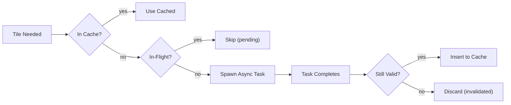
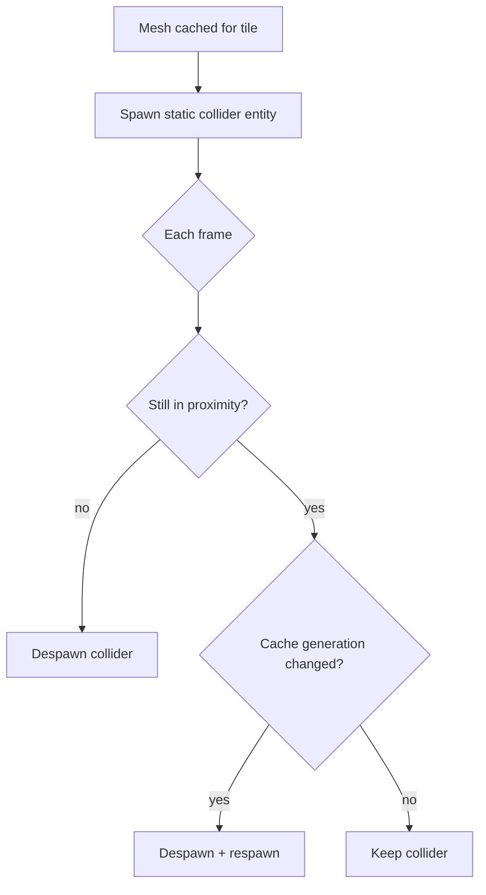

# Collision System

Mesh generation from solid pixels for physics interactions.

## Overview

The collision system generates collision meshes from pixel data, enabling physics entities to interact with the
simulated terrain.

## Collision Pixel Selection

For collision mesh generation, pixels must meet **both** criteria (requires Flags layer):

| Flag      | Required Value | Meaning                                                     |
|-----------|----------------|-------------------------------------------------------------|
| `solid`   | 1              | Material is not liquid or gas (includes solids and powders) |
| `falling` | 0              | Pixel is stable (at rest, not currently moving)             |

**Selection logic:** `solid=1 AND falling=0`

**Note:** The collision system requires the Flags layer (included in Default Bundle). Without the Flags layer, collision must be derived directly from material state, which is less efficient. See [Pixel Layers](../modularity/pixel-layers.md).

| Pixel State    | `solid` | `falling` | In Collision Mesh? |
|----------------|---------|-----------|--------------------|
| Settled stone  | 1       | 0         | Yes                |
| Falling debris | 1       | 1         | No (still moving)  |
| Settled sand   | 1       | 0         | Yes                |
| Falling sand   | 1       | 1         | No (still moving)  |
| Water          | 0       | 0         | No (liquid)        |
| Steam          | 0       | 0         | No (gas)           |

**Note:** The `solid` flag caches whether the material's `state` is `solid` or `powder` (i.e., not `liquid` or `gas`).
This avoids a material registry lookup during collision mesh generation - a cache locality optimization since we're
iterating over many pixels.

## Mesh Generation Pipeline

The collision mesh is generated through a multi-stage pipeline:


### Stage 1: Marching Squares

Build outline polygons from the solid pixel grid.

| Aspect         | Description                                       |
|----------------|---------------------------------------------------|
| **Input**      | Binary grid (solid vs non-solid pixels)           |
| **Output**     | Contour polylines tracing solid boundaries        |
| **Algorithm**  | Standard marching squares with edge interpolation |
| **Resolution** | Per-pixel (no downsampling)                       |

**Note:** Per-pixel resolution is required for accurate collision meshes. Downsampling would compromise collision
fidelity.

### Stage 2: Line Simplification

Reduce vertex count while preserving shape.

| Aspect        | Description                              |
|---------------|------------------------------------------|
| **Input**     | Raw contour polylines                    |
| **Output**    | Simplified polylines with fewer vertices |
| **Algorithm** | Douglas-Peucker                          |

Tolerance value to be determined during Phase 5 implementation. Start with 1.0 pixel tolerance and tune based on visual/performance testing.

### Stage 3: Delaunay Triangulation

Produce optimized triangle mesh for physics engine.

| Aspect          | Description                                    |
|-----------------|------------------------------------------------|
| **Input**       | Simplified polygon outlines                    |
| **Output**      | Triangle mesh suitable for collision detection |
| **Constraints** | Respects polygon boundaries, no slivers        |

## Generation Scope and Locality

Collision meshes are **not** generated for the entire world. Instead:

### Dynamic Object Proximity

Meshes are generated only around **dynamic physics objects**:

| Object Type   | Example                          |
|---------------|----------------------------------|
| Characters    | Player, NPCs                     |
| Dynamic props | Falling crates, rolling boulders |

Areas without nearby dynamic objects have no collision mesh - there's nothing to collide with.

### Tile-Based Generation

Collision meshes are generated at **tile granularity**, not chunk granularity:

| Aspect          | Tile-Based Approach                                               |
|-----------------|-------------------------------------------------------------------|
| **Scope**       | Individual tiles around dynamic objects                           |
| **Consistency** | Tile boundaries provide natural mesh seams                        |
| **Efficiency**  | Avoids regenerating entire chunk when only a small region changes |

```
+-------+-------+-------+-------+
|       |       |       |       |
|       | [obj] |       |       |   [obj] = dynamic object
|       |       |       |       |
+-------+-------+-------+-------+
|       |#######|#######|       |   ####### = tiles with collision
|       |#######|#######|       |            mesh generated
|       |#######|#######|       |
+-------+-------+-------+-------+
|       |#######|#######|       |
|       |#######|#######|       |
|       |#######|#######|       |
+-------+-------+-------+-------+
```

### Update Triggers

Tile collision meshes are regenerated when:

1. A dynamic object enters a tile's proximity
2. Pixels within an active tile change (`solid` or `falling` flags modified)

Tiles outside any dynamic object's proximity have their meshes discarded.

### Update Frequency

Collision mesh updates run at **60 TPS** (same rate as CA and physics simulation), triggered by:

- Physics object proximity changes (object enters/leaves tile)
- Cellular automata pixel changes (solid/falling flag modifications)

See [Configuration](../foundational/configuration.md) for tick rate definitions.

## Collision Cache

Generated meshes are cached to avoid redundant computation:



### Cache Invalidation

When pixels change in a tile:

1. Remove tile from cache
2. Remove from in-flight set (discards pending results)
3. Next frame: tile is re-requested, new task spawns

### Generation Counter

Each cached mesh has a `generation` counter incremented on every insert. Collider entities track their creation generation—if the cache entry has a higher generation, the collider is stale and must be respawned.

### Async Generation

Mesh generation runs on Bevy's `AsyncComputeTaskPool`:

1. Main thread marks tile as in-flight
2. Task runs marching squares, simplification, triangulation
3. On completion, result inserts to cache if tile wasn't invalidated
4. Collider sync system spawns physics entities from cached meshes

## Physics Integration

Collision meshes integrate with physics engines via feature flags (`avian2d` or `rapier2d`).

### CollisionQueryPoint

Entities with `CollisionQueryPoint` marker drive collision generation. The system generates meshes in a radius around each query point:

```rust
commands.spawn((
    RigidBody::Dynamic,
    Collider::circle(10.0),
    CollisionQueryPoint,  // Generates collision in proximity
));
```

Tiles outside all query point radii have colliders despawned.

### Collider Lifecycle



### Sleeping Body Wake

When terrain changes (collider despawned due to staleness), sleeping physics bodies nearby are woken:

| Physics Backend | Wake Mechanism                      |
|-----------------|-------------------------------------|
| Avian2D         | Remove `Sleeping` component         |
| Rapier2D        | Set `Sleeping::sleeping = false`    |

Bodies within 1 tile of the changed tile are woken to respond to new terrain.

## Entity Culling

Entities with `StreamCulled` are automatically disabled when outside the streaming window:

```rust
commands.spawn((
    RigidBody::Dynamic,
    Collider::circle(10.0),
    StreamCulled,  // Auto-disable outside streaming window
));
```

### Culling Lifecycle

| Entity Position | Collision Ready | Action                            |
|-----------------|-----------------|-----------------------------------|
| Outside window  | —               | Insert `Disabled` component       |
| Inside window   | No              | Keep disabled (wait for mesh)     |
| Inside window   | Yes             | Remove `Disabled`, entity active  |

"Collision ready" means the tile is cached and not in-flight. This prevents physics bodies from falling through unmeshed terrain when re-entering the streaming window.

## Related Documentation

- [Pixel Format](../foundational/pixel-format.md) - Solid flag definition
- [Pixel Bodies](pixel-bodies.md) - Dynamic objects with per-body collision
- [Simulation](../simulation/simulation.md) - When solid flag changes
- [Spatial Hierarchy](../foundational/spatial-hierarchy.md) - Chunk and tile organization
- [Streaming Window](../streaming/streaming-window.md) - Window that drives entity culling
- [Glossary](../glossary.md) - Collision terminology
- [Architecture Overview](../README.md)
