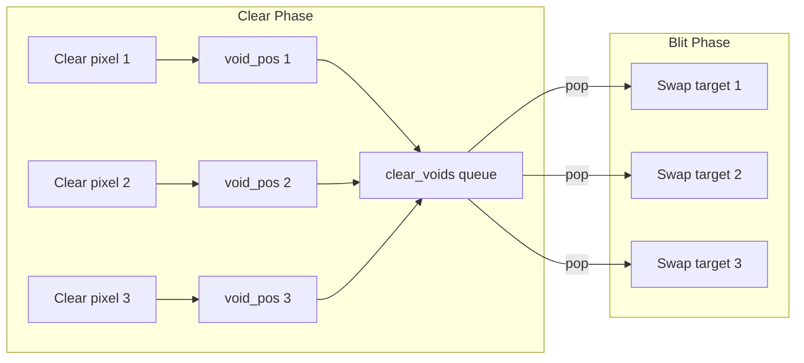
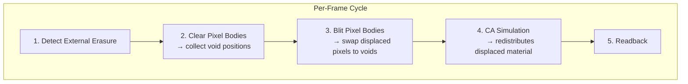
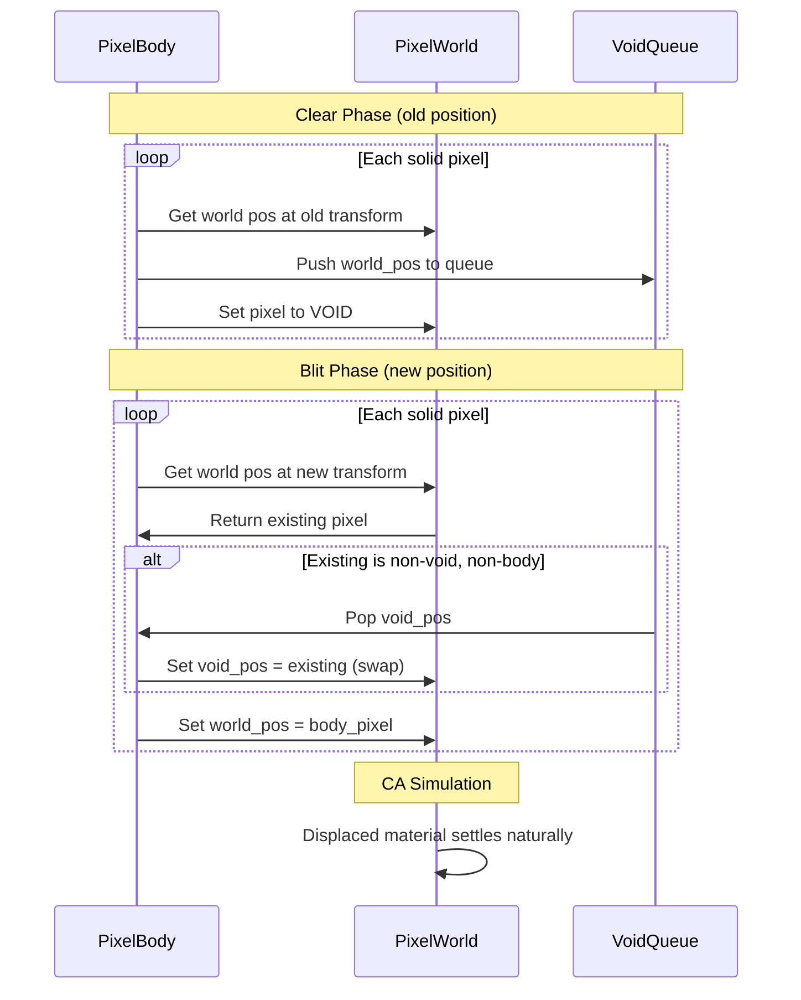

# Pixel Displacement

When pixel bodies move through the world, they must displace material rather than erase it.

## Problem Statement

A pixel body occupies space in the pixel world. When it moves:

1. **Clear phase**: Body pixels removed from OLD position → creates voids
2. **Blit phase**: Body pixels written to NEW position → overwrites existing pixels

Without displacement, pixels at the new position are erased - creating "carved trails" through fluids:

```
Frame N                          Frame N+1 (BUG)

   ~~~~~~~~~~~                      ~~~~~~~~~~~
   ~~~~~~~~~~~                      ~~~~   ~~~~ ← carved hole
   ~~~[body]~~                      ~~~~~~~~~~~
   ~~~~~~~~~~~                      ~~~[body]~~
   ~~~~~~~~~~~                      ~~~~~~~~~~~
```

The water above the body should fill the space it vacated, not disappear.

## Core Insight

The body's movement creates a **conservation opportunity**:

- Clear phase produces N void pixels (where body was)
- Blit phase would overwrite M pixels (where body goes)

For pure translation without rotation: N ≈ M. The voids from clearing are the natural destination for displaced pixels.

```
Clear creates voids:           Blit would overwrite:

   ~~~~~~~~~~~                    ~~~~~~~~~~~
   ~~~~~~~~~~~                    ~~~~~~~~~~~
   ~~~[void]~~  ← N voids         ~~~[HERE]~~ ← M pixels to displace
   ~~~~~~~~~~~                    ~~~~~~~~~~~
   ~~~~~~~~~~~                    ~~~~~~~~~~~
```

**Solution**: Swap instead of overwrite. Move pixels from new position into voids at old position.

## Algorithm

### Phase 1: Collect Voids During Clear

When clearing the body at its old position, instead of unconditionally writing void pixels, collect the world positions being cleared:

```
clear_voids = []
for each solid pixel in body at OLD transform:
    world_pos = transform_to_world(local_pos, old_transform)
    clear_voids.push(world_pos)
    world.set_pixel(world_pos, VOID)
```

### Phase 2: Swap During Blit

When blitting the body at its new position, check each target pixel. If non-void and non-body, swap it to a collected void:

```
for each solid pixel in body at NEW transform:
    world_pos = transform_to_world(local_pos, new_transform)
    existing = world.get_pixel(world_pos)

    if existing.is_void() or existing.is_pixel_body():
        # Normal blit - nothing to displace
        world.set_pixel(world_pos, body_pixel)
    else:
        # Displacement: swap existing to a void slot
        if let Some(void_pos) = clear_voids.pop():
            world.set_pixel(void_pos, existing)
        world.set_pixel(world_pos, body_pixel)
```

### FIFO Order

The first iteration uses simple FIFO matching - no spatial coherence. Displaced pixels go to arbitrary void slots. The CA simulation will then redistribute them naturally (water flows, sand falls).



## System Integration

The displacement logic integrates with the existing pixel body cycle:



The void collection and swap logic are tightly coupled to clear/blit - they share the iteration over body pixels.

## Data Flow



## Edge Cases

### More Displaced Than Voids

When rotation or scaling causes blit to cover more pixels than clear freed:

```
Rotation increases footprint:

    ╱╲                    ┌────────┐
   ╱  ╲     rotates to    │        │
   ╲  ╱                   └────────┘
    ╲╱

   4 voids created         8 pixels to displace
```

**Handling**: When `clear_voids` is empty, remaining pixels are erased (acceptable degradation). Prioritize displacing leading-edge pixels by processing blit in movement-direction order.

### Fewer Displaced Than Voids

When rotation decreases footprint or body moves into void space:

```
Body moves into air:

   [body]~~~         ~~~[body]
   ~~~~~~~~    →     ~~~~~~~~

   N voids            0 pixels to displace
```

**Handling**: Unused voids remain void - correct behavior.

### Body Fully in Void

If body moves through empty space, no displacement occurs. The void queue fills during clear but nothing pops during blit.

### Overlapping Old/New Positions

For small movements, old and new positions overlap significantly:

```
Small movement (1 pixel right):

   Frame N:    [AAAA]
   Frame N+1:   [AAAA]
               ↑    ↑
            clear  blit
            here   here
```

The overlap region is cleared then immediately re-blitted. Only the non-overlapping edges participate in displacement.

## Limitations of FIFO Approach

FIFO swap has no spatial awareness:

```
Water displaced to arbitrary voids:

   ~~~~~~~~~~~         ~~W~~~~~~~~
   ~~~~~~~~~~~         ~~~W~~~~~~~
   ~~~[body]~~    →    ~~W~~~~~~~~  ← water scattered
   ~~~~~~~~~~~         ~~~[body]~~
   ~~~~~~~~~~~         ~~~~~~~~~~~
```

The CA simulation corrects this over subsequent frames - water flows back together. For slow-moving bodies, this is visually acceptable.

Future iterations may add spatial coherence (nearest-void matching) if needed.

## Implementation Notes

### Resource: VoidQueue

A per-body or shared queue storing `WorldPos` values collected during clear:

```rust
struct DisplacementVoids {
    positions: Vec<WorldPos>,
}
```

Cleared each frame. Capacity can be pre-allocated based on body size.

### Coordinate Transforms

Both clear and blit use the same inverse-transform approach for world↔local mapping. The displacement logic reuses these calculations.

### Thread Safety

Displacement operates on a single body at a time. Multiple bodies can be processed in parallel if their world regions don't overlap (same constraints as existing blit/clear).

## Verification

```bash
cargo run --example painting --features avian2d
```

1. Paint a deep pool of water
2. Press Space to spawn pixel body above water
3. Watch body sink into water
4. **Expected**: Water level rises as body sinks, displaced water appears at surface
5. **Actual (current bug)**: Carved trail through water

## Related Documentation

- [Pixel Bodies](pixel-bodies.md) - Core pixel body system
- [Simulation](../simulation/simulation.md) - CA passes that redistribute displaced material
- [Scheduling](../simulation/scheduling.md) - System ordering guarantees
