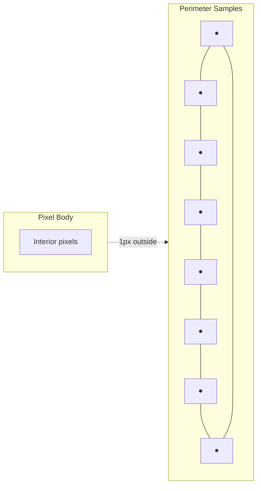
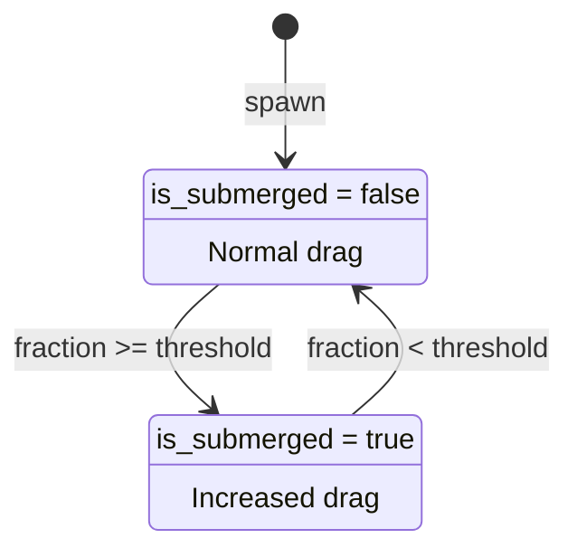

# Submergence Detection

Perimeter-based liquid detection for pixel bodies.

## Overview

Submergence detection determines how much of a rigid body is submerged in liquid materials. It provides:

- **Submerged fraction** - 0.0 to 1.0 ratio of samples in liquid
- **State transitions** - Events when crossing the submersion threshold
- **Drag modification** - Automatic damping adjustment when submerged

This system is used by [Buoyancy](../physics/buoyancy.md) to apply forces, but can also be used standalone for gameplay
mechanics (drowning, aquatic AI, splash effects).

## Perimeter Sampling

Sample points are distributed along the body outline rather than filling the interior:

- Precalculate sample points on spawn or `ShapeMaskModified`
- Sample points positioned at 1px proximity outside the body perimeter
- Transform sample positions to world space each frame using body's transform matrix
- Check each sample against pixel world for liquid presence



### Why Perimeter?

- **Efficiency** - O(perimeter) samples vs O(area) for interior sampling
- **Accuracy** - Surface contact is what matters for liquid detection
- **Robustness** - Works for convex, concave, and complex shapes

## Data Structures

### SubmergenceSamples (Component)

Precalculated sample positions in body-local space:

```
local_positions: Vec<Vec2>    # Outline sample positions relative to body origin
```

Generated once on spawn or when body shape changes (`ShapeMaskModified`). Positions are transformed to world space each
frame for pixel world queries.

### SubmersionState (Component)

Current submersion status, updated each frame:

```
is_submerged: bool            # Threshold crossed (for event detection)
submerged_fraction: f32       # 0.0 to 1.0 based on sample ratio
previous_submerged: bool      # Previous frame's is_submerged (for edge detection)
```

### SubmersionDragConfig (Resource)

Global drag modification settings:

```
linear_drag_multiplier: f32     # Applied to LinearDamping when submerged (default: 3.0)
angular_drag_multiplier: f32    # Applied to AngularDamping when submerged (default: 2.0)
```

## Threshold Heuristic

The `is_submerged` flag uses a threshold to avoid flickering:

- `is_submerged = true` when `submerged_fraction >= threshold`
- Default threshold: 0.25 (25% of perimeter in liquid)
- Use `>=` comparison to favor submerged state when threshold exactly met

This prevents rapid state changes when bodies bob at the surface.

## Events

Events fire on `is_submerged` state transitions:

| Event | Fired When | Payload |
|-------|------------|---------|
| `Submerged` | `is_submerged` transitions false -> true | `{ entity, submerged_fraction }` |
| `Surfaced` | `is_submerged` transitions true -> false | `{ entity }` |



### Event Guarantees

- Events fire exactly once per transition
- No event on spawn (initial state is "above")
- Rapid oscillation across threshold produces paired events
- Events are processed before force application in the same frame

## Drag Modification

When submersion state changes, rigidbody drag is automatically adjusted:

**On `is_submerged` becoming true:**
1. Store original `LinearDamping` and `AngularDamping` values
2. Multiply both by their respective multipliers from `SubmersionDragConfig`

**On `is_submerged` becoming false:**
1. Restore original drag values

This provides natural water resistance without manual component management.

## System Ordering

```mermaid
gantt
    title Submergence System Timing
    dateFormat X
    axisFormat %s

    section Pixel Bodies
    Blit pixel bodies: blit, 0, 1

    section Submergence
    Generate perimeter samples (on change): gen, 1, 2
    Sample world pixels: sample, 2, 3
    Emit Submerged/Surfaced events: events, 3, 4
    Apply drag modifications: drag, 4, 5

    section Consumers
    Buoyancy forces: buoy, 5, 6
    Gameplay systems: game, 5, 6
```



System set ordering:

```
PixelBodySet::Blit
  → SubmergenceSet::GenerateSamples  # Run on Added<Submergent> or ShapeMaskModified
  → SubmergenceSet::Sample           # Read pixel world, update SubmersionState
  → SubmergenceSet::EmitEvents       # Fire Submerged/Surfaced events
  → SubmergenceSet::ApplyDrag        # Modify LinearDamping/AngularDamping
  → (consumers read SubmersionState and events)
```

## Integration Points

| System | Interface | Purpose |
|--------|-----------|---------|
| PixelWorld | `get_pixel(WorldPos)` | Detect liquid presence at sample positions |
| Materials | `get_material(MaterialId)` | Check if pixel is liquid state |
| Pixel Bodies | `shape_mask`, `ShapeMaskModified` | Trigger sample regeneration |
| EventWriter | `Submerged`, `Surfaced` | Notify consumers of state changes |
| LinearDamping/AngularDamping | Component read/write | Automatic drag adjustment |

## Edge Cases

| Scenario | Handling |
|----------|----------|
| Rapid surface crossing | Events fire for each threshold crossing |
| Body splits while submerged | Each fragment gets new samples, re-evaluates submersion |
| Threshold exactly met | Use `>=` comparison, favor submerged state |
| No liquid in world | All samples return non-liquid, fraction stays 0.0 |
| Body fully in air | `submerged_fraction = 0.0`, `is_submerged = false` |
| Body fully in liquid | `submerged_fraction = 1.0`, `is_submerged = true` |

## Related Documentation

- [Buoyancy](../physics/buoyancy.md) - Force application using submersion data
- [Pixel Bodies](../physics/pixel-bodies.md) - Bodies with pixel content
- [Materials](../simulation/materials.md) - Liquid state property
