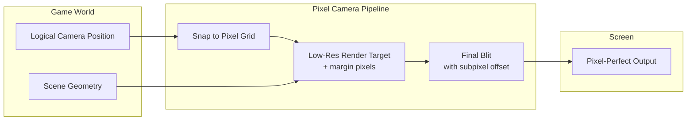
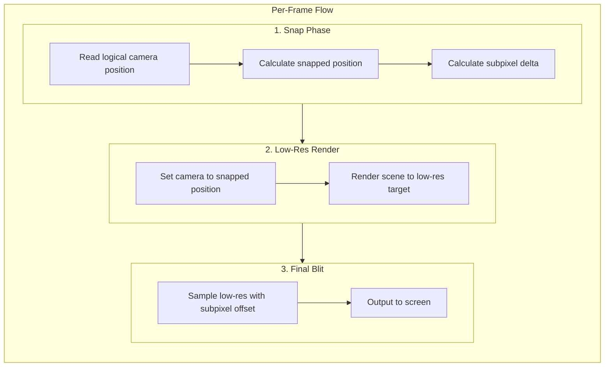
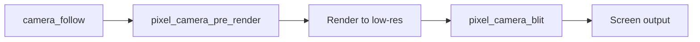
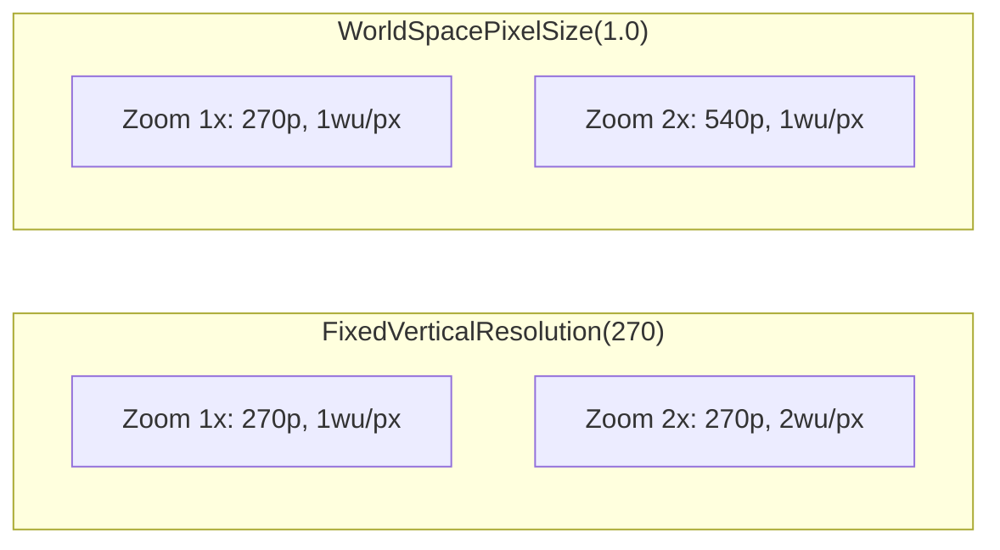

# Pixel-Perfect Camera

Camera snapping and subpixel offset for artifact-free rendering.

## Overview

The pixel-perfect camera module eliminates visual artifacts from sub-pixel rendering while preserving smooth camera movement through low-resolution rendering with subpixel offset compensation.



## Problem Statement

When camera position has fractional components, mesh edges fall between screen pixels. The GPU's fill rules leave gaps between adjacent meshes that don't share vertices.

**Root cause:** Rendering at screen resolution with floating-point camera positions.

**Solution:** Render at a lower resolution where camera is always pixel-aligned, then blit to screen with subpixel offset.

## Design Goals

1. **Pixel-perfect alignment** - All geometry aligns to pixel grid during rendering
2. **Smooth visual movement** - Subpixel offset creates illusion of smooth camera motion
3. **Configurable pixel sizing** - Support both fixed resolution and world-space pixel size modes
4. **Minimal overhead** - Single additional render pass with small render target

## Pixel Size Modes

Two modes for determining the low-resolution target size:

| Mode | Description | Use Case |
|------|-------------|----------|
| **FixedVerticalResolution** | Target height is fixed pixel count (e.g., 270p) | Consistent pixel density across displays |
| **WorldSpacePixelSize** | 1 world unit = N screen pixels | Pixel size tied to game world scale |

```rust
pub enum PixelSizeMode {
    /// Fixed vertical resolution in pixels.
    /// Width calculated from aspect ratio.
    FixedVerticalResolution(u32),

    /// World units per pixel (typically 1.0).
    /// Resolution derived from camera orthographic size.
    WorldSpacePixelSize(f32),
}
```

### Mode Calculations

**FixedVerticalResolution(height):**

```
target_height = height
target_width = ceil(height * aspect_ratio)
pixel_world_size = (2.0 * ortho_size) / height
```

**WorldSpacePixelSize(size):**

```
pixel_world_size = size
target_height = ceil((2.0 * ortho_size) / size)
target_width = ceil(target_height * aspect_ratio)
```

## Architecture

### Render Pipeline



### Subpixel Offset with Margin

The low-resolution target includes margin pixels to allow shifting without edge artifacts:

```
┌─────────────────────────────┐
│  margin (e.g., 2 pixels)    │
│  ┌───────────────────────┐  │
│  │                       │  │
│  │   visible viewport    │  │
│  │                       │  │
│  └───────────────────────┘  │
│                             │
└─────────────────────────────┘

Target size = viewport + (2 * margin)
```

When blitting, the sampling UV is offset by the subpixel delta:

- Delta of (0.3, 0.2) shifts sample point right and up
- Margin ensures we never sample outside valid pixels

### Snap Calculation

```
// Logical position from game systems
logical_pos: Vec2

// Snap to nearest pixel in world space
snapped_pos = round(logical_pos / pixel_world_size) * pixel_world_size

// Subpixel delta (always in range [-0.5, 0.5] * pixel_world_size)
delta_world = logical_pos - snapped_pos

// Convert to UV offset for blit shader
delta_uv = delta_world / (pixel_world_size * target_size)
```

## Resources

```rust
/// Configuration for pixel camera rendering.
#[derive(Resource)]
pub struct PixelCameraConfig {
    /// How pixel size is determined.
    pub pixel_size_mode: PixelSizeMode,

    /// Margin pixels around render target for subpixel offset.
    /// Typically 1-2 pixels.
    pub margin: u32,

    /// Enable subpixel smoothing.
    /// When false, camera snaps without offset compensation.
    pub subpixel_smoothing: bool,
}

/// Runtime state for pixel camera rendering.
#[derive(Resource)]
pub struct PixelCameraState {
    /// Low-resolution render target.
    pub render_target: Handle<Image>,

    /// Current subpixel offset in UV space.
    pub subpixel_offset_uv: Vec2,

    /// Calculated world-space pixel size.
    pub pixel_world_size: f32,

    /// Low-res target dimensions (including margin).
    pub target_size: UVec2,
}
```

## Components

```rust
/// Marker for camera that uses pixel-perfect rendering.
#[derive(Component)]
pub struct PixelCamera {
    /// Override pixel size mode for this camera.
    pub pixel_size_mode: Option<PixelSizeMode>,
}

/// Internal: tracks logical camera position before snapping.
#[derive(Component)]
pub struct LogicalCameraPosition(pub Vec2);
```

## Systems

### System Ordering



### `pixel_camera_pre_render`

Runs before rendering:

1. Store logical position in `LogicalCameraPosition`
2. Calculate snapped position and delta
3. Update camera transform to snapped position
4. Update `PixelCameraState` with delta and target info
5. Resize render target if viewport changed

### `pixel_camera_blit`

Post-process pass:

1. Read low-res render target
2. Sample with UV offset from `PixelCameraState.subpixel_offset_uv`
3. Output to screen with point filtering (nearest neighbor)

## Blit Shader

```wgsl
@group(0) @binding(0) var low_res_texture: texture_2d<f32>;
@group(0) @binding(1) var low_res_sampler: sampler;  // point/nearest
@group(0) @binding(2) var<uniform> subpixel_offset: vec2<f32>;
@group(0) @binding(3) var<uniform> viewport_rect: vec4<f32>;  // xy=offset, zw=size

@fragment
fn fragment(@location(0) uv: vec2<f32>) -> @location(0) vec4<f32> {
    // Map screen UV to viewport UV (accounting for margin)
    let viewport_uv = viewport_rect.xy + uv * viewport_rect.zw;

    // Apply subpixel offset
    let sample_uv = viewport_uv + subpixel_offset;

    // Point sample (nearest neighbor)
    return textureSample(low_res_texture, low_res_sampler, sample_uv);
}
```

## Integration with Existing Systems

### Chunk Rendering

Chunks render to the low-res target. No shader changes needed—pixel alignment is handled by camera snapping.

### Streaming Window

`update_streaming_windows` uses the **logical** camera position (before snapping) to determine which chunks to load. This ensures smooth streaming without visible chunk pop-in at grid boundaries.

### Camera Follow

Existing `camera_follow` system writes logical position. `pixel_camera_pre_render` reads this and applies snapping.

## Zoom Behavior

When orthographic scale changes (zoom):

**FixedVerticalResolution:** Pixel size in world space changes. Zooming in makes pixels cover more world area.

**WorldSpacePixelSize:** Target resolution changes. Zooming in increases pixel count to maintain constant pixel-to-world ratio.



## Configuration Examples

### Retro Game (Fixed Resolution)

```rust
PixelCameraConfig {
    pixel_size_mode: PixelSizeMode::FixedVerticalResolution(240),
    margin: 2,
    subpixel_smoothing: true,
}
```

### Pixel Sandbox (World-Space Pixels)

```rust
PixelCameraConfig {
    pixel_size_mode: PixelSizeMode::WorldSpacePixelSize(1.0),
    margin: 1,
    subpixel_smoothing: true,
}
```

## Related Documentation

- [Rendering](rendering.md) - Chunk texture upload pipeline
- [Streaming Window](../streaming/streaming-window.md) - Camera-based chunk loading
- [Coordinates](../foundational/coordinates.md) - Y+ up convention
- [Architecture Overview](../README.md)
