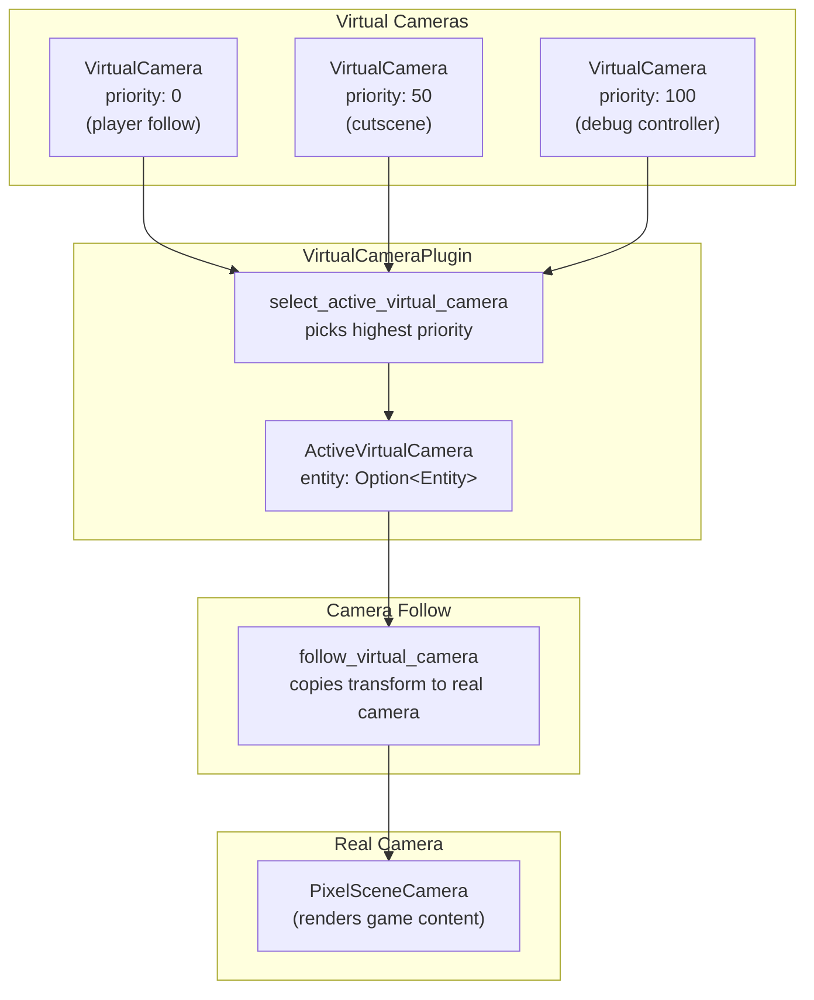

# Virtual Camera

Priority-based camera control for decoupled systems.

## Overview

Multiple systems want camera control: player follow, debug controller, cutscenes, console teleport. Each spawns a `VirtualCamera` entity with a priority; the highest-priority one controls the real camera.

This decouples camera ownership from rendering—systems don't need to know about each other or coordinate directly.

## Architecture



## Components

```rust
/// Marker for virtual camera entities.
/// Systems spawn these to request camera control.
#[derive(Component)]
pub struct VirtualCamera {
    /// Higher priority wins. Equal priority: prefer current active, then lowest Entity.
    pub priority: i32,
}
```

Virtual cameras are regular entities with a `Transform`. Position the virtual camera where you want the real camera to look.

## Resources

```rust
/// Tracks which virtual camera is currently active.
#[derive(Resource, Default)]
pub struct ActiveVirtualCamera {
    pub entity: Option<Entity>,
}
```

## Priority Conventions

| Priority | Use Case |
|----------|----------|
| 0 | Player follow (default) |
| 50 | Cutscenes, scripted sequences |
| 100 | Debug controller (WASD camera) |
| 200+ | Console override, forced camera |

Higher priority always wins. Within the same priority, the current active camera is preferred (hysteresis), otherwise lowest `Entity` wins for determinism.

## Systems

### `select_active_virtual_camera`

**Schedule:** `PostUpdate`, before `follow_virtual_camera`

1. Query all `VirtualCamera` entities
2. Find the one with highest priority
3. On tie: prefer currently active, else lowest Entity
4. Update `ActiveVirtualCamera` resource

### `follow_virtual_camera`

**Schedule:** `PostUpdate`, after selection

1. Read `ActiveVirtualCamera.entity`
2. Copy that entity's `Transform` to the `PixelSceneCamera`
3. Update `LogicalCameraPosition` component for streaming

## Integration

### Game Crate (`core/camera.rs`)

Spawn a default virtual camera alongside the player:

```rust
commands.spawn((
    VirtualCamera { priority: 0 },
    Transform::default(),
    // CameraTarget system updates this transform
));
```

The `camera_follow` system now updates the virtual camera's transform instead of the real camera.

### Debug Controller (`debug_camera.rs`)

Spawn a virtual camera at priority 100:

```rust
commands.spawn((
    VirtualCamera { priority: 100 },
    Transform::from_translation(initial_pos),
));
```

WASD input updates this virtual camera's transform. When disabled, despawn it—control returns to priority 0.

### Console Teleport

Modify the active virtual camera's transform directly:

```rust
fn teleport(
    active: Res<ActiveVirtualCamera>,
    mut transforms: Query<&mut Transform, With<VirtualCamera>>,
) {
    if let Some(entity) = active.entity {
        if let Ok(mut transform) = transforms.get_mut(entity) {
            transform.translation = target_position;
        }
    }
}
```

Or spawn a temporary high-priority virtual camera for forced override.

## Related Documentation

- [pixel-camera.md](pixel-camera.md) - Pixel-perfect rendering pipeline
- [streaming-window.md](../streaming/streaming-window.md) - Camera-based chunk loading
