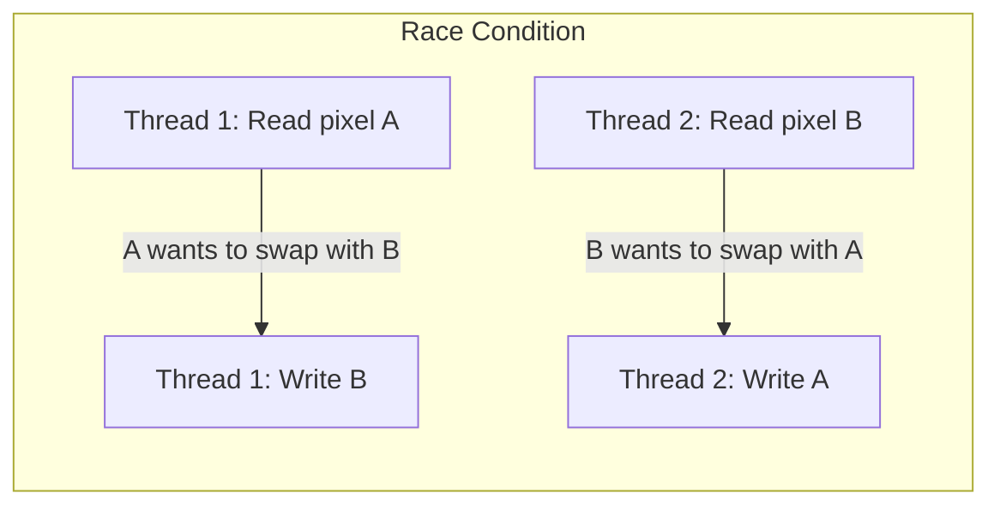
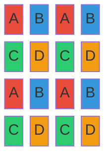
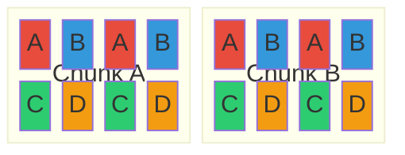

# Scheduling

Thread-safe parallel scheduling for cellular automata simulation.

## Schedule Modes

The **iterator type** in a simulation's function signature determines the schedule mode:

| Iterator | Mechanism | Safety | Performance |
|----------|-----------|--------|-------------|
| `PhasedIter<L>` | Checkerboard 4-phase | Safe for local ops | High (parallel within phases) |
| (regular loop) | Ordered iteration | Always safe | Low (single-threaded) |

**PhasedIter** is the default for CA physics—it uses checkerboard tile phasing (described below) to guarantee thread safety for operations that read neighbors and write to self.

**Sequential** (no special iterator) is for simulations with complex dependencies or global state.

See [Simulation Extensibility](../modularity/simulation-extensibility.md) for full API.

## Checkerboard Phasing (PhasedParallel)

Thread-safe parallel scheduling using checkerboard tile phasing.

## The Race Condition Problem

Naive parallel simulation creates race conditions:



If pixel A and pixel B are neighbors and both threads read simultaneously, they may both decide to swap, corrupting the
simulation state.

## Checkerboard Scheduling

Partition each chunk into tiles (e.g., 16x16 pixels per tile - see [Configuration](../foundational/configuration.md)). Assign each tile
to one of four phases (A, B, C, D) in a 2x2 repeating pattern:

**Important:** The "2x2" refers to the phase assignment pattern, not the tile pixel dimensions. A 512x512 chunk with
16x16 tiles has a 32x32 tile grid, with phases assigned in the repeating 2x2 pattern shown below.

### Phase Pattern



- **Phase A** (red): Top-left of each 2x2 group
- **Phase B** (blue): Top-right of each 2x2 group
- **Phase C** (green): Bottom-left of each 2x2 group
- **Phase D** (orange): Bottom-right of each 2x2 group

### Thread Safety Guarantees

Tiles of the same phase are never adjacent. When processing all A tiles in parallel:

- A tiles can read/write their own pixels
- A tiles can read neighboring B, C, D tiles (not being written)
- No two threads write to the same memory

Each phase guarantees at least one tile gap between all scheduled workloads, providing a safe read radius of half a tile
around each processing tile.

## Execution Timeline

```mermaid
gantt
    title Simulation Tick (4 Phases)
    dateFormat X
    axisFormat %s

    Phase A (parallel): a1, 0, 1
    Phase B (parallel): b1, 1, 2
    Phase C (parallel): c1, 2, 3
    Phase D (parallel): d1, 3, 4
```



Each phase:

1. All tiles of that phase process in parallel across worker threads
2. Barrier/sync point before next phase
3. Four phases complete one full simulation tick

## Cross-Chunk Boundaries

### The Boundary Problem

Without a unifying abstraction, chunks have isolated memory arrays. Each chunk's pixel buffer is independent, and naive
simulation operates on tiles within a single chunk. This creates a boundary problem:

- Pixels cannot swap positions between different chunks directly
- Each chunk's simulation only has write access to its own buffer
- Cross-chunk pixel movement requires coordinated writes to two separate buffers

### What 2x2 Scheduling Solves

The checkerboard scheduling with aligned phases across chunk boundaries provides **thread safety**, not cross-chunk
pixel movement:

- **Chunks must have even dimensions in tiles.** This ensures the checkerboard pattern aligns seamlessly across chunk
  boundaries.
- Adjacent chunks have complementary phases at their shared edge
- Boundary pixels are never processed simultaneously by different threads



Phase alignment prevents concurrent writes to adjacent boundary pixels from different threads processing neighboring
chunks. However, checkerboard scheduling alone does not enable cross-chunk pixel movement - that requires the Canvas
abstraction described below.

### Solution: Tiled Canvas

A Canvas abstraction provides unified world-coordinate access over multiple chunks, enabling cross-chunk pixel operations
transparently.

**Data hierarchy:**

```
Canvas
└── HashMap<ChunkPos, Chunk>
      └── Chunk
            └── Surface (pixel buffer)
```

**Pixel addressing:**

```
world_pixel_pos → chunk_pos → chunk_map[chunk_pos] → chunk → local_pixel
```

The Blitter operates on the Canvas using world coordinates. The Canvas routes writes to the correct chunk via hashmap
lookup. For cross-chunk swaps, the Canvas can write to multiple chunks in a single operation.

**Chunk position calculation:**

```
chunk_pos.xy = floor(world_pixel_pos.xy / CHUNK_SIZE)
```

**Streaming integration:**

The chunk map is updated when the streaming window repositions (camera movement):

1. Streaming window determines which chunk positions should be loaded
2. New chunks are allocated from the pool and added to the map
3. Chunks outside the window are removed and returned to the pool

**System ordering:**

Bevy's auto-parallelization requires explicit ordering constraints. Streaming systems must be ordered before simulation
systems to ensure the chunk map is stable - tiles can safely address any pixel within the Canvas bounds without
concurrent map modifications.

## Related Documentation

- [Simulation Extensibility](../modularity/simulation-extensibility.md) - Schedule mode selection in builder API
- [Simulation](simulation.md) - Multi-pass simulation overview
- [Spatial Hierarchy](../foundational/spatial-hierarchy.md) - World, chunk, tile, pixel organization
- [Configuration Reference](../foundational/configuration.md) - Tunable tile and chunk sizes
- [Architecture Overview](../README.md)
