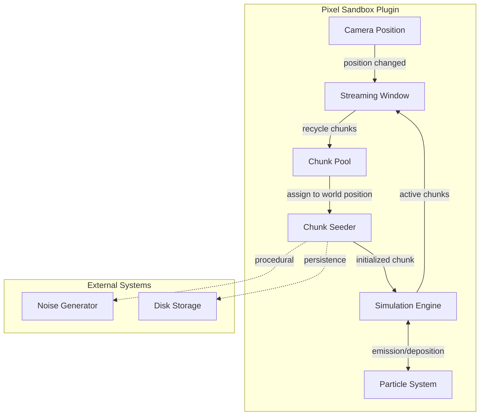
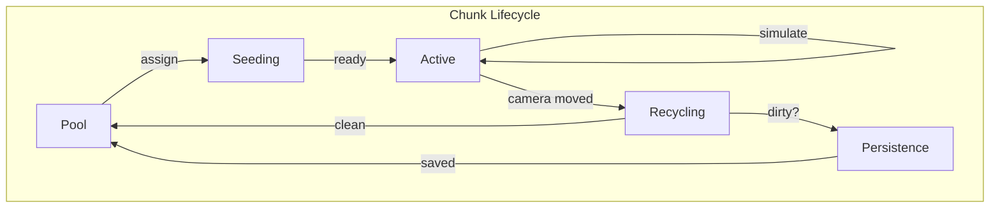

# Pixel Sandbox Plugin Architecture

A Bevy plugin for virtual infinite 2D pixel worlds with full cellular automata simulation.

## Key Design Principles

- **Zero runtime allocation** - All chunk memory is pooled and reused
- **Parallel simulation** - Checkerboard scheduling enables safe concurrent pixel updates
- **Infinite worlds** - Streaming window loads chunks around the camera on demand
- **Extensible generation** - Chunk seeder trait supports procedural generation and persistence

## System Architecture

## Component Overview

| Component             | Purpose                                                          | Documentation                                |
|-----------------------|------------------------------------------------------------------|----------------------------------------------|
| **Glossary**          | Canonical definitions of technical terms                         | [glossary.md](glossary.md)                   |
| **Coordinates**       | Canonical coordinate system convention (Y+ up)                   | [coordinates.md](coordinates.md)             |
| **Spatial Hierarchy** | World, chunk, tile, pixel organization and coordinate systems    | [spatial-hierarchy.md](spatial-hierarchy.md) |
| **Pixel Format**      | Data structure for individual pixels                             | [pixel-format.md](pixel-format.md)           |
| **Materials**         | Material definitions, behavior types, tags, and interactions     | [materials.md](materials.md)                 |
| **Chunk Pool**        | Object pool pattern for zero-allocation chunk management         | [chunk-pooling.md](chunk-pooling.md)         |
| **Chunk Persistence** | Save file format, random access, compression, dirty tracking     | [chunk-persistence.md](chunk-persistence.md) |
| **Recovery Persistence** | Dual-save crash recovery with autosave and explicit checkpoints | [recovery-persistence.md](recovery-persistence.md) |
| **Named Saves**       | Consumer-controlled save management with complete world snapshots | [named-saves.md](named-saves.md)             |
| **Simulation Engine** | Parallel cellular automata with checkerboard scheduling          | [simulation.md](simulation.md)               |
| **Particle System**   | Free-form particles for dynamic effects (debris, gases, pouring) | [particles.md](particles.md)                 |
| **Pixel Bodies**      | Dynamic physics objects with pixel content in CA simulation      | [pixel-bodies.md](pixel-bodies.md)           |
| **Pixel Displacement**| Conserve pixels when bodies move through fluids                  | [pixel-displacement.md](pixel-displacement.md) |
| **Buoyancy**          | Physics forces for bodies submerged in liquid                    | [buoyancy.md](buoyancy.md)                   |
| **Streaming Window**  | Camera-tracking active region management                         | [streaming-window.md](streaming-window.md)   |
| **Chunk Seeder**      | Trait for procedural generation, noise pipelines                 | [chunk-seeding.md](chunk-seeding.md)         |
| **Rendering**         | Chunk texture upload and material identity textures              | [rendering.md](rendering.md)                 |
| **Collision**         | Marching squares mesh generation from solid pixels               | [collision.md](collision.md)                 |
| **Configuration**     | Tunable parameters and constraints                               | [configuration.md](configuration.md)         |

## Data Flow

1. **Pool** - Chunks wait in the object pool for assignment
2. **Seeding** - Chunk seeder plants initial pixel data (from noise or disk)
3. **Active** - Chunk participates in simulation each tick
4. **Recycling** - Chunk leaves the active region
5. **Persistence** - If dirty, chunk is saved to disk before returning to pool

## Bevy Integration

The plugin integrates with Bevy's ECS and scheduling:

- **Resources** - Chunk pool, streaming window configuration, seeder registry
- **Systems** - Camera tracking, chunk lifecycle management, parallel simulation
- **Events** - Chunk loaded, chunk unloaded, chunk modified
