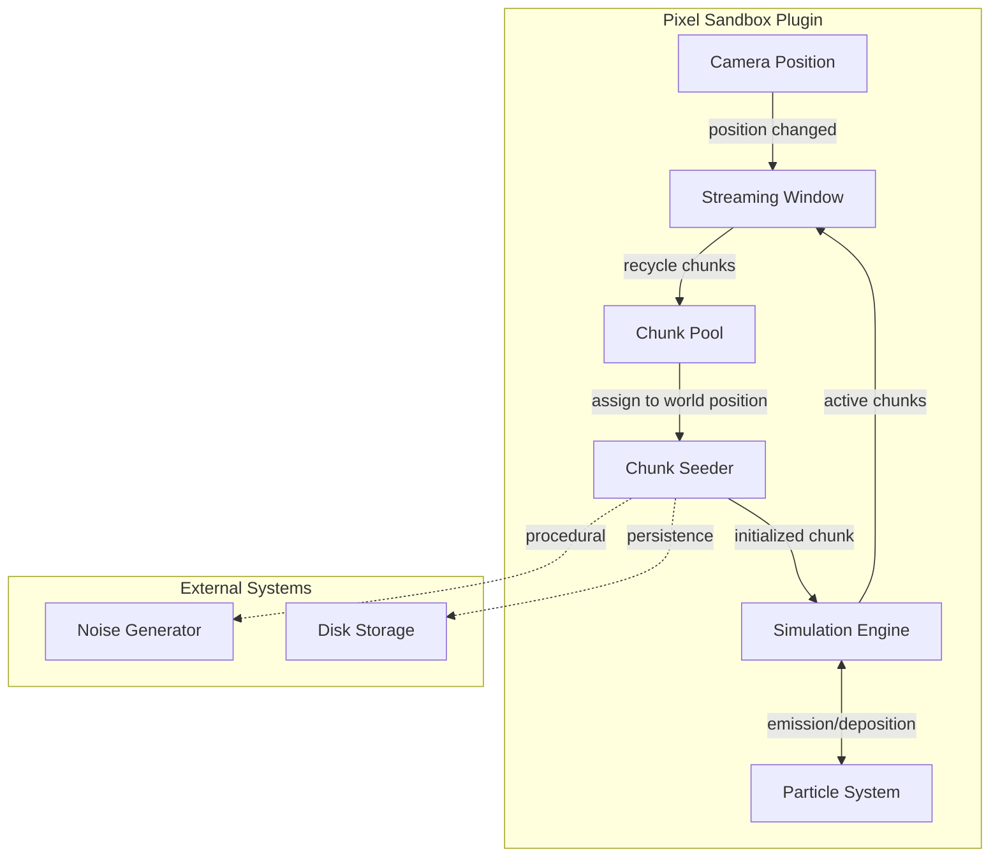
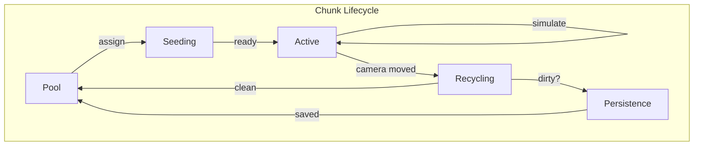

# Pixel Sandbox Plugin Architecture

A Bevy plugin for virtual infinite 2D pixel worlds with full cellular automata simulation.

## Key Design Principles

- **Zero runtime allocation** - All chunk memory is pooled and reused
- **Parallel simulation** - Checkerboard scheduling enables safe concurrent pixel updates
- **Infinite worlds** - Streaming window loads chunks around the camera on demand
- **Extensible generation** - Chunk seeder trait supports procedural generation and persistence

## System Architecture

## Documentation Structure

Documentation is organized into thematic sections:

### Reference

| Document | Purpose |
|----------|---------|
| [Systems Flow](systems-flow.md) | Complete frame update loop, system ordering, and data flow |
| [Glossary](glossary.md) | Canonical definitions of technical terms |

### Foundational

Core concepts that other documentation depends on.

| Document | Purpose |
|----------|---------|
| [Coordinates](foundational/coordinates.md) | Canonical coordinate system convention (Y+ up) |
| [Spatial Hierarchy](foundational/spatial-hierarchy.md) | World, chunk, tile, pixel organization |
| [Pixel Format](foundational/pixel-format.md) | Data structure for individual pixels |
| [Configuration](foundational/configuration.md) | Tunable parameters and constraints |

### Simulation

Cellular automata engine and material system.

| Document | Purpose |
|----------|---------|
| [Simulation](simulation/simulation.md) | Parallel CA with checkerboard scheduling |
| [Scheduling](simulation/scheduling.md) | Thread-safe parallel tile scheduling |
| [Materials](simulation/materials.md) | Material definitions, behavior types, interactions |
| [Particles](simulation/particles.md) | Free-form particles for debris, gases, pouring |

### Physics

Dynamic objects and force systems.

| Document | Purpose |
|----------|---------|
| [Pixel Bodies](physics/pixel-bodies.md) | Dynamic physics objects with pixel content |
| [Collision](physics/collision.md) | Marching squares mesh generation |
| [Pixel Displacement](physics/pixel-displacement.md) | Conserve pixels when bodies move through fluids |
| [Buoyancy](physics/buoyancy.md) | Physics forces for bodies submerged in liquid |

### Pixel Awareness

Systems that query the pixel world.

| Document | Purpose |
|----------|---------|
| [Submergence](pixel-awareness/submergence.md) | Perimeter-based liquid detection and events |

### Chunk Management

Chunk lifecycle and memory management.

| Document | Purpose |
|----------|---------|
| [Chunk Pooling](chunk-management/chunk-pooling.md) | Object pool pattern for zero-allocation management |
| [Chunk Seeding](chunk-management/chunk-seeding.md) | Trait for procedural generation, noise pipelines |

### Persistence

Save files and data persistence.

| Document | Purpose |
|----------|---------|
| [Chunk Persistence](persistence/chunk-persistence.md) | Save file format, random access, compression |
| [Recovery Persistence](persistence/recovery-persistence.md) | Dual-save crash recovery with autosave |
| [Named Saves](persistence/named-saves.md) | Consumer-controlled save management |

### Rendering

Visual output systems.

| Document | Purpose |
|----------|---------|
| [Rendering](rendering/rendering.md) | Chunk texture upload and material identity textures |
| [Pixel Camera](rendering/pixel-camera.md) | Camera snapping and subpixel offset for artifact-free rendering |

### World Generation

Procedural content generation.

| Document | Purpose |
|----------|---------|
| [PCG Ideas](world-generation/pcg-ideas.md) | Advanced generation with WFC, stamps |

### Streaming

Infinite world management.

| Document | Purpose |
|----------|---------|
| [Streaming Window](streaming/streaming-window.md) | Camera-tracking active region management |

### Editor

Level editing and runtime control.

| Document | Purpose |
|----------|---------|
| [Level Editor Mode](editor/level-editor-mode.md) | Simulation and persistence control for level editing |

### Modularity

Extensibility architecture for crate consumers.

| Document | Purpose |
|----------|---------|
| [Modularity Overview](modularity/README.md) | Extension points and design principles |
| [Rendering Backends](modularity/rendering-backends.md) | Abstract render targets (GPU, terminal, headless) |
| [Pixel Layers](modularity/pixel-layers.md) | Unified layer system (sample rate, swap-follow, render) |
| [Simulation Extensibility](modularity/simulation-extensibility.md) | Pluggable rules and library functions |

## Data Flow

1. **Pool** - Chunks wait in the object pool for assignment
2. **Seeding** - Chunk seeder plants initial pixel data (from noise or disk)
3. **Active** - Chunk participates in simulation each tick
4. **Recycling** - Chunk leaves the active region
5. **Persistence** - If dirty, chunk is saved to disk before returning to pool

## Bevy Integration

The plugin integrates with Bevy's ECS and scheduling:

- **Resources** - Chunk pool, streaming window configuration, seeder registry
- **Systems** - Camera tracking, chunk lifecycle management, parallel simulation
- **Events** - Chunk loaded, chunk unloaded, chunk modified
