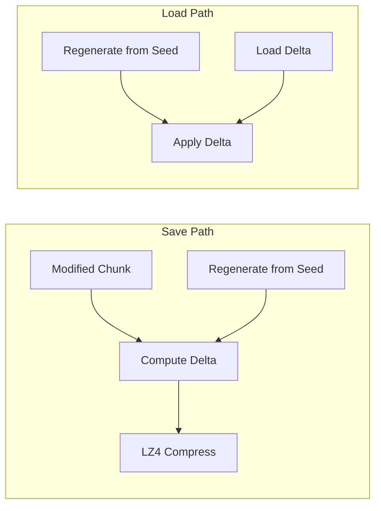
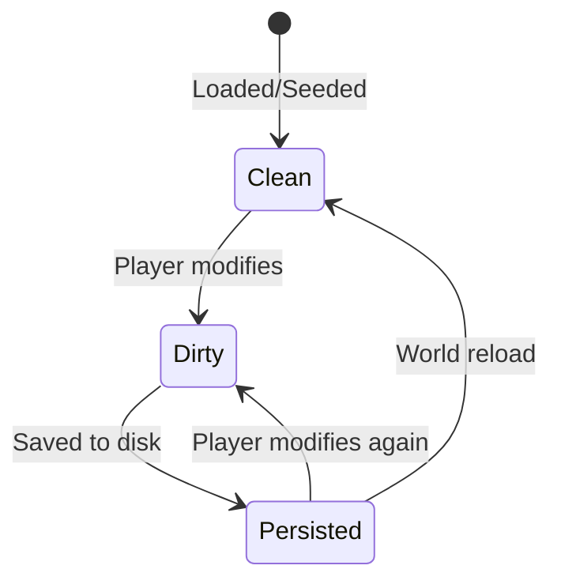
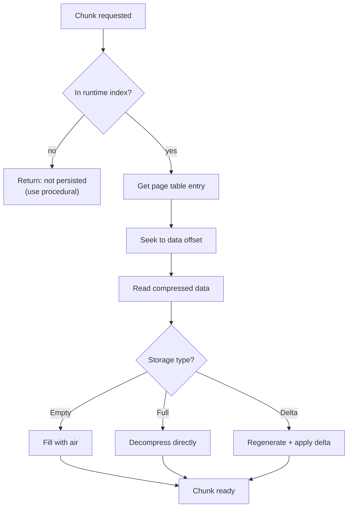
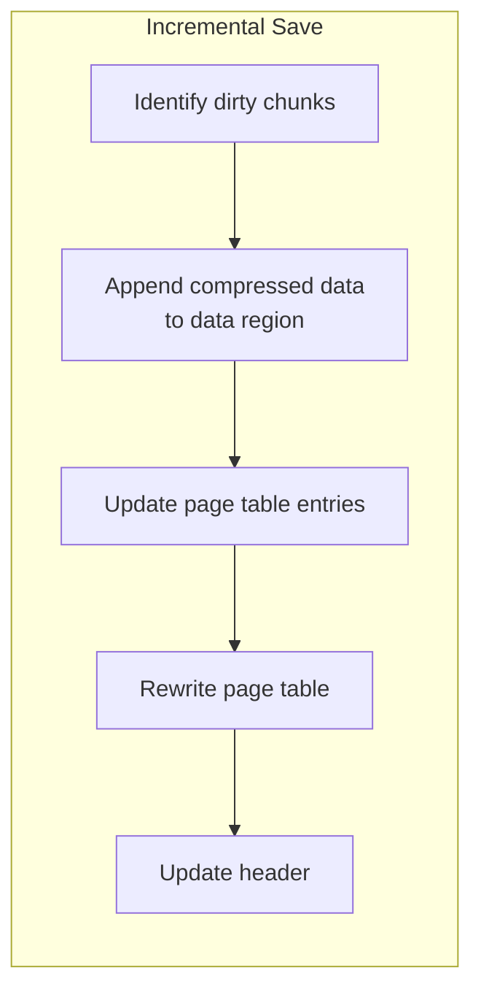

# Chunk Persistence

Disk storage system for modified chunks with efficient random access.

## Overview

The persistence system saves player modifications while allowing procedural regeneration of unvisited areas. Key design
goals:

- **Sparse storage** - Only save modified chunks
- **Random access** - Load any chunk without scanning entire file
- **Fast reads** - Prioritize load speed over save speed
- **Corruption resilience** - Detect and recover from partial writes

## Save File Structure

A world save is a single file with three regions:

```
┌─────────────────────────────────────────────────────────────┐
│                         Header                              │
│  (magic, version, world seed, chunk count)                  │
├─────────────────────────────────────────────────────────────┤
│                       Page Table                            │
│  (chunk position → file offset mapping)                     │
├─────────────────────────────────────────────────────────────┤
│                       Data Region                           │
│  (compressed chunk data, variable-length entries)           │
└─────────────────────────────────────────────────────────────┘
```

### Header (64 bytes, fixed)

| Offset | Size | Field            | Description                             |
|--------|------|------------------|-----------------------------------------|
| 0      | 4    | Magic            | `0x50585357` ("PXSW" - PixelSandWorld)  |
| 4      | 2    | Version          | Format version for migration            |
| 6      | 2    | Flags            | Feature flags (compression type, etc.)  |
| 8      | 8    | World Seed       | For procedural regeneration             |
| 16     | 8    | Creation Time    | Unix timestamp                          |
| 24     | 8    | Modified Time    | Last save timestamp                     |
| 32     | 4    | Chunk Count      | Number of saved chunks                  |
| 36     | 4    | Page Table Size  | Bytes allocated for page table          |
| 40     | 8    | Data Region Ptr  | File offset where data region starts    |
| 48     | 2    | Chunk Size       | Pixels per chunk edge (512)             |
| 50     | 2    | Tile Size        | Pixels per tile edge (32)               |
| 52     | 1    | Pixel Size       | Bytes per pixel (4)                     |
| 53     | 11   | Reserved         | Future use                              |

**On load, validate these match the running game's constants.** Mismatched parameters indicate an incompatible save:

- **Chunk size mismatch**: Data layout incompatible, cannot load
- **Tile size mismatch**: Simulation would behave incorrectly
- **Pixel size mismatch**: Data structure changed, needs migration

### Page Table

Maps chunk world positions to file offsets.

#### Page Table Entry (24 bytes)

| Offset | Size | Field           | Description                          |
|--------|------|-----------------|--------------------------------------|
| 0      | 4    | Chunk X         | World chunk coordinate (signed i32)  |
| 4      | 4    | Chunk Y         | World chunk coordinate (signed i32)  |
| 8      | 8    | Data Offset     | Offset into data region (u64)        |
| 16     | 4    | Data Size       | Compressed data size in bytes (u32)  |
| 20     | 1    | Storage Type    | Full, Delta, or Empty (see below)    |
| 21     | 1    | Checksum        | CRC8 of entry for corruption detect  |
| 22     | 2    | Reserved        | Alignment padding                    |

#### Storage Types

| Value | Type    | Description                                    |
|-------|---------|------------------------------------------------|
| 0     | Empty   | Chunk entirely cleared (no data needed)        |
| 1     | Delta   | Stores only changes from procedural generation |
| 2     | Full    | Stores complete chunk buffer                   |

#### On-Disk Organization

The page table is stored as a **sorted array** ordered by `(chunk_y, chunk_x)`:

```
Lookup algorithm:
1. Binary search for target (chunk_x, chunk_y)
2. If found: read data offset, seek to data region
3. If not found: chunk not persisted, use procedural generation
```

The sorted array enables forward scanning for corruption recovery and spatial range queries.

#### Runtime Index

On world load, build a HashMap for O(1) lookups:

```rust
struct ChunkIndex {
    by_position: HashMap<ChunkPos, PageTableEntry>,
}
```

**Lookup performance (1000 lookups):**

| Entries   | Binary Search | HashMap  |
|-----------|---------------|----------|
| 1,000     | 13 µs         | 6 µs     |
| 10,000    | 23 µs         | 6 µs     |
| 100,000   | 41 µs         | 7 µs     |
| 1,000,000 | 64 µs         | 7 µs     |

The HashMap cost is negligible on load; always use it.

### Data Region

Variable-length compressed chunk data, referenced by page table offsets.

```
┌────────────┬──────────────────────────────────────┐
│ Entry Size │ Compressed Payload                   │
│  (4 bytes) │ (variable, LZ4 compressed)           │
└────────────┴──────────────────────────────────────┘
```

The entry size is redundant with the page table's `Data Size` field but allows forward iteration through the data region
for recovery/validation.

## Compression

### LZ4

LZ4 provides the best balance for game saves:

| Metric             | LZ4         | zstd        | gzip        |
|--------------------|-------------|-------------|-------------|
| Compression speed  | ~500 MB/s   | ~200 MB/s   | ~50 MB/s    |
| Decompression      | ~2000 MB/s  | ~800 MB/s   | ~200 MB/s   |

LZ4's decompression speed is critical—players experience load times, not save times.

### Compression Ratios (512×512 chunks, 1MB uncompressed)

| Pattern       | Compressed  | Ratio  |
|---------------|-------------|--------|
| Empty (air)   | 4 KB        | 254×   |
| Uniform       | 4 KB        | 254×   |
| Sparse 1%     | 18 KB       | 60×    |
| Sparse 5%     | 67 KB       | 16×    |
| Terrain       | 187 KB      | 5.6×   |
| Sparse 25%    | 202 KB      | 5.2×   |
| Random        | 1,053 KB    | 1.0×   |

Typical terrain chunks compress to ~187KB.

### Delta Compression

For chunks with minor modifications, store only the difference from procedural generation:



#### Delta Format

```
┌────────────────┬─────────────────────────────────────────────┐
│  Entry Count   │  Delta Entries (compressed)                 │
│   (4 bytes)    │  [position: u24][new_pixel: u32] × count    │
└────────────────┴─────────────────────────────────────────────┘

Position: Linear index into chunk buffer (24 bits supports 512×512 = 262K pixels)
New Pixel: Full 4-byte pixel value
```

**Special markers:**

- `Entry Count = 0`: Chunk matches procedural generation exactly (should not be saved)
- `Entry Count = 0xFFFFFF`: Chunk entirely empty/void (Storage Type = Empty)

#### Delta vs Full (terrain base, 512×512 chunks)

| Modification | Delta Entries | Delta Size | Full Size |
|--------------|---------------|------------|-----------|
| 1%           | 2,605         | 87 B       | 195 KB    |
| 5%           | 12,761        | 366 B      | 226 KB    |
| 10%          | 24,898        | 699 B      | 255 KB    |
| 25%          | 58,027        | 1.6 KB     | 305 KB    |
| 50%          | 103,238       | 2.8 KB     | 328 KB    |

Delta wins at all densities up to 50%. Use delta when modifications are below 75% of chunk pixels.

## Dirty Tracking

Three-state tracking determines save behavior:



| State     | Description                       | On Recycle        |
|-----------|-----------------------------------|-------------------|
| Clean     | Matches procedural generation     | Skip save         |
| Dirty     | Modified since load/seed          | Save required     |
| Persisted | Saved to disk, not modified since | Skip save         |

The dirty flag is set when pixels actually change. Stable configurations (sand at rest) remain clean.

## Read Path



All disk operations happen on a background thread. The streaming window requests chunks ahead of the camera, hiding load
latency.

## Write Path

### Incremental Save

Rather than rewriting the entire file, append new/modified chunk data:



Incremental saves cause fragmentation. Deleted/overwritten chunks leave dead space in the data region.

### Compaction

Periodically compact the save file to reclaim space:

1. Create new file with fresh header
2. Copy only live chunk data (referenced by page table)
3. Build new page table with updated offsets
4. Atomic rename: new file replaces old

Trigger compaction when dead space exceeds 25% of file size.

### Atomic Saves

Use write-then-rename pattern for crash safety:

1. Write to `world.save.tmp`
2. Sync to disk (`fsync`)
3. Rename `world.save.tmp` → `world.save`

If crash during write, `.tmp` file is discarded on next load.

## Corruption Recovery

### Detection

- Header magic/version validation
- Page table entry CRC8 checksums
- Data region entry size cross-check

### Recovery Strategies

| Corruption Type       | Recovery                                      |
|-----------------------|-----------------------------------------------|
| Invalid header        | File unusable, offer "new world"              |
| Bad page table entry  | Skip entry, chunk regenerates procedurally    |
| Bad chunk data        | Skip chunk, regenerate procedurally           |
| Truncated file        | Recover entries before truncation point       |

## Capacity

### Memory Budget

| Chunks Saved | Page Table  | Runtime HashMap | Total   |
|--------------|-------------|-----------------|---------|
| 1,000        | 24 KB       | ~50 KB          | ~74 KB  |
| 10,000       | 240 KB      | ~500 KB         | ~740 KB |
| 100,000      | 2.4 MB      | ~5 MB           | ~7.4 MB |
| 1,000,000    | 24 MB       | ~50 MB          | ~74 MB  |

### File Size (with delta compression)

| World Activity      | Chunks | Estimated Size |
|---------------------|--------|----------------|
| Brief exploration   | 100    | ~200 KB        |
| Normal playthrough  | 1,000  | ~10 MB         |
| Heavy modification  | 5,000  | ~100 MB        |
| Stress test         | 10,000 | ~500 MB        |

### World Size Limits

| Page Table Memory | Max Chunks  | World Coverage (512px chunks) |
|-------------------|-------------|-------------------------------|
| 24 MB             | 1,000,000   | 1000×1000 (512K × 512K px)    |
| 240 MB            | 10,000,000  | 3162×3162 (1.6M × 1.6M px)    |

At 1 pixel = 1 cm, a 1M chunk world covers 5.12 km × 5.12 km.

## Configuration

| Parameter                  | Default | Description                                 |
|----------------------------|---------|---------------------------------------------|
| `delta_threshold`          | 0.75    | Max delta entries as fraction of chunk size |
| `compaction_threshold`     | 0.25    | Dead space ratio triggering compaction      |
| `async_save_queue_size`    | 64      | Max pending save operations                 |
| `page_table_growth_factor` | 1.5     | Reallocation multiplier when table fills    |

## Related Documentation

- [Chunk Seeding](chunk-seeding.md) - Procedural generation (fallback for unpersisted chunks)
- [Chunk Pooling](chunk-pooling.md) - Lifecycle that triggers save/load
- [Streaming Window](streaming-window.md) - Determines which chunks to load
- [Pixel Format](pixel-format.md) - Data structure being persisted
- [Architecture Overview](README.md)
