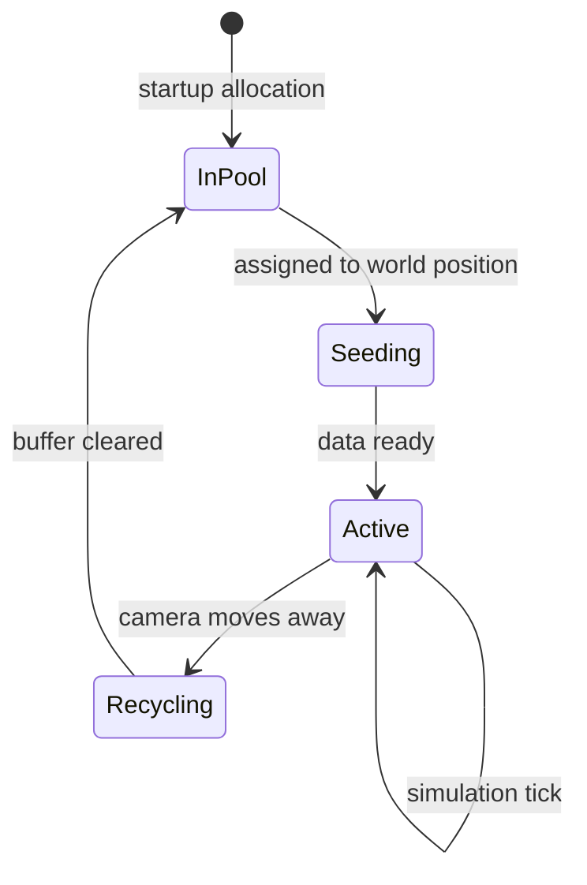
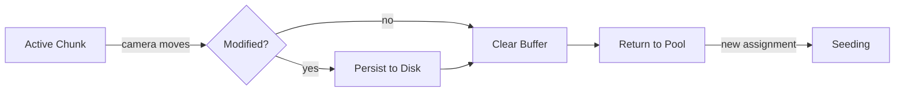

# Chunk Pooling

Object pool pattern for zero-allocation chunk management.

## Design Goal

Eliminate runtime memory allocations during gameplay. All chunk buffers are allocated once at startup and reused throughout the session. This prevents allocation spikes, fragmentation, and garbage collection pauses.

## Pool Structure

The pool consists of:

- **Fixed chunk count** - Sized to match the active region dimensions
- **Uniform chunk buffers** - Each chunk has identical pixel dimensions
- **Pre-allocated memory** - Total pool memory is chunk count × chunk buffer size

See [Configuration Reference](configuration.md) for tunable parameters.

## Chunk Lifecycle

## State Descriptions

### In Pool
- Buffer memory is allocated but unassigned
- No world position associated
- Ready for immediate assignment without allocation

### Seeding
- Assigned to a specific world coordinate (chunk position)
- Chunk seeder is filling the buffer with initial data
- May be async if loading from disk

### Active
- Fully initialized and part of the active region
- Participates in simulation each tick
- Rendered to the screen
- May be modified by player interaction

### Recycling
- Camera has moved, chunk is no longer in active region
- If modified, optionally persisted to disk
- Buffer contents cleared (zeroed or marked invalid)
- Returns to pool for reuse

## Buffer Reuse Pattern

When a chunk is recycled:

The buffer is never deallocated. Instead:

1. **Clear** - Zero the pixel buffer or mark as uninitialized
2. **Reassign** - Update the chunk's world position
3. **Refill** - Chunk seeder writes new data into the same buffer

## Benefits

- **Predictable memory usage** - No allocation spikes during exploration
- **No fragmentation** - Fixed-size buffers prevent heap fragmentation
- **Cache-friendly** - Buffers can be aligned and laid out optimally
- **Deterministic performance** - No garbage collection or allocator latency

## Related Documentation

- [Streaming Window](streaming-window.md) - Decides when chunks enter/leave the pool
- [Chunk Seeding](chunk-seeding.md) - Fills pooled chunks with data
- [Configuration Reference](configuration.md) - Pool size and chunk parameters
- [Architecture Overview](README.md)
