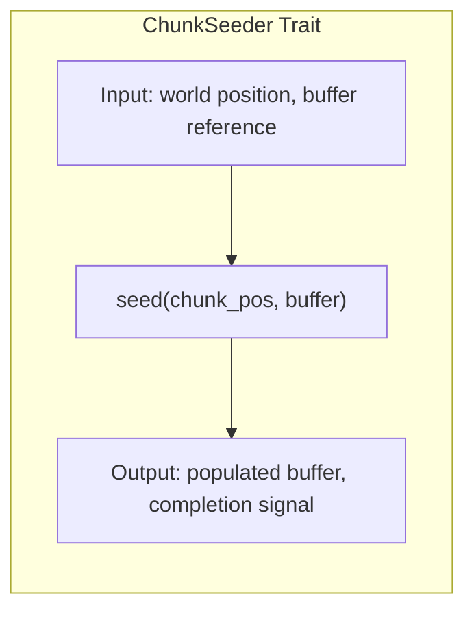
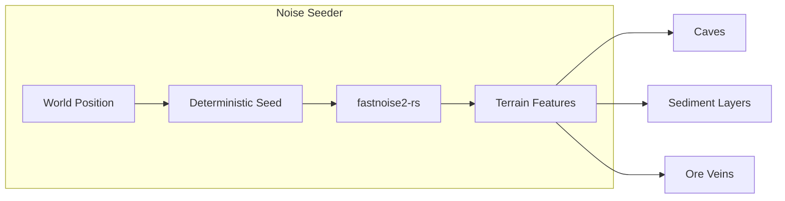
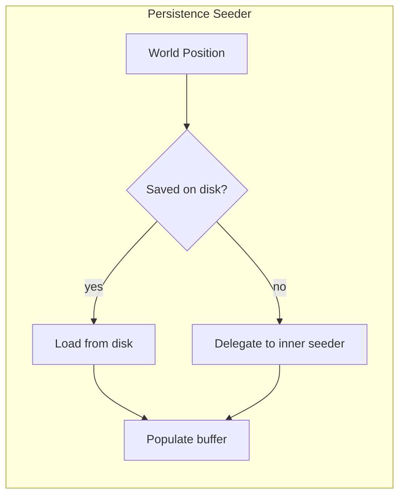
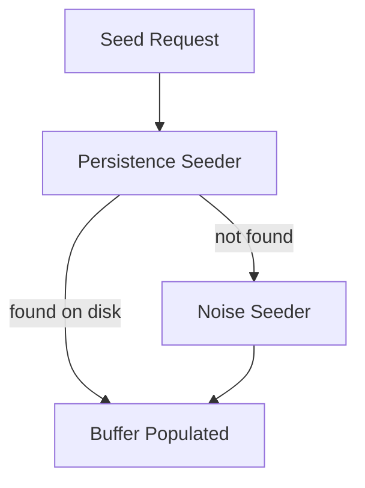
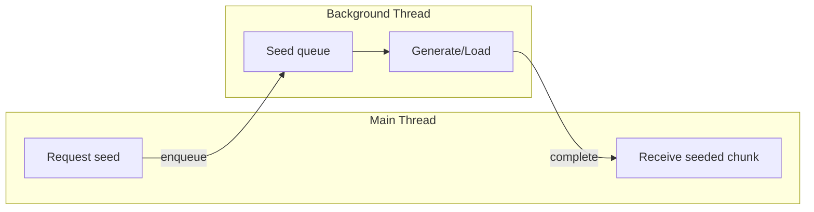
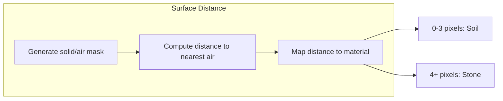

# Chunk Seeding

Trait abstraction for populating empty chunks with initial pixel data.

## Overview

When a chunk is assigned to a new world position, it needs initial pixel data. The **ChunkSeeder** trait provides a
pluggable interface for generating this data, supporting both procedural generation and disk persistence.

## ChunkSeeder Trait

The seeder trait defines how chunk buffers are populated:

| Method     | Purpose                                              |
|------------|------------------------------------------------------|
| `seed`     | Fill buffer with pixel data for given world position |
| `is_async` | Whether seeding may block (disk I/O)                 |

## Implementation: Noise Seeder

Procedural terrain generation using coherent noise.

### Characteristics

| Property      | Value                                            |
|---------------|--------------------------------------------------|
| Deterministic | Same world position always produces same terrain |
| Infinite      | Any world coordinate can be generated            |
| Stateless     | No disk I/O required                             |
| Fast          | Suitable for real-time generation                |

### Terrain Generation Pipeline

A basic proof-of-concept pipeline for initial development:

1. **Height map** - 2D noise determines surface elevation
2. **Layer placement** - Depth-based material assignment (dirt, stone, bedrock)
3. **Cave carving** - 3D noise creates underground cavities (optional)

This serves as a minimal seeder example. For production-quality worlds, see [PCG World Ideas](pcg-ideas.md) for advanced
generation with WFC, stamps, and hierarchical content.

### Noise Configuration

| Noise Type | Use Case                         |
|------------|----------------------------------|
| Perlin     | Smooth terrain elevation         |
| Simplex    | Cave systems, organic shapes     |
| Cellular   | Ore clusters, crystal formations |
| Value      | Background variation             |

## Implementation: Persistence Seeder

Disk-based storage for modified chunks. Wraps another seeder and checks disk before delegating.

The persistence seeder is a decorator—it wraps a noise seeder (or any other seeder) and intercepts requests to check
for saved data first.

See [Chunk Persistence](chunk-persistence.md) for:

- Save file binary format
- Page table structure for random access
- Compression strategy (LZ4, delta encoding)
- Dirty tracking and write paths
- Large file optimizations

## Seeder Composition

Multiple seeders can be chained with fallback behavior:

This enables:

- Player modifications persist to disk
- Unvisited areas generate procedurally
- Seamless transition between saved and generated content

## Async Seeding

Seeders that perform I/O (disk, network) should be async to avoid blocking the main thread:

The streaming window requests chunks ahead of the camera, hiding generation/load latency.

### Seeder Threading Model

| Seeder Type | Threading           | Reason                                 |
|-------------|---------------------|----------------------------------------|
| Noise       | Background pool     | CPU-bound, benefits from parallelism   |
| Persistence | Dedicated I/O       | Disk-bound, avoid head contention      |
| Hybrid      | I/O with CPU assist | Check disk, then parallel generate     |

## Surface Distance Coloring

A technique for assigning materials based on distance to air:

This creates natural-looking terrain with surface soil transitioning to deeper stone.

### Algorithm

1. Generate noise, threshold to solid/air
2. For each solid pixel, calculate distance to nearest air (flood fill or jump flood)
3. Map distance ranges to materials

### Color Variation

Within each material, use the pixel's `ColorIndex` field for variation:

- Sample secondary noise at pixel position
- Map to palette index (0-255)
- Material's palette provides actual RGB values

This prevents flat, uniform terrain while keeping material identity consistent.

## Related Documentation

- [Chunk Persistence](chunk-persistence.md) - Save/load system for modified chunks
- [Chunk Pooling](chunk-pooling.md) - Lifecycle that triggers seeding
- [Streaming Window](streaming-window.md) - Determines which chunks need seeding
- [PCG World Ideas](pcg-ideas.md) - Advanced generation with stamps and WFC
- [Materials](materials.md) - Material definitions for seeded pixels
- [Configuration Reference](configuration.md) - Seeder parameters
- [Architecture Overview](README.md)
