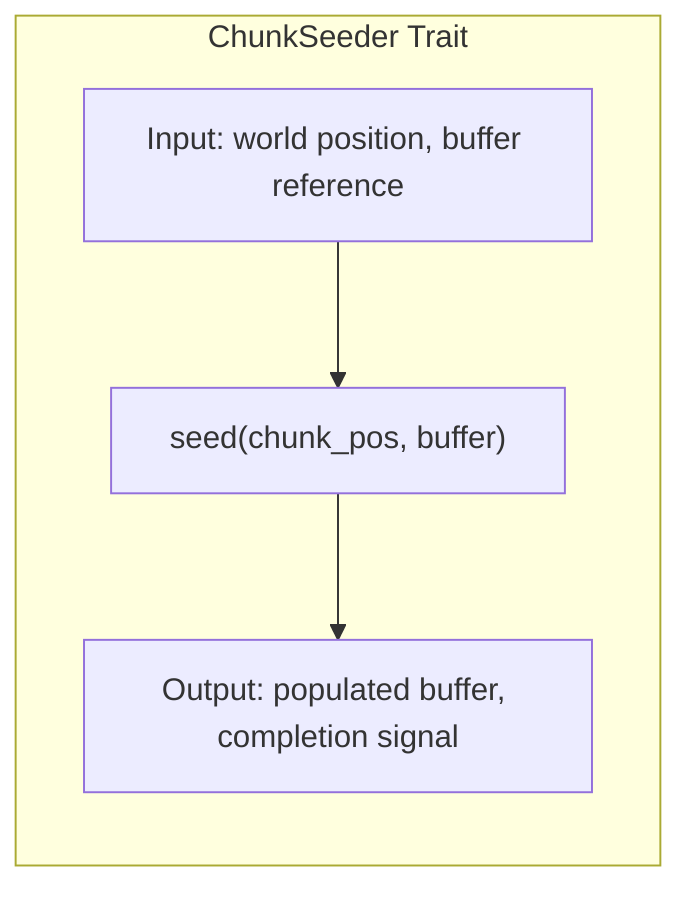
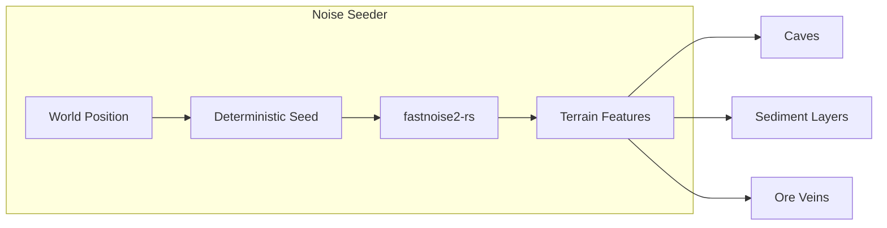
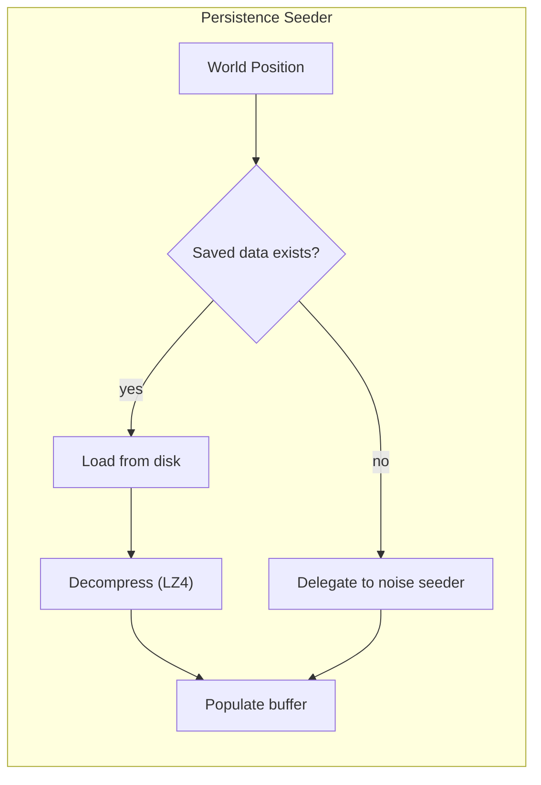
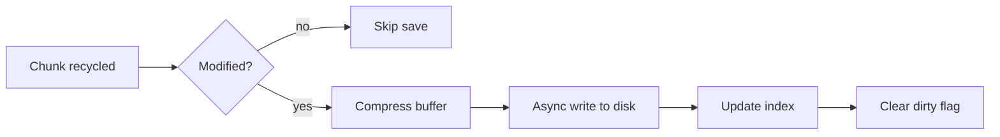
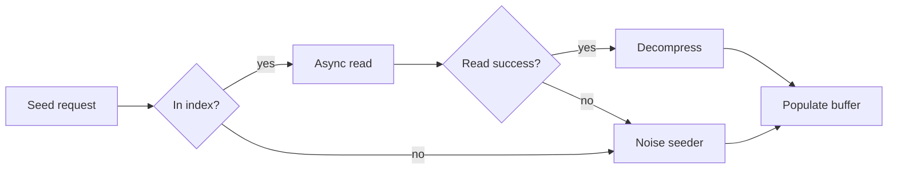
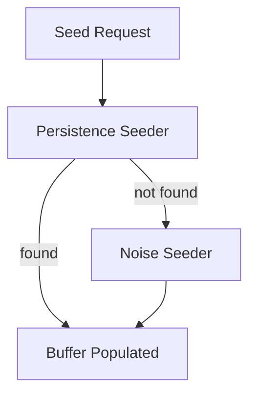
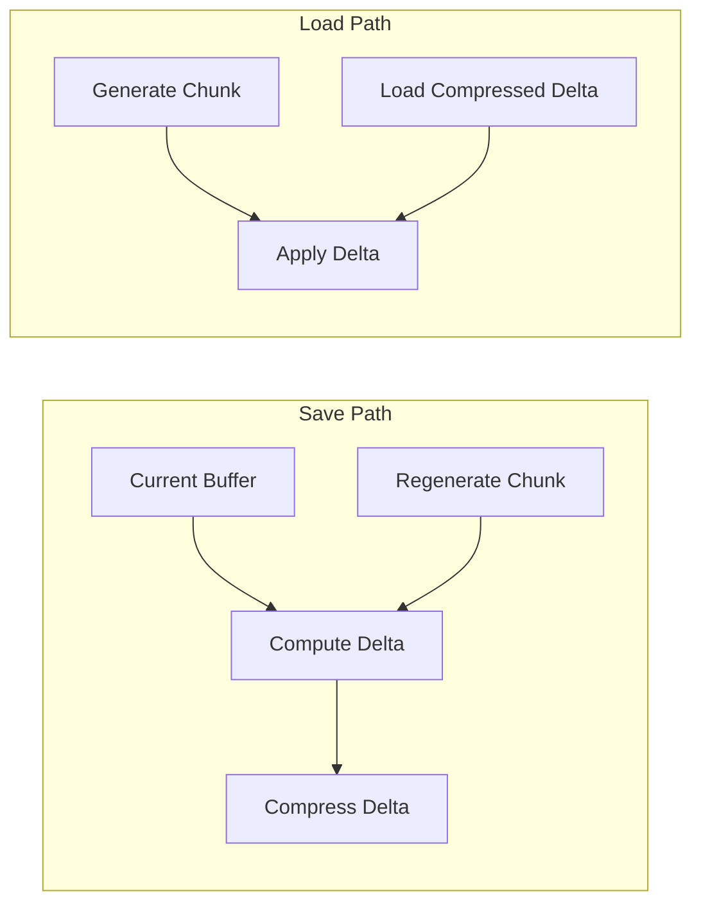

# Chunk Seeding

Trait abstraction for planting initial pixel data into empty chunks.

## Overview

When a chunk is assigned to a new world position, it needs initial pixel data. The **ChunkSeeder** trait provides a
pluggable interface for generating this data, supporting both procedural generation and disk persistence.

## ChunkSeeder Trait

The seeder trait defines how chunk buffers are populated:



| Method     | Purpose                                              |
|------------|------------------------------------------------------|
| `seed`     | Fill buffer with pixel data for given world position |
| `is_async` | Whether seeding may block (disk I/O)                 |

## Implementation: Noise Seeder

Procedural terrain generation using coherent noise.



### Characteristics

| Property      | Value                                            |
|---------------|--------------------------------------------------|
| Deterministic | Same world position always produces same terrain |
| Infinite      | Any world coordinate can be generated            |
| Stateless     | No disk I/O required                             |
| Fast          | Suitable for real-time generation                |

### Terrain Generation Pipeline

A basic proof-of-concept pipeline for initial development:

1. **Height map** - 2D noise determines surface elevation
2. **Layer placement** - Depth-based material assignment (dirt, stone, bedrock)
3. **Cave carving** - 3D noise creates underground cavities (optional)

This serves as a minimal seeder example. For production-quality worlds, see [PCG World Ideas](pcg-ideas.md) for advanced
generation with WFC, stamps, and hierarchical content.

### Noise Configuration

| Noise Type | Use Case                         |
|------------|----------------------------------|
| Perlin     | Smooth terrain elevation         |
| Simplex    | Cave systems, organic shapes     |
| Cellular   | Ore clusters, crystal formations |
| Value      | Background variation             |

## Implementation: Persistence Seeder

Disk-based storage for modified chunks.



### Features

| Feature        | Description                                         |
|----------------|-----------------------------------------------------|
| Async I/O      | Non-blocking disk operations                        |
| Compression    | LZ4 for fast compress/decompress                    |
| Dirty tracking | Only save chunks that were modified                 |
| Fallback chain | Missing data falls through to procedural generation |

### Storage Format

| Component              | Purpose                            |
|------------------------|------------------------------------|
| Chunk index            | Maps world position to file offset |
| Compressed data        | LZ4-compressed pixel buffer        |
| Modification timestamp | For cache invalidation             |
| Checksum               | Data integrity verification        |

### Write Path (Recycling)



### Read Path (Seeding)



## Seeder Composition

Multiple seeders can be chained with fallback behavior:



This enables:

- Player modifications persist to disk
- Unvisited areas generate procedurally
- Seamless transition between saved and generated content

For more complex generation strategies involving stamps, WFC, and hierarchical content,
see [PCG World Ideas](pcg-ideas.md).

## Delta Persistence Optimization

Rather than storing entire chunk buffers, store only the difference from the procedurally generated state.

### Concept



### Benefits

| Aspect             | Full Storage | Delta Storage           |
|--------------------|--------------|-------------------------|
| Unmodified chunk   | Full buffer  | Nothing (skip)          |
| Minor edits        | Full buffer  | Sparse delta            |
| Heavy modification | Full buffer  | Delta (or fallback)     |
| Compression ratio  | Moderate     | Excellent (sparse data) |

### Storage Cases

| Case                 | Storage Strategy                                              |
|----------------------|---------------------------------------------------------------|
| **Unmodified**       | No storage needed - regenerate from noise                     |
| **Modified**         | Compressed delta of changed pixels                            |
| **Entirely erased**  | Single flag byte indicating empty - no delta needed           |
| **Heavily modified** | Delta, or fallback to full storage if delta exceeds threshold |

The "entirely erased" case deserves explicit handling rather than relying on LZ4 to collapse an all-zero delta. A single
sentinel value is cleaner and faster to detect.

### Delta Format (Conceptual)

[needs clarification: exact binary format and endianness - to be addressed during implementation]

**Planned approach:**

- Idiomatic Rust structure marshalling into a streamable map format
- Spatial cell lookup for fast loading times
- Minimal paging information on disk
- Runtime-built efficiency lookup structure

```
Delta entry: [position: u32][old_pixel: u32][new_pixel: u32]
  - position: linear index into chunk buffer
  - old_pixel: expected value (for validation/merge conflicts)
  - new_pixel: replacement value

Compressed payload:
  [entry_count: u32][lz4_compressed_entries...]

Special markers:
  - entry_count = 0: chunk matches procedural generation
  - entry_count = 0xFFFFFFFF: chunk entirely empty (void)
```

### Trade-offs

| Consideration     | Impact                                              |
|-------------------|-----------------------------------------------------|
| Load cost         | Must regenerate procedurally before applying delta  |
| Save cost         | Must regenerate to compute diff                     |
| CPU vs Storage    | Trades compute for disk space                       |
| Noise determinism | **Critical** - noise must be perfectly reproducible |

The regeneration cost is acceptable because noise generation is fast and chunks load asynchronously. The storage savings
compound significantly in large worlds with sparse modifications.

### When to Use Full Storage

Fall back to full buffer storage when:

- Delta size exceeds ~50% of full buffer size
- Chunk uses non-deterministic seeding (e.g., runtime-randomized features)
- Migration from older save format

## Dirty Tracking

Efficient persistence requires tracking which chunks have been modified:

| State     | Meaning                       | Save Behavior               |
|-----------|-------------------------------|-----------------------------|
| Clean     | Matches procedural generation | Skip save                   |
| Dirty     | Player modified               | Save on recycle             |
| Persisted | Saved to disk                 | Save only if modified again |

## Related Documentation

- [Chunk Pooling](chunk-pooling.md) - Lifecycle that triggers seeding
- [Streaming Window](streaming-window.md) - Determines which chunks need seeding
- [PCG World Ideas](pcg-ideas.md) - Advanced generation with stamps and WFC
- [Configuration Reference](configuration.md) - Seeder parameters
- [Architecture Overview](README.md)
