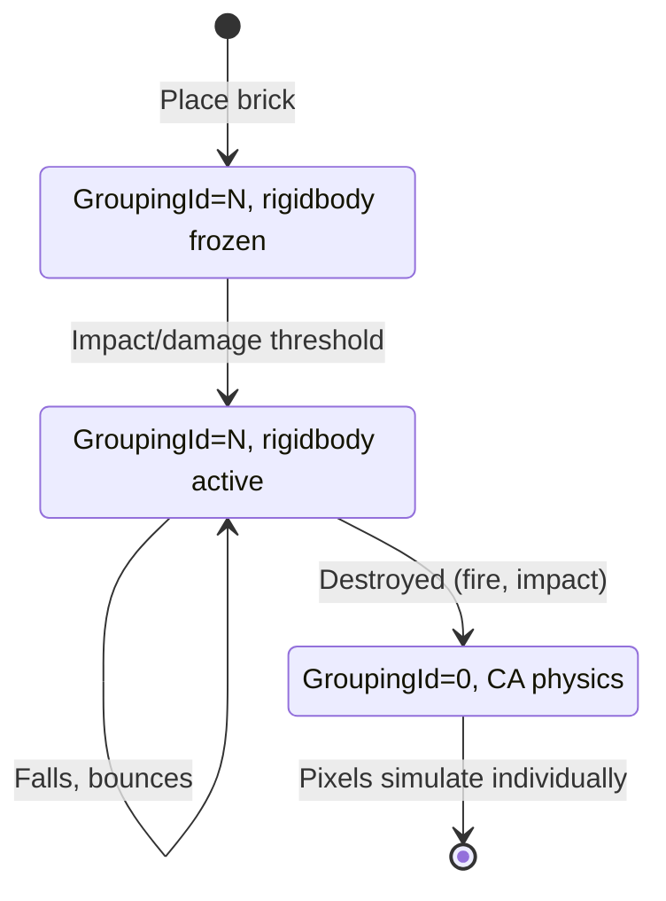
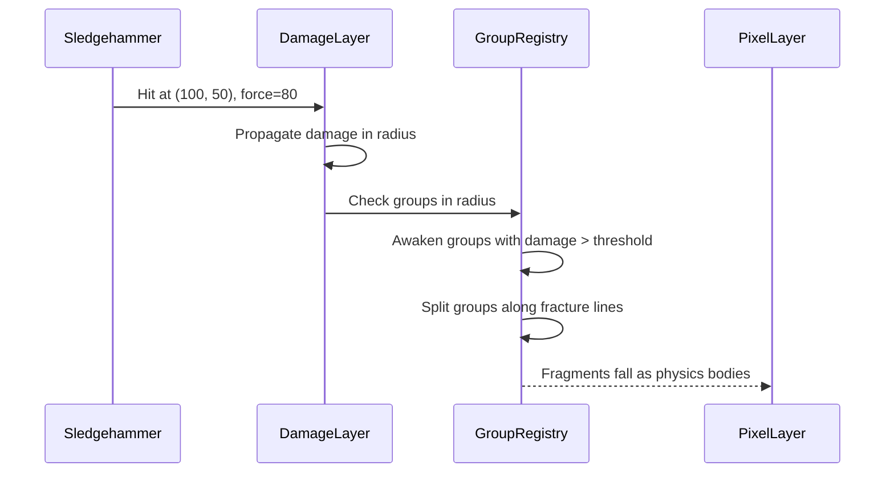

# Unified Grouping

Bricks and pixel bodies are the same concept: groups of pixels that move and interact as units.

## Core Insight

A **brick** is just a **sleeping pixel body**.

```
GroupingId = 0:  Individual pixel, simulated by CA physics (terrain)
GroupingId > 0:  Belongs to group N
  └── Group N sleeping:  Static, part of structure (brick in wall)
  └── Group N awake:     Physics-simulated pixel body (falling brick)
```

## GroupingLayer

```rust
struct GroupingLayer;
impl Layer for GroupingLayer {
    type Element = GroupingId;  // u16: 0 = none, 1+ = group ID
    const SAMPLE_RATE: u32 = 1;
    const NAME: &'static str = "grouping";
}
```

**Why swap-follow?** When pixels move (gravity, fluid flow), their group membership moves with them. A brick pixel that falls is still part of its brick.

**Why u16?** Supports up to 65,535 groups per world. Larger worlds can use spatial partitioning.

## State Transitions



| State | GroupingId | Rigidbody | Simulation |
|-------|------------|-----------|------------|
| **Sleeping** | N (group ID) | Frozen | None (static) |
| **Awake** | N (group ID) | Active | Rapier physics |
| **Released** | 0 | None | CA pixel physics |

## Group Metadata

Stored separately from GroupingLayer (not per-pixel):

```rust
struct PixelGroup {
    id: GroupingId,
    state: GroupState,        // Sleeping | Awake
    rigidbody: Option<Entity>,
    damage: u8,
}

enum GroupState {
    Sleeping,  // Static, part of structure
    Awake,     // Active physics body
}
```

## Unified Workflow

### Building/Placement

```
1. Player places brick
2. Create new PixelGroup (id = next_id, state = Sleeping)
3. Set GroupingId for all pixels in brick shape
4. Create frozen rigidbody for collision
```

### Destruction

```
1. Attack hits brick
2. Damage accumulates on PixelGroup
3. If damage > threshold:
   a. Awaken group (unfreeze rigidbody)
   b. Group falls as physics body
4. If destroyed completely:
   a. Set GroupingId = 0 for all pixels
   b. Remove rigidbody
   c. Pixels simulate individually (sand/ash/debris)
```

## Framework vs Demo

### Framework Provides

| API | Purpose |
|-----|---------|
| `GroupingLayer` | Per-pixel group membership (u16, swap-follow) |
| `GroupRegistry` | Manages group metadata, sleeping/awake state |
| `groups.awaken(id)` | Wake a sleeping body |
| `groups.split(id, regions)` | Split body into fragments |
| `groups.release(id)` | Set all pixels to GroupingId = 0 |

### Demo Game Implements

| Feature | Responsibility |
|---------|----------------|
| Crack simulation | Possibly sequential, needs connected region tracking |
| Damage threshold logic | When to awaken vs destroy |
| Fracture point detection | Where to split bodies |
| Attack propagation | Shockwave/damage radius |

## Example: Sledgehammer vs Brick Wall



### Attack Mechanics (Demo)

```
1. Attack hits point P with force F
2. Damage radiates outward (shockwave)
3. DamageLayer accumulates at each position
4. Sleeping bodies in radius are awakened
5. Bodies with damage > threshold split along fracture lines
```

### Body Splitting Logic (Demo)

```
When accumulated damage at position exceeds threshold:
  1. Mark position as "fracture point"
  2. Flood-fill from fracture to find connected regions
  3. Each disconnected region becomes new body
  4. Call groups.split() with region info
```

## Burning Propagation Example

```
1. Fire touches brick edge
2. Burning spreads to brick pixels
3. Brick accumulates damage
4. Damage threshold exceeded → brick awakens
5. Brick falls (physics body)
6. More burning → brick destroyed
7. GroupingId = 0 for all pixels → sand/ash simulation
```

## Benefits of Unified Model

| Aspect | Unified Model |
|--------|---------------|
| Terraria-style building | Place sleeping groups |
| Destruction | Awaken then destroy |
| Pixel bodies | Same system, just start awake |
| Burning/decay | Damages groups, triggers state changes |
| Memory | One GroupingLayer instead of separate systems |

## Layer Hierarchy

```
PixelLayer (innate, 2 bytes)
├── material: MaterialId (u8)
└── flags: PixelFlags (u8)

ColorLayer (opt-in, swap-follow, 1 byte)
└── color: ColorIndex (u8)

DamageLayer (opt-in, swap-follow, 1 byte)
└── damage: u8

GroupingLayer (opt-in, swap-follow, 2 bytes)
└── group_id: GroupingId (u16)  // 0 = none, 1+ = group

HeatLayer (opt-in, positional, 1 byte, sample_rate: 4)
└── heat: u8
```

## Design Questions

### Does your game need grouping?

| Game Type | Recommendation |
|-----------|----------------|
| Building/destruction (Terraria-style) | Yes, use GroupingLayer |
| Pure falling sand | No, skip GroupingLayer |
| Physics puzzles with breakable objects | Yes |
| Terrain-only sandbox | No |

### Does your data belong to the pixel or the group?

| Data | Location |
|------|----------|
| Group membership | Per-pixel (GroupingLayer) |
| Group damage | Per-group (GroupRegistry) |
| Group state | Per-group (GroupRegistry) |
| Rigidbody reference | Per-group (GroupRegistry) |

## Related Documentation

- [Pixel Layers](pixel-layers.md) - Layer system and swap-follow mechanics
- [Simulation Extensibility](simulation-extensibility.md) - Implementing custom simulations
- [Architecture Overview](../README.md)
