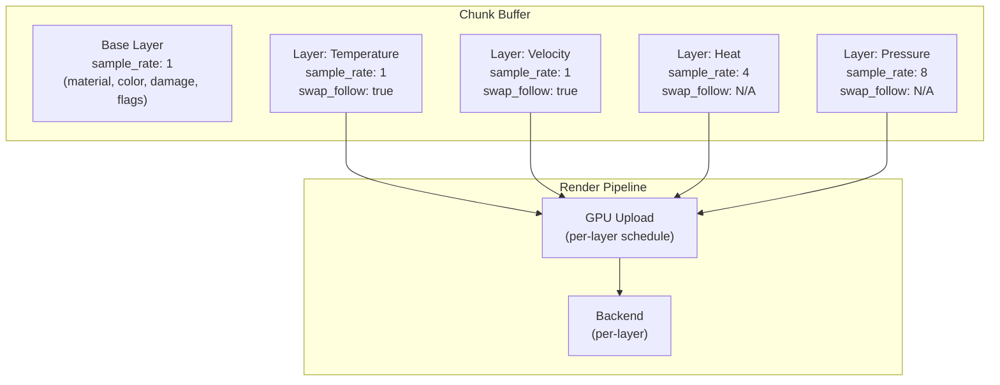
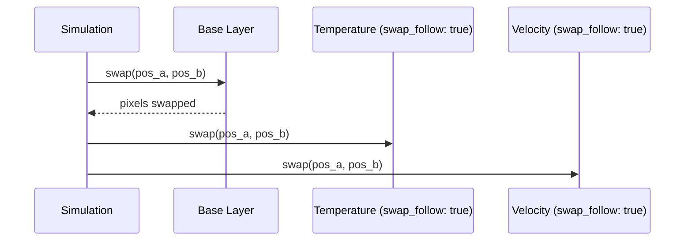
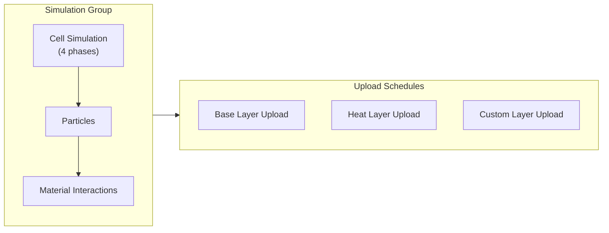

# Pixel Layers

Unified layer system for per-pixel and downsampled metadata.

## Overview

All auxiliary data uses the same layer abstraction. The **sample rate** parameter determines resolution and available features:

| Sample Rate | Resolution | Cells per Chunk (512×512) | Swap-Follow | Use Case |
|-------------|------------|---------------------------|-------------|----------|
| 1 | 1:1 with pixels | 262,144 | Available | Temperature, velocity, age |
| 4 | 4×4 pixels per cell | 16,384 | N/A | Heat map, moisture zones |
| 8 | 8×8 pixels per cell | 4,096 | N/A | Pressure regions, light |

## Architecture



## Layer Definition

Each layer declares its properties at registration:

```
trait Layer {
    /// Element type stored in this layer
    type Element: Copy + Default;

    /// Pixels per cell (1 = full resolution, 4 = 4×4, etc.)
    const SAMPLE_RATE: u32;

    /// Layer name for debugging and serialization
    const NAME: &'static str;
}
```

### Sample Rate

Determines the resolution ratio between pixels and layer cells:

| Sample Rate | Meaning | Memory Reduction |
|-------------|---------|------------------|
| 1 | One cell per pixel | None (full resolution) |
| 2 | One cell per 2×2 pixels | 4× |
| 4 | One cell per 4×4 pixels | 16× |
| 8 | One cell per 8×8 pixels | 64× |

**Coordinate mapping:**

```
layer_x = pixel_x / sample_rate
layer_y = pixel_y / sample_rate
```

## Base Layer

The core pixel format is the implicit base layer with `sample_rate: 1`:

| Field | Type | Purpose |
|-------|------|---------|
| Material | u8 | Type identifier |
| Color | u8 | Palette index |
| Damage | u8 | Accumulated damage |
| Flags | u8 | Simulation state bits |

**Total: 4 bytes per pixel**

See [Pixel Format](../foundational/pixel-format.md) for full specification.

### Stability Guarantee

The base layer format will not change within a major version. Extension layers exist specifically to avoid breaking this contract.

## Swap-Follow

Layers with `sample_rate: 1` can opt into synchronized swapping with the base layer.

### Behavior

When enabled (default for `sample_rate: 1`):



### Configuration

```
struct LayerConfig {
    /// Follow base layer swaps (only valid when sample_rate = 1)
    swap_follow: bool,  // default: true

    /// Save to disk or resimulate on load
    persistent: bool,   // default: false
}
```

| Sample Rate | swap_follow | Behavior |
|-------------|-------------|----------|
| 1 | true (default) | Layer data moves with pixels |
| 1 | false | Layer data stays at position (spatial field) |
| > 1 | N/A | Coarse resolution, no pixel correspondence |

### Use Cases

**swap_follow: true** (default)
- Temperature that belongs to the pixel (hot lava stays hot when falling)
- Velocity/momentum (pixel carries its motion)
- Age (pixel's lifetime counter)

**swap_follow: false**
- Spatial fields (wind direction at a location)
- Environmental zones (radiation level at position)

## Downsampled Layers

Layers with `sample_rate > 1` store coarse data that applies to pixel regions:

### Heat Layer Example

```
struct HeatLayer;

impl Layer for HeatLayer {
    type Element = u8;  // 0-255 temperature
    const SAMPLE_RATE: u32 = 4;
    const NAME: &'static str = "heat";
}
```

**Properties:**
- One heat cell per 4×4 pixel region
- 16× memory reduction vs full resolution
- Smooth gradients more physically plausible than per-pixel heat

### Aggregation

Downsampled layers aggregate from pixels or propagate between cells:

```
// Heat accumulation from burning pixels
for pixel in cell_region {
    if pixel.flags.burning {
        cell.heat += BURN_HEAT;
    }
}

// Diffusion between cells
new_heat = (self + neighbors.avg()) / 2 * cooling_factor;
```

## Render Modularity

Each layer controls its own GPU upload pipeline.

### Scheduling Model

All upload schedules run **after** the pixel simulation group completes:



### Default Schedule

The default upload schedule:

1. Runs after each simulation group tick
2. Checks chunk dirty flag
3. Uploads only if dirty

```
struct DefaultUploadSchedule;

impl UploadSchedule for DefaultUploadSchedule {
    fn should_upload(&self, chunk: &Chunk, tick: u64) -> bool {
        chunk.is_dirty()
    }

    fn tick_divisor(&self) -> u32 {
        1  // every simulation tick
    }
}
```

### Custom Schedules

Custom schedules can modify both the check logic and tick rate:

```
trait UploadSchedule {
    /// Custom condition for upload (default: dirty check)
    fn should_upload(&self, chunk: &Chunk, tick: u64) -> bool;

    /// Run every N simulation ticks (1 = every tick, 4 = every 4th tick)
    fn tick_divisor(&self) -> u32;
}
```

### Schedule Presets

| Preset | `tick_divisor` | Check | Use Case |
|--------|----------------|-------|----------|
| `OnChange` | 1 | Dirty flag | Base pixels - immediate visual feedback |
| `Periodic(n)` | n | Always true | Heat - interpolation hides latency |
| `OnChangeThrottled(n)` | n | Dirty flag | Large layers - reduce upload frequency |
| `Never` | - | Always false | Velocity - simulation-only, not rendered |

### Examples

| Layer | Schedule | Behavior |
|-------|----------|----------|
| Base pixels | `OnChange` | Upload every tick if any pixel changed |
| Heat | `Periodic(4)` | Upload every 4th tick unconditionally |
| Moisture | `OnChangeThrottled(2)` | Upload every 2nd tick if dirty |
| Velocity | `Never` | No GPU upload, CPU-only |

### Backend Integration

Layers provide render data through the `LayerRender` trait:

```
trait LayerRender {
    /// Upload schedule for this layer
    fn schedule(&self) -> &dyn UploadSchedule;

    /// Called when schedule triggers upload
    fn upload(&self, gpu: &mut GpuContext);

    /// Shader uniform binding (if any)
    fn binding(&self) -> Option<BindGroup>;
}
```

**Shader integration examples:**
- Heat layer → uniform buffer for glow tinting
- Moisture layer → wet sheen intensity multiplier
- Custom layer → game-specific visual effects

## Persistence

Layers are either **persistent** (saved to disk) or **transient** (resimulated on load).

### Persistent Layers

Saved alongside base pixel data in chunk files:

| Property | Behavior |
|----------|----------|
| Serialization | Binary format, streamed with chunk |
| Load | Read from disk, ready immediately |
| Use case | Source-of-truth data that can't be derived |

**Examples:**
- Base pixel layer (always persistent)
- Player-placed markers or ownership data
- Light/visibility (fog of war - explored areas stay revealed)
- Accumulated damage that affects gameplay

### Transient Layers

Not saved; regenerated when chunk loads:

| Property | Behavior |
|----------|----------|
| Serialization | None |
| Load | Initialized to default, resimulated |
| Use case | Derived/computed data |

**Examples:**
- Heat (derived from burning pixels, diffuses from neighbors)
- Velocity cache (derived from recent movement)
- Collision cache (derived from solid pixels)

### Configuration

```
// Persistent: saved to disk
world.register_layer::<OwnershipLayer>(LayerConfig {
    persistent: true,
    ..default()
});

// Transient: resimulated on load (default)
world.register_layer::<HeatLayer>(LayerConfig {
    persistent: false,  // default
    ..default()
});
```

### Chunk File Format

Persistent layers append to chunk save format:

```
ChunkFile:
  header: ChunkHeader
  base_pixels: [Pixel; CHUNK_SIZE²]
  layer_ownership: [u8; CHUNK_SIZE²]    // if registered + persistent
  layer_custom: [T; cells]              // if registered + persistent
```

See [Chunk Persistence](../persistence/chunk-persistence.md) for save format details.

## Memory Layout

All layers use SoA (Structure of Arrays) for cache efficiency:

```
Base pixels:  [P0, P1, P2, P3, P4, ...]     // 4 bytes each, 262k cells
Temperature:  [T0, T1, T2, T3, T4, ...]     // 1 byte each,  262k cells
Heat:         [H0, H1, H2, H3, ...]         // 1 byte each,  16k cells
Pressure:     [R0, R1, R2, ...]             // 2 bytes each, 4k cells
```

### Memory Example

For a 512×512 chunk:

| Layer | Sample Rate | Cells | Per-Cell | Total |
|-------|-------------|-------|----------|-------|
| Base | 1 | 262,144 | 4 bytes | 1 MB |
| Temperature | 1 | 262,144 | 1 byte | 256 KB |
| Velocity | 1 | 262,144 | 2 bytes | 512 KB |
| Heat | 4 | 16,384 | 1 byte | 16 KB |
| Pressure | 8 | 4,096 | 2 bytes | 8 KB |
| **Total** | | | | ~1.8 MB |

## Registration

Layers are registered at startup:

```
world.register_layer::<TemperatureLayer>(LayerConfig {
    swap_follow: true,
    persistent: true,  // save pixel temperatures
});

world.register_layer::<HeatLayer>(LayerConfig::default());  // transient, resimulates
```

### Requirements

| Requirement | Rationale |
|-------------|-----------|
| Register before first chunk | Ensures all chunks have consistent layers |
| Fixed set per session | Dynamic registration would complicate sync |
| Declare sample rate at compile time | Enables static allocation sizing |

## Related Documentation

- [Pixel Format](../foundational/pixel-format.md) - Base layer specification
- [Simulation](../simulation/simulation.md) - Heat layer propagation, swap mechanics
- [Simulation Extensibility](simulation-extensibility.md) - Custom rules using layer data
- [Rendering Backends](rendering-backends.md) - Backend integration for layer rendering
- [Chunk Pooling](../chunk-management/chunk-pooling.md) - Chunk lifecycle and layer allocation
- [Chunk Persistence](../persistence/chunk-persistence.md) - Save format for persistent layers
- [Architecture Overview](../README.md)
