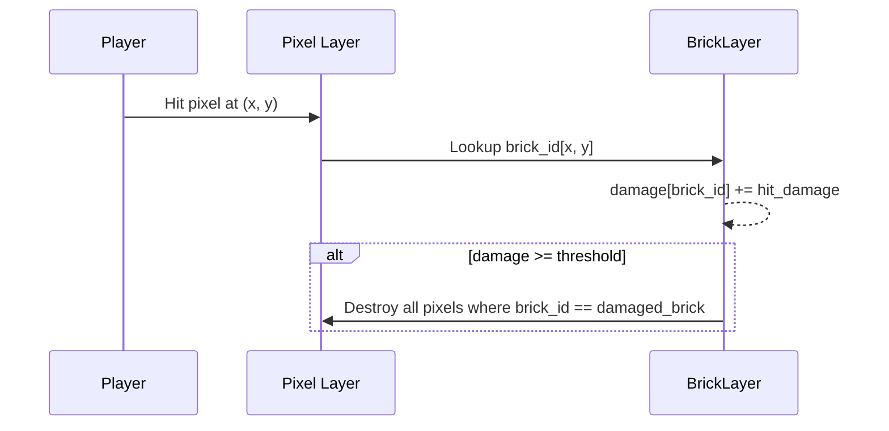
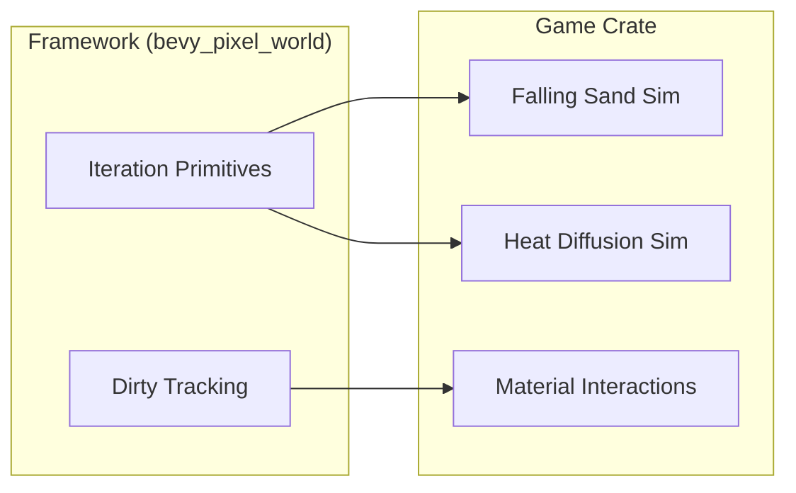
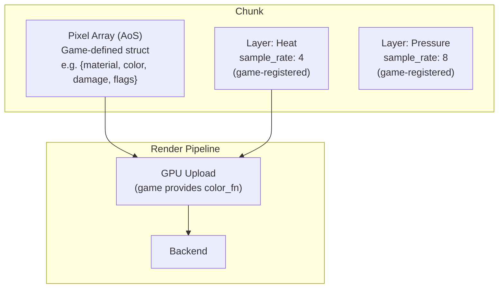
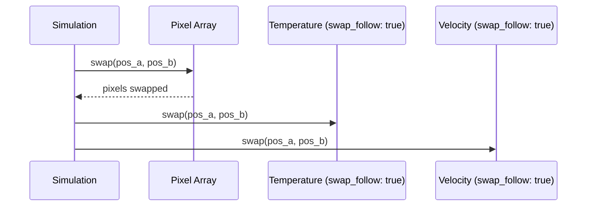
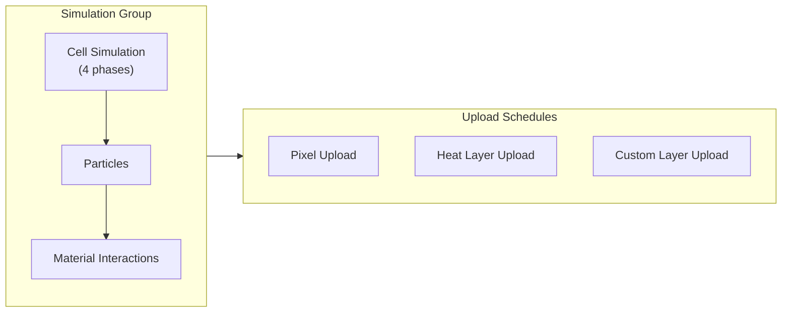

# Pixel Layers

> **Status: Planned Architecture**
>
> This document describes a planned layer system. Current implementation uses a monolithic 4-byte `Pixel` struct (material, color, damage, flags). The macros and generic infrastructure described here are not yet implemented.

Modular layer system where the **game defines its own pixel structure**.

## Core Concept

**Radical modularity:** The framework has no opinion about what a pixel contains.

- Framework provides: `Chunk<T>`, `Canvas<T>`, iteration primitives
- Framework requires: `T: Copy + Default + 'static` (nothing else)
- Game defines: pixel struct with whatever fields it needs

```
// Framework doesn't care what's in here
GamePixel {
    material: u8,     // game concept
    color: u8,        // game concept
    damage: u8,       // game concept
    flags: u8,        // game concept
}

// Framework just stores T and provides spatial operations
Chunk<GamePixel>
Canvas<GamePixel>
PixelWorld<GamePixel>
```

## Demo Game as Reference

The demo game shows one way to structure pixels. Users clone and modify.

```
Demo Game Pixel (4 bytes):
  Material: u8    // indexes game's material registry
  Color: u8       // palette index for rendering
  Damage: u8      // accumulated damage
  Flags: u8       // dirty, solid, falling, burning, etc.

Your Game Pixel (whatever you need):
  // Define your own fields, your own meaning
```

This is not a "bundle system" with presets. It's "here's how we did it, adapt to your needs."

## Separate Layers (SoA)

Beyond the pixel struct (AoS), games can register separate layers stored as Structure-of-Arrays:

| Layer | Type | Sample Rate | Purpose |
|-------|------|-------------|---------|
| Temperature | u8 | 1 | Per-pixel temperature (swaps with pixel) |
| Velocity | (i8, i8) | 1 | Pixel momentum (swaps with pixel) |
| Heat | u8 | 4 | Thermal diffusion (downsampled, spatial) |
| Pressure | u16 | 8 | Fluid/gas pressure (downsampled, spatial) |

These are defined and registered by the game, not the framework.

## Brick Layer (Demo Game Example)

A reference implementation for block-based destruction gameplay, included in the demo game. Copy and adapt as needed.

### Concept

Bricks subdivide chunks into destructible blocks. Players hit pixels, damage accumulates per-brick, and when threshold is exceeded, all pixels in that brick are destroyed.

```
BrickLayer<const GRID: usize = 16> {
    // Full resolution - which brick each pixel belongs to
    id: [BrickId; CHUNK_SIZE²],

    // Downsampled - one damage value per brick
    damage: [u8; GRID²],
}
```

The const generic `GRID` controls everything:

| GRID | Bricks | Brick Pixels | Id Type | Damage Cells |
|------|--------|--------------|---------|--------------|
| 16 | 256 | CHUNK_SIZE/16 | u8 | 256 |
| 32 | 1024 | CHUNK_SIZE/32 | u16 | 1024 |
| 64 | 4096 | CHUNK_SIZE/64 | u16 | 4096 |

**BrickId type derivation:**
- `GRID² ≤ 256` → `u8`
- `GRID² > 256` → `u16`

### Sample Rates

| Sub-layer | Sample Rate | Formula |
|-----------|-------------|---------|
| `id` | 1 | Full resolution (pixel → brick mapping) |
| `damage` | CHUNK_SIZE / GRID | One cell per brick |

For a 512×512 chunk with `GRID = 16`:
- Brick pixel size: 512 / 16 = 32×32 pixels per brick
- Damage sample rate: 32 (matches brick size)
- 256 bricks, 256 damage cells

### Usage

Since both CHUNK_SIZE and GRID are compile-time constants, a macro generates the layer types:

```
define_brick_layer!(GameBrickLayer, chunk_size: 512, grid: 16);
// Generates BrickIdLayer + BrickDamageLayer with correct types and sizes

// During plugin init:
let brick_handles = GameBrickLayer::register(&mut layer_registry);
commands.insert_resource(brick_handles);

// In systems:
fn brick_damage_system(
    mut chunks: Query<&mut Chunk>,
    brick: Res<BrickLayerHandles>,
) {
    for mut chunk in &mut chunks {
        let ids = chunk.get(brick.id);
        let damage = chunk.get_mut(brick.damage);
        // accumulate damage per brick...
    }
}
```

### Gameplay Flow



### GPU Upload

Both sub-layers are uploaded for shader-based damage visualization:

| Sub-layer | Schedule | Shader Use |
|-----------|----------|------------|
| `id` | `OnChange` | Map pixel to brick for effect lookup |
| `damage` | `Periodic(4)` | Damage overlay (cracks, glow) on whole brick |

The shader combines both: sample `id` to find which brick, sample `damage` to determine visual intensity. Entire brick regions show damage effects uniformly.

### Customization

`BrickLayer` is a reference implementation. For different needs:

- **Different damage type**: Use macro with custom damage type for more granularity
- **Multiple damage types**: Add `fire_damage`, `physical_damage` sub-layers
- **Non-uniform bricks**: Replace uniform grid with runtime-defined brick shapes (loses const-generic benefits)

## Simulation Systems

Simulations are implemented by the game, not the framework.

The framework provides:
- Iteration primitives (checkerboard phasing)
- Chunk dirty tracking
- Bevy system scheduling infrastructure

The game implements:
- All simulation rules (falling, burning, spreading)
- Material interactions
- Heat diffusion
- Any game-specific behavior



## Overview

Two storage patterns:

1. **Pixel struct (AoS):** Game-defined struct, swaps atomically
2. **Separate layers (SoA):** Per-layer arrays, independent lifetime

The **sample rate** parameter determines resolution for separate layers:

| Sample Rate | Resolution | Cells per Chunk (512×512) | Swap-Follow | Use Case |
|-------------|------------|---------------------------|-------------|----------|
| 1 | 1:1 with pixels | 262,144 | Available | Temperature, velocity, age |
| 4 | 4×4 pixels per cell | 16,384 | N/A | Heat map, moisture zones |
| 8 | 8×8 pixels per cell | 4,096 | N/A | Pressure regions, light |

## Architecture



## Separate Layer Definition

For SoA layers registered separately from the pixel struct:

```
trait Layer {
    /// Element type stored in this layer
    type Element: Copy + Default;

    /// Pixels per cell (1 = full resolution, 4 = 4×4, etc.)
    const SAMPLE_RATE: u32;

    /// Layer name for debugging and serialization
    const NAME: &'static str;
}
```

### Sample Rate

Determines the resolution ratio between pixels and layer cells:

| Sample Rate | Meaning | Memory Reduction |
|-------------|---------|------------------|
| 1 | One cell per pixel | None (full resolution) |
| 2 | One cell per 2×2 pixels | 4× |
| 4 | One cell per 4×4 pixels | 16× |
| 8 | One cell per 8×8 pixels | 64× |

**Coordinate mapping:**

```
layer_x = pixel_x / sample_rate
layer_y = pixel_y / sample_rate
```

## Pixel Struct (Game-Defined)

The game defines its pixel struct. Framework doesn't know or care what's in it.

```rust
// Game crate defines this
#[repr(C)]
pub struct GamePixel {
    pub material: u8,  // game concept
    pub color: u8,     // game concept
    pub damage: u8,    // game concept
    pub flags: u8,     // game concept
}

// Framework just needs these bounds
impl Copy for GamePixel {}
impl Default for GamePixel { ... }
```

See the demo game for a reference implementation.

## Swap-Follow

Separate layers with `sample_rate: 1` can opt into synchronized swapping with the pixel array.

### Behavior

When enabled (default for `sample_rate: 1`):



### Configuration

```
struct LayerConfig {
    /// Follow pixel swaps (only valid when sample_rate = 1)
    swap_follow: bool,  // default: true

    /// Save to disk or resimulate on load
    persistent: bool,   // default: false
}
```

| Sample Rate | swap_follow | Behavior |
|-------------|-------------|----------|
| 1 | true (default) | Layer data moves with pixels |
| 1 | false | Layer data stays at position (spatial field) |
| > 1 | N/A | Coarse resolution, no pixel correspondence |

### Use Cases

**swap_follow: true** (default) — Data belongs to the pixel:
- Temperature that belongs to the pixel (hot lava stays hot when falling)
- Velocity/momentum (pixel carries its motion)
- Age (pixel's lifetime counter)

**swap_follow: false** — Data belongs to the location:
- Spatial fields (wind direction at a location)
- Environmental zones (radiation level at position)

### Temperature vs Heat: A Clarifying Example

These two pixel layers sound similar but serve different purposes:

| Layer | Sample Rate | swap_follow | Semantic |
|-------|-------------|-------------|----------|
| Temperature | 1 | true | "This pixel is hot" |
| Heat | 4 | false | "This location is hot" |

**Temperature (sample_rate: 1, swap_follow: true):**
A lava pixel has temperature=255. When it falls through a cold cave, its temperature stays at 255 because the data moves with the pixel. The lava is inherently hot.

**Heat (sample_rate: 4, swap_follow: false):**
The cave has a heat grid at 1/4 resolution. When lava passes through, it *adds* heat to that location. After the lava falls away, the heat persists at that location, slowly diffusing to neighbors and cooling over time. A pixel entering this region reads the ambient heat and might ignite if flammable.

This distinction matters for gameplay:
- A bucket of water dumped on lava cools the *lava pixels* (reduces their Temperature)
- Lava flowing through a cave heats up the *cave region* (increases local Heat)
- An ice golem entering a heated region takes damage from ambient Heat, even if no hot pixels remain

## Downsampled Layers

Layers with `sample_rate > 1` store coarse data that applies to pixel regions:

### Heat Layer Example

```
struct HeatLayer;

impl Layer for HeatLayer {
    type Element = u8;  // 0-255 temperature
    const SAMPLE_RATE: u32 = 4;
    const NAME: &'static str = "heat";
}
```

**Properties:**
- One heat cell per 4×4 pixel region
- 16× memory reduction vs full resolution
- Smooth gradients more physically plausible than per-pixel heat

### Aggregation

Downsampled layers aggregate from pixels or propagate between cells:

```
// Heat accumulation from burning pixels
for pixel in cell_region {
    if pixel.flags.burning {
        cell.heat += BURN_HEAT;
    }
}

// Diffusion between cells
new_heat = (self + neighbors.avg()) / 2 * cooling_factor;
```

## Render Modularity

Each layer controls its own GPU upload pipeline.

### Scheduling Model

All upload schedules run **after** the pixel simulation group completes:



### Default Schedule

The default upload schedule:

1. Runs after each simulation group tick
2. Checks chunk dirty flag
3. Uploads only if dirty

```
struct DefaultUploadSchedule;

impl UploadSchedule for DefaultUploadSchedule {
    fn should_upload(&self, chunk: &Chunk, tick: u64) -> bool {
        chunk.is_dirty()
    }

    fn tick_divisor(&self) -> u32 {
        1  // every simulation tick
    }
}
```

### Custom Schedules

Custom schedules can modify both the check logic and tick rate:

```
trait UploadSchedule {
    /// Custom condition for upload (default: dirty check)
    fn should_upload(&self, chunk: &Chunk, tick: u64) -> bool;

    /// Run every N simulation ticks (1 = every tick, 4 = every 4th tick)
    fn tick_divisor(&self) -> u32;
}
```

### Schedule Presets

| Preset | `tick_divisor` | Check | Use Case |
|--------|----------------|-------|----------|
| `OnChange` | 1 | Dirty flag | Pixels - immediate visual feedback |
| `Periodic(n)` | n | Always true | Heat - interpolation hides latency |
| `OnChangeThrottled(n)` | n | Dirty flag | Large layers - reduce upload frequency |
| `Never` | - | Always false | Velocity - simulation-only, not rendered |

### Examples

| Layer | Schedule | Behavior |
|-------|----------|----------|
| Pixels | `OnChange` | Upload every tick if any pixel changed |
| Heat | `Periodic(4)` | Upload every 4th tick unconditionally |
| Moisture | `OnChangeThrottled(2)` | Upload every 2nd tick if dirty |
| Velocity | `Never` | No GPU upload, CPU-only |

### Backend Integration

Layers provide render data through the `LayerRender` trait:

```
trait LayerRender {
    /// Upload schedule for this layer
    fn schedule(&self) -> &dyn UploadSchedule;

    /// Called when schedule triggers upload
    fn upload(&self, gpu: &mut GpuContext);

    /// Shader uniform binding (if any)
    fn binding(&self) -> Option<BindGroup>;
}
```

**Shader integration examples:**
- Heat layer → uniform buffer for glow tinting
- Moisture layer → wet sheen intensity multiplier
- Custom layer → game-specific visual effects

## Persistence

Layers are either **persistent** (saved to disk) or **transient** (resimulated on load).

### Persistent Layers

Saved alongside pixel data in chunk files:

| Property | Behavior |
|----------|----------|
| Serialization | Binary format, streamed with chunk |
| Load | Read from disk, ready immediately |
| Use case | Source-of-truth data that can't be derived |

**Examples:**
- Pixel array (always persistent)
- Player-placed markers or ownership data
- Light/visibility (fog of war - explored areas stay revealed)
- Accumulated damage that affects gameplay

### Transient Layers

Not saved; regenerated when chunk loads:

| Property | Behavior |
|----------|----------|
| Serialization | None |
| Load | Initialized to default, resimulated |
| Use case | Derived/computed data |

**Examples:**
- Heat (derived from burning pixels, diffuses from neighbors)
- Velocity cache (derived from recent movement)
- Collision cache (derived from solid pixels)

### Configuration

```
// Persistent: saved to disk
world.register_layer::<OwnershipLayer>(LayerConfig {
    persistent: true,
    ..default()
});

// Transient: resimulated on load (default)
world.register_layer::<HeatLayer>(LayerConfig {
    persistent: false,  // default
    ..default()
});
```

### Chunk File Format

Persistent layers append to chunk save format:

```
ChunkFile:
  header: ChunkHeader
  pixels: [GamePixel; CHUNK_SIZE²]
  layer_ownership: [u8; CHUNK_SIZE²]    // if registered + persistent
  layer_custom: [T; cells]              // if registered + persistent
```

See [Chunk Persistence](../persistence/chunk-persistence.md) for save format details.

## Memory Layout

**Pixel struct (AoS):** Game-defined, stored contiguously:

```
Pixels: [P0, P1, P2, P3, ...]  // sizeof(GamePixel) each, 262k pixels
```

**Separate layers (SoA):** Registered by game, stored independently:

```
Heat:     [H0, H1, H2, H3, ...]  // 1 byte each, 16k cells (sample_rate: 4)
Pressure: [R0, R1, R2, ...]      // 2 bytes each, 4k cells (sample_rate: 8)
```

### Memory Examples

For a 512×512 chunk:

**4-byte pixel (demo game style):**

| Storage | Cells | Per-Cell | Total |
|---------|-------|----------|-------|
| GamePixel array | 262,144 | 4 bytes | 1 MB |
| **Total** | | | **1 MB** |

**4-byte pixel + heat + pressure:**

| Storage | Cells | Per-Cell | Total |
|---------|-------|----------|-------|
| GamePixel array | 262,144 | 4 bytes | 1 MB |
| Heat layer | 16,384 | 1 byte | 16 KB |
| Pressure layer | 4,096 | 2 bytes | 8 KB |
| **Total** | | | **~1 MB** |

**2-byte pixel (minimal):**

| Storage | Cells | Per-Cell | Total |
|---------|-------|----------|-------|
| MinimalPixel array | 262,144 | 2 bytes | 512 KB |
| **Total** | | | **512 KB** |

Games choose pixel size based on their needs. Smaller pixels = more chunks in memory.

## Registration

Layers are registered at startup:

```
world.register_layer::<TemperatureLayer>(LayerConfig {
    swap_follow: true,
    persistent: true,  // save pixel temperatures
});

world.register_layer::<HeatLayer>(LayerConfig::default());  // transient, resimulates
```

### Requirements

| Requirement | Rationale |
|-------------|-----------|
| Register before first chunk | Ensures all chunks have consistent layers |
| Fixed set per session | Dynamic registration would complicate sync |
| Declare sample rate at compile time | Enables static allocation sizing |

## Design Exploration: Bitpacked Pixel Macro

The `pixel_macro` crate provides tools for game developers to define their pixel structs.

### Philosophy

**Framework provides:**
- Generic storage: `Chunk<T>`, `Canvas<T>`, `PixelWorld<T>`
- Iteration primitives
- Rendering infrastructure (game provides color extraction)
- Constraint: `T: Copy + Default + 'static`

**Game defines:**
- Pixel struct with whatever fields it needs
- Field names, bit widths, packing order
- All simulation logic
- Material system (if any)

The framework doesn't know what "burning" or "damage" or even "material" means. These are all game concepts.

### Goals

1. **Game owns everything** — Framework is just spatial infrastructure
2. **Semantic names** — `pixel.burning()` not `pixel.flags & 0x08`
3. **Optimal packing** — Sub-byte fields, no wasted bits
4. **Swap atomicity** — Entire pixel struct swaps as one unit
5. **Zero-cost** — Accessor methods inline to bit operations

### Proposed Macro: `define_pixel!`

```rust
// In game crate — game defines its pixel
define_pixel! {
    material: u8,           // 8 bits - game's material system
    color: u8,              // 8 bits - palette index
    damage: u4,             // 4 bits - 0-15 damage levels
    variant: u4,            // 4 bits - 0-15 visual variants
    flags: flags8 {
        dirty,              // game uses for scheduling
        solid,              // game uses for collision
        falling,            // game uses for physics
        burning,
        wet,
        pixel_body,
    },
}
```

**Total: 8 + 8 + 4 + 4 + 8 = 32 bits = 4 bytes**

### Generated Code

The macro generates a `#[repr(C)]` struct with byte fields:

```rust
#[repr(C)]
#[derive(Clone, Copy, Default, PartialEq, Eq)]
pub struct Pixel {
    pub material: u8,       // byte 0
    pub color: u8,          // byte 1
    packed_damage_var: u8,  // byte 2 (nibbles)
    flags: u8,              // byte 3
}

impl Pixel {
    // Byte field access (direct)
    #[inline] pub fn material(&self) -> u8 { self.material }
    #[inline] pub fn color(&self) -> u8 { self.color }

    // Nibble access (shift + mask)
    #[inline] pub fn damage(&self) -> u8 { self.packed_damage_var >> 4 }
    #[inline] pub fn variant(&self) -> u8 { self.packed_damage_var & 0x0F }

    #[inline]
    pub fn set_damage(&mut self, v: u8) {
        debug_assert!(v < 16);
        self.packed_damage_var = (self.packed_damage_var & 0x0F) | (v << 4);
    }

    // Flag access (bit test)
    #[inline] pub fn dirty(&self) -> bool { self.flags & 0x01 != 0 }
    #[inline] pub fn solid(&self) -> bool { self.flags & 0x02 != 0 }
    #[inline] pub fn falling(&self) -> bool { self.flags & 0x04 != 0 }
    #[inline] pub fn burning(&self) -> bool { self.flags & 0x08 != 0 }

    #[inline]
    pub fn set_burning(&mut self, v: bool) {
        if v { self.flags |= 0x08; } else { self.flags &= !0x08; }
    }
}
```

The struct is `#[repr(C)]` so memory layout matches shader expectations.

### Field Types

Byte-aligned for shader compatibility:

| Type | Size | Use Case |
|------|------|----------|
| `u8` | 1 byte | Material, color, damage |
| `u16` | 2 bytes | Extended material ID, large counters |
| `flags8 { ... }` | 1 byte | 8 named boolean flags |
| `nibbles { a, b }` | 1 byte | Two 4-bit values (0-15 each) |

**Nibble packing** (two u4 values in one byte):

```rust
define_pixel! {
    material: u8,
    color: u8,
    packed: nibbles { damage, variant },  // byte 2: damage in high nibble, variant in low
    flags: flags8 { dirty, solid, falling, burning, wet, pixel_body, _r6, _r7 },
}

// Generated accessors
impl Pixel {
    pub fn damage(&self) -> u8 { (self.packed >> 4) & 0x0F }
    pub fn set_damage(&mut self, v: u8) {
        debug_assert!(v < 16);
        self.packed = (self.packed & 0x0F) | (v << 4);
    }
    pub fn variant(&self) -> u8 { self.packed & 0x0F }
    // ...
}
```

Everything stays byte-aligned. Shaders can read any byte directly.

### Packing: Byte-Aligned for Shaders

Everything is byte-aligned. Shaders read bytes, not arbitrary bits.

```rust
define_pixel! {
    material: u8,       // byte 0
    color: u8,          // byte 1
    damage_variant: u8, // byte 2 (game splits internally: high nibble damage, low nibble variant)
    flags: flags8 {     // byte 3 (8 flags in one byte)
        dirty,
        solid,
        falling,
        burning,
        wet,
        pixel_body,
        _reserved6,
        _reserved7,
    }
}
```

**Memory layout (4 bytes, shader-friendly):**

```
┌──────────┬──────────┬──────────┬──────────┐
│ Byte 0   │ Byte 1   │ Byte 2   │ Byte 3   │
│ material │ color    │ dmg|var  │ flags    │
└──────────┴──────────┴──────────┴──────────┘
```

**WGSL shader access:**

```wgsl
// Reading from texture or buffer
let pixel_data: u32 = textureLoad(pixel_texture, coord, 0).r;
let material = pixel_data & 0xFFu;
let color = (pixel_data >> 8u) & 0xFFu;
let damage = (pixel_data >> 16u) & 0xF0u >> 4u;  // high nibble
let variant = (pixel_data >> 16u) & 0x0Fu;        // low nibble
let flags = (pixel_data >> 24u) & 0xFFu;

// Flag checks
let is_burning = (flags & 0x08u) != 0u;  // bit 3
let is_wet = (flags & 0x10u) != 0u;      // bit 4
```

### Flag Blocks

Flags are grouped into 8-bit blocks. One `flags8` block = 8 boolean flags in one byte.

```rust
define_pixel! {
    material: u8,
    color: u8,

    // First flag block
    core_flags: flags8 {
        dirty, solid, falling,
        burning, wet, pixel_body,
        _r6, _r7,
    },

    // Second flag block (if needed)
    game_flags: flags8 {
        electrified, frozen, radioactive, pressurized,
        _r4, _r5, _r6, _r7,
    },
}
```

Games with fewer flags use one block. Games with many flags add more blocks. Each block is one byte, cleanly addressable in shaders.

### Framework Integration

The framework is generic over any `T: Copy + Default + 'static`:

```rust
// Framework storage is generic
pub struct Chunk<T: Copy + Default + 'static> {
    pixels: Surface<T>,
    // ...
}

pub struct PixelWorld<T: Copy + Default + 'static> {
    canvas: Canvas<T>,
    // ...
}
```

The game instantiates with its concrete type:

```rust
// In game crate
fn main() {
    App::new()
        .add_plugins(PixelWorldPlugin::<GamePixel>::new(
            config,
            |pixel| palette.lookup(pixel.color()),  // color extraction
        ))
        // ...
}
```

### Validation

The macro performs compile-time validation:

```rust
define_pixel! {
    material: u8,
    damage: u4,
    oops: u9,  // ERROR: u9 not supported, max is u8
}
```

No "required fields" — the game decides what it needs.

### Separate SoA Layers

Not all data belongs in the packed pixel. Declare separate layers for:
- Data that doesn't swap with pixels (spatial fields)
- Downsampled grids (heat, pressure)
- Optional per-pixel data (velocity, age)

```rust
// Game crate: packed pixel (AoS, swaps atomically)
define_pixel! {
    material: u8,
    color: u8,
    damage_variant: nibbles { damage, variant },
    flags: flags8 { dirty, solid, falling, burning, wet, pixel_body },
}

// Game crate: separate layers (SoA, independent lifetime)
define_layer!(Heat, element: u8, sample_rate: 4, swap_follow: false);
define_layer!(Velocity, element: (i8, i8), sample_rate: 1, swap_follow: true);
```

The game decides what goes in the pixel vs. separate layers based on:
- **In pixel:** Data that must swap together (material, color, damage)
- **Separate layer:** Data with different sample rate, or spatial (not pixel-bound)

### Memory Examples

| Configuration | Size | Layout |
|---------------|------|--------|
| material + color + damage + flags8 | 4 bytes | `[mat][col][dmg][flg]` |
| material + color + nibbles{dmg,var} + flags8 | 4 bytes | `[mat][col][d\|v][flg]` |
| material + flags8 | 2 bytes | `[mat][flg]` |
| material + color + flags8 + flags8 | 4 bytes | `[mat][col][flg1][flg2]` |
| material(u16) + color + flags8 | 4 bytes | `[mat][mat][col][flg]` |

Games define exactly what they need. Byte-alignment ensures shader compatibility.

### Implementation Notes

**Crate:** `pixel_macro` (POC exists with 26 tests)

**Implemented:**
- `flags8!` — 8 named boolean flags in 1 byte
- `nibbles!` — 2 nibbles in 1 byte
- `define_pixel!` — compose into `#[repr(C)]` struct

**Remaining work:**
1. Integrate with framework as generic parameter
2. Add `define_layer!` for SoA layers
3. Wire up color extraction callback for rendering

### Status

**POC complete.** The `pixel_macro` crate demonstrates the approach. Integration with framework pending.

Current framework code still uses hardcoded:
```rust
pub struct Pixel {
    pub material: MaterialId,
    pub color: ColorIndex,
    pub damage: u8,
    pub flags: PixelFlags,  // bitflags! macro, hardcoded names
}
```

This will move to the game crate as part of the modularity refactor.

## Related Documentation

- [Pixel Format](../foundational/pixel-format.md) - Base layer specification
- [Simulation](../simulation/simulation.md) - Heat layer propagation, swap mechanics
- [Simulation Extensibility](simulation-extensibility.md) - Custom rules using layer data
- [Rendering Backends](rendering-backends.md) - Backend integration for layer rendering
- [Chunk Pooling](../chunk-management/chunk-pooling.md) - Chunk lifecycle and layer allocation
- [Chunk Persistence](../persistence/chunk-persistence.md) - Save format for persistent layers
- [Architecture Overview](../README.md)
