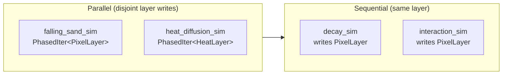
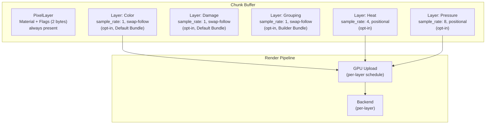
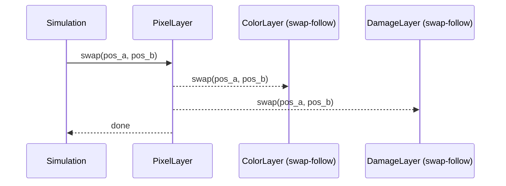
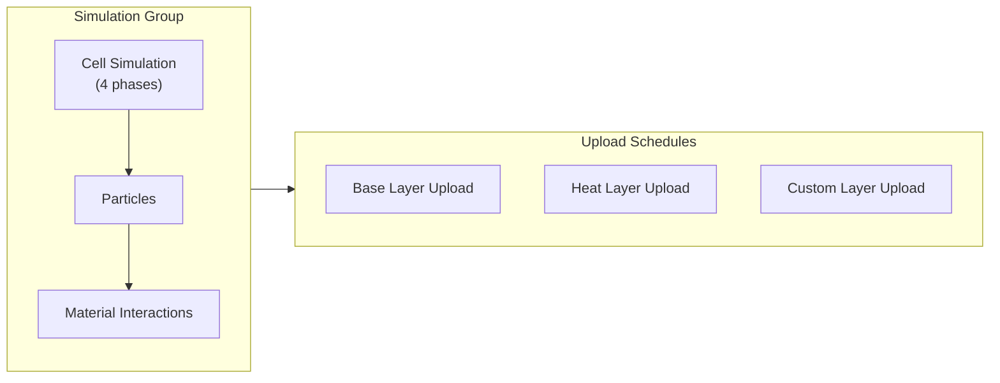

# Pixel Layers

Modular layer system where every piece of per-pixel data is an opt-in layer.

## Core Concept

The **PixelLayer** (2 bytes) is the innate base layer—always present, packing material ID and flags together. Everything else—color, damage, temperature—is an optional layer that simulations opt into.

```
PixelLayer (innate, always present):
  material: MaterialId  // u8, indexes material registry
  flags: PixelFlags     // u8, collision/simulation state

Default Bundle Layers (opt-in, included in preset):
  Color: u8     // palette index
  Damage: u8    // accumulated damage

Additional Layers (opt-in):
  Temperature, Velocity, Heat, Pressure, Grouping, etc.
```

**Why pack flags with material?**

- Flags are needed for collision detection (SOLID bit) and simulation (DIRTY, FALLING)
- Packing avoids requiring two layers for basic operations
- Collision plugin only needs PixelLayer, not a separate FlagsLayer

## Layer Bundles

Bundles are presets that register common layer combinations:

| Bundle | Layers | Memory/pixel | Use Case |
|--------|--------|--------------|----------|
| **Minimal** | PixelLayer only | 2 bytes | Maximum performance, custom simulation |
| **Default** | PixelLayer + Color + Damage | 4 bytes | Standard falling sand |
| **Builder** | Default + Grouping | 6 bytes | Building/destruction games |
| **Custom** | Builder API | Varies | Game-specific combinations |

### Builder API

```rust
PixelWorldPlugin::builder()
    .with_layer::<ColorLayer>().swap_follow()   // swaps with PixelLayer
    .with_layer::<DamageLayer>().swap_follow()  // swaps with PixelLayer
    .with_layer::<HeatLayer>()                  // NOT swap-follow (spatial field)
    .with_simulation(falling_sand_sim)
    .with_simulation(heat_diffusion_sim)
    .build()
```

### Default Bundle

The Default Bundle provides the standard falling sand experience:

| Layer | Purpose | Required By |
|-------|---------|-------------|
| PixelLayer | Material + Flags (2 bytes) | All simulations, collision |
| Color | Palette index for rendering | Rendering systems |
| Damage | Accumulated damage | Destruction, decay |

## PixelLayer (Innate)

Every chunk has a hardcoded PixelLayer containing material + flags. This is not opt-in—it's fundamental to the simulation.

```rust
struct PixelLayer;
impl Layer for PixelLayer {
    type Element = Pixel;  // { material: MaterialId, flags: PixelFlags }
    const SAMPLE_RATE: u32 = 1;
    const NAME: &'static str = "pixel";
}

#[repr(C)]
struct Pixel {
    material: MaterialId,  // u8
    flags: PixelFlags,     // u8
}
```

The layer system described below is for *additional* data on top of this base.

## Optional Layers

| Layer | Type | Sample Rate | Category | Purpose |
|-------|------|-------------|----------|---------|
| Color | u8 | 1 | Swap-follow | Palette index |
| Damage | u8 | 1 | Swap-follow | Accumulated damage |
| Grouping | u16 | 1 | Swap-follow | Pixel body membership |
| Temperature | u8 | 1 | Swap-follow | Per-pixel temperature |
| Velocity | (i8, i8) | 1 | Swap-follow | Pixel momentum |
| Heat | u8 | 4 | Positional | Thermal diffusion (downsampled) |
| Pressure | u16 | 8 | Positional | Fluid/gas pressure (downsampled) |

## Layer Categories

Layers fall into two categories based on whether their data belongs to the **pixel** or the **location**:

### Swap-Follow Layers

Data belongs to the pixel. When PixelLayer swaps, registered swap-follow layers swap automatically:

```rust
PixelWorldPlugin::builder()
    .with_layer::<ColorLayer>().swap_follow()   // swaps with PixelLayer
    .with_layer::<DamageLayer>().swap_follow()  // swaps with PixelLayer
```

Simulations should produce swaps on PixelLayer, and associated layers follow automatically. Swap-follow layers *can* be swapped directly if needed, but use at your own risk—you're responsible for maintaining consistency.

**Examples:**
- ColorLayer: pixel's palette index moves with it
- DamageLayer: accumulated damage stays with the pixel
- GroupingLayer: pixel's group membership moves with it
- Temperature: hot lava stays hot when falling
- Velocity: pixel carries its momentum

### Positional/Spatial Layers

Data belongs to the location, not the pixel. Pixels move through spatial fields without affecting them:

```rust
PixelWorldPlugin::builder()
    .with_layer::<HeatLayer>()     // NOT swap-follow (spatial field)
    .with_layer::<PressureLayer>() // NOT swap-follow
```

**Examples:**
- HeatLayer: ambient heat at a location (pixel falls through hot zone)
- PressureLayer: fluid pressure gradient
- WindLayer: environmental wind at a location
- RadiationLayer: radiation level at position

### Category Decision Tree

```
Does the data belong to the pixel or the location?
├── Pixel (moves with pixel) → Swap-follow
│   "The pixel IS hot" → Temperature (swap-follow)
│   "The pixel HAS damage" → Damage (swap-follow)
│
└── Location (pixel passes through) → Positional
    "The location IS hot" → Heat (positional)
    "The location HAS pressure" → Pressure (positional)
```

## GroupingLayer

The GroupingLayer enables pixel body mechanics—groups of pixels that move and interact as units.

```rust
struct GroupingLayer;
impl Layer for GroupingLayer {
    type Element = GroupingId;  // u16: 0 = none, 1+ = group ID
    const SAMPLE_RATE: u32 = 1;
    const NAME: &'static str = "grouping";
}
```

**Why swap-follow?** When pixels move (gravity, fluid flow), their group membership moves with them. A brick pixel that falls is still part of its brick.

See [Grouping](grouping.md) for the unified grouping model where bricks and pixel bodies are the same concept.

## Simulation Systems

Simulations are Bevy systems. The **iterator type** determines the schedule mode, and **layers** provide global pixel addressing.

**Critical constraint:** Simulations must produce swaps on PixelLayer. Swap-follow layers (ColorLayer, DamageLayer, etc.) are updated automatically.

```rust
fn falling_sand_sim(
    iter: PhasedIter<PixelLayer>,        // schedule mode = phased parallel
    mut pixels: ResMut<PixelLayer>,      // layer has swap, get, set
    materials: Res<MaterialRegistry>,
) {
    iter.for_each(|frag: WorldFragment| {
        if let Some(target) = try_fall_and_slide(frag.pos(), &pixels, &materials) {
            pixels.swap(frag.pos(), target);
            // ColorLayer, DamageLayer swap automatically (swap-follow)
        }
    });
}

fn heat_diffusion_sim(
    iter: PhasedIter<HeatLayer>,       // schedule mode = phased parallel
    pixels: Res<PixelLayer>,           // read-only access
    mut heat: ResMut<HeatLayer>,       // layer has get, set (not swap)
) {
    iter.for_each(|frag| {
        heat.diffuse(frag.pos(), &pixels);
    });
}
```

`PhasedIter<L>::for_each()` internally:
1. Iterates phase A tiles via `rayon::par_iter()`
2. Barrier
3. Iterates phase B tiles
4. Barrier
5. ... (4 phases total)

### Two Levels of Parallelism

| Level | Mechanism | Safety |
|-------|-----------|--------|
| Between systems | Bevy scheduler (disjoint `ResMut` → parallel) | Automatic |
| Within system | Iterator type (how pixels iterated) | Mode-dependent |

### Schedule Modes (Iterator Types)

| Iterator | Behavior | Use Case |
|----------|----------|----------|
| `PhasedIter<L>` | Checkerboard 4-phase | Standard CA physics |
| `ParallelIter<L>` | All pixels at once (unsafe) | Intentionally racy effects |
| (regular loop) | Sequential iteration | Complex interactions |

### Scheduling

- **Missing layer = system skipped** (configurable: skip silently or panic)
- **Disjoint write sets = parallel execution** (Bevy infers from `ResMut` params)
- **Shared write sets = sequential execution** (Bevy orders them)



See [Simulation Extensibility](simulation-extensibility.md) for the full API.

## Overview

All auxiliary data uses the same layer abstraction. The **sample rate** parameter determines resolution and available features:

| Sample Rate | Resolution | Cells per Chunk (512×512) | Swap-Follow | Use Case |
|-------------|------------|---------------------------|-------------|----------|
| 1 | 1:1 with pixels | 262,144 | Available | Color, damage, grouping |
| 4 | 4×4 pixels per cell | 16,384 | N/A | Heat map, moisture zones |
| 8 | 8×8 pixels per cell | 4,096 | N/A | Pressure regions, light |

## Architecture



## Layer Definition

Each layer declares its properties at registration:

```rust
trait Layer {
    /// Element type stored in this layer
    type Element: Copy + Default;

    /// Pixels per cell (1 = full resolution, 4 = 4×4, etc.)
    const SAMPLE_RATE: u32;

    /// Layer name for debugging and serialization
    const NAME: &'static str;
}
```

### Sample Rate

Determines the resolution ratio between pixels and layer cells:

| Sample Rate | Meaning | Memory Reduction |
|-------------|---------|------------------|
| 1 | One cell per pixel | None (full resolution) |
| 2 | One cell per 2×2 pixels | 4× |
| 4 | One cell per 4×4 pixels | 16× |
| 8 | One cell per 8×8 pixels | 64× |

**Coordinate mapping:**

```
layer_pos.xy = pixel_pos.xy / sample_rate
```

## Base Layer

The PixelLayer contains Material + Flags with `sample_rate: 1`:

| Field | Type | Purpose |
|-------|------|---------|
| Material | u8 | Type identifier, indexes into material registry |
| Flags | u8 | SOLID, DIRTY, FALLING, etc. |

**Total: 2 bytes per pixel (minimum)**

Additional fields (Color, Damage) are opt-in layers included in the Default Bundle.

See [Pixel Format](../foundational/pixel-format.md) for the base layer specification and flag bitmask reference.

### Stability Guarantee

The PixelLayer (Material + Flags) will not change within a major version. The Default Bundle layers (Color, Damage) are stable for backward compatibility.

## Swap-Follow Mechanics

Layers with `sample_rate: 1` can opt into synchronized swapping with PixelLayer.

### Behavior

When PixelLayer swaps, registered swap-follow layers swap automatically:



### Registration

```rust
PixelWorldPlugin::builder()
    .with_layer::<ColorLayer>().swap_follow()   // explicit opt-in
    .with_layer::<DamageLayer>().swap_follow()
    .with_layer::<HeatLayer>()                  // NOT swap-follow
```

### Typical Usage

```rust
// ✓ Recommended: swap on PixelLayer, others follow
pixels.swap(a, b);  // ColorLayer, DamageLayer swap automatically

// ⚠ Allowed but risky: direct swap on swap-follow layer
color.swap(a, b);   // works, but you're responsible for consistency
```

### Implementation

PixelLayer swap atomically swaps all swap-follow layers inline—no callbacks, no backtracking:

```rust
impl PixelAccess for LayerResource<PixelLayer> {
    fn swap(&mut self, a: WorldPos, b: WorldPos) {
        self.canvas.swap_layer(0, a, b);  // PixelLayer
        for &layer_idx in &self.swap_follow_layer_indices {
            self.canvas.swap_layer(layer_idx, a, b);
        }
    }
}
```

See [Layer Storage](../../implementation/layer-storage.md) for full implementation details.

### Configuration Summary

| Sample Rate | Category | Swap Behavior |
|-------------|----------|---------------|
| 1 | Swap-follow | Swaps with PixelLayer; direct swap allowed (at your own risk) |
| 1 | Positional | Stays at location, can get/set/swap freely |
| > 1 | (always positional) | Coarse resolution, no pixel correspondence |

## Downsampled Layers

Layers with `sample_rate > 1` store coarse data that applies to pixel regions:

### Heat Layer Example

```
struct HeatLayer;

impl Layer for HeatLayer {
    type Element = u8;  // 0-255 temperature
    const SAMPLE_RATE: u32 = 4;
    const NAME: &'static str = "heat";
}
```

**Properties:**
- One heat cell per 4×4 pixel region
- 16× memory reduction vs full resolution
- Smooth gradients more physically plausible than per-pixel heat

### Aggregation

Downsampled layers aggregate from pixels or propagate between cells:

```
// Heat accumulation from burning pixels
for pixel in cell_region {
    if pixel.flags.burning {
        cell.heat += BURN_HEAT;
    }
}

// Diffusion between cells
new_heat = (self + neighbors.avg()) / 2 * cooling_factor;
```

## Render Modularity

Each layer controls its own GPU upload pipeline.

### Scheduling Model

All upload schedules run **after** the pixel simulation group completes:



### Default Schedule

The default upload schedule:

1. Runs after each simulation group tick
2. Checks chunk dirty flag
3. Uploads only if dirty

```
struct DefaultUploadSchedule;

impl UploadSchedule for DefaultUploadSchedule {
    fn should_upload(&self, chunk: &Chunk, tick: u64) -> bool {
        chunk.is_dirty()
    }

    fn tick_divisor(&self) -> u32 {
        1  // every simulation tick
    }
}
```

### Custom Schedules

Custom schedules can modify both the check logic and tick rate:

```
trait UploadSchedule {
    /// Custom condition for upload (default: dirty check)
    fn should_upload(&self, chunk: &Chunk, tick: u64) -> bool;

    /// Run every N simulation ticks (1 = every tick, 4 = every 4th tick)
    fn tick_divisor(&self) -> u32;
}
```

### Schedule Presets

| Preset | `tick_divisor` | Check | Use Case |
|--------|----------------|-------|----------|
| `OnChange` | 1 | Dirty flag | Base pixels - immediate visual feedback |
| `Periodic(n)` | n | Always true | Heat - interpolation hides latency |
| `OnChangeThrottled(n)` | n | Dirty flag | Large layers - reduce upload frequency |
| `Never` | - | Always false | Velocity - simulation-only, not rendered |

### Examples

| Layer | Schedule | Behavior |
|-------|----------|----------|
| Base pixels | `OnChange` | Upload every tick if any pixel changed |
| Heat | `Periodic(4)` | Upload every 4th tick unconditionally |
| Moisture | `OnChangeThrottled(2)` | Upload every 2nd tick if dirty |
| Velocity | `Never` | No GPU upload, CPU-only |

### Backend Integration

Layers provide render data through the `LayerRender` trait:

```
trait LayerRender {
    /// Upload schedule for this layer
    fn schedule(&self) -> &dyn UploadSchedule;

    /// Called when schedule triggers upload
    fn upload(&self, gpu: &mut GpuContext);

    /// Shader uniform binding (if any)
    fn binding(&self) -> Option<BindGroup>;
}
```

**Shader integration examples:**
- Heat layer → uniform buffer for glow tinting
- Moisture layer → wet sheen intensity multiplier
- Custom layer → game-specific visual effects

## Persistence

Layers are either **persistent** (saved to disk) or **transient** (resimulated on load).

### Persistent Layers

Saved alongside base pixel data in chunk files:

| Property | Behavior |
|----------|----------|
| Serialization | Binary format, streamed with chunk |
| Load | Read from disk, ready immediately |
| Use case | Source-of-truth data that can't be derived |

**Examples:**
- Base pixel layer (always persistent)
- Player-placed markers or ownership data
- Light/visibility (fog of war - explored areas stay revealed)
- Accumulated damage that affects gameplay

### Transient Layers

Not saved; regenerated when chunk loads:

| Property | Behavior |
|----------|----------|
| Serialization | None |
| Load | Initialized to default, resimulated |
| Use case | Derived/computed data |

**Examples:**
- Heat (derived from burning pixels, diffuses from neighbors)
- Velocity cache (derived from recent movement)
- Collision cache (derived from solid pixels)

### Configuration

```
// Persistent: saved to disk
world.register_layer::<OwnershipLayer>(LayerConfig {
    persistent: true,
    ..default()
});

// Transient: resimulated on load (default)
world.register_layer::<HeatLayer>(LayerConfig {
    persistent: false,  // default
    ..default()
});
```

### Chunk File Format

Persistent layers append to chunk save format:

```
ChunkFile:
  header: ChunkHeader
  base_pixels: [Pixel; CHUNK_SIZE²]
  layer_ownership: [u8; CHUNK_SIZE²]    // if registered + persistent
  layer_custom: [T; cells]              // if registered + persistent
```

See [Chunk Persistence](../persistence/chunk-persistence.md) for save format details.

## Memory Layout

All layers use SoA (Structure of Arrays) for cache efficiency:

```
PixelLayer:   [P0, P1, P2, P3, P4, ...]     // 2 bytes each, 262k cells (always)
Color:        [C0, C1, C2, C3, C4, ...]     // 1 byte each,  262k cells (Default Bundle)
Damage:       [D0, D1, D2, D3, D4, ...]     // 1 byte each,  262k cells (Default Bundle)
Grouping:     [G0, G1, G2, G3, G4, ...]     // 2 bytes each, 262k cells (Builder Bundle)
Heat:         [H0, H1, H2, H3, ...]         // 1 byte each,  16k cells  (opt-in)
Pressure:     [R0, R1, R2, ...]             // 2 bytes each, 4k cells   (opt-in)
```

### Memory Examples

For a 512×512 chunk with different configurations:

**Minimal Bundle (PixelLayer only):**

| Layer | Sample Rate | Cells | Per-Cell | Total |
|-------|-------------|-------|----------|-------|
| PixelLayer | 1 | 262,144 | 2 bytes | 512 KB |
| **Total** | | | | **512 KB** |

**Default Bundle:**

| Layer | Sample Rate | Cells | Per-Cell | Total |
|-------|-------------|-------|----------|-------|
| PixelLayer | 1 | 262,144 | 2 bytes | 512 KB |
| Color | 1 | 262,144 | 1 byte | 256 KB |
| Damage | 1 | 262,144 | 1 byte | 256 KB |
| **Total** | | | | **1 MB** |

**Builder Bundle (with Grouping):**

| Layer | Sample Rate | Cells | Per-Cell | Total |
|-------|-------------|-------|----------|-------|
| PixelLayer | 1 | 262,144 | 2 bytes | 512 KB |
| Color | 1 | 262,144 | 1 byte | 256 KB |
| Damage | 1 | 262,144 | 1 byte | 256 KB |
| Grouping | 1 | 262,144 | 2 bytes | 512 KB |
| **Total** | | | | **1.5 MB** |

**Builder Bundle + Heat + Pressure:**

| Layer | Sample Rate | Cells | Per-Cell | Total |
|-------|-------------|-------|----------|-------|
| PixelLayer | 1 | 262,144 | 2 bytes | 512 KB |
| Color | 1 | 262,144 | 1 byte | 256 KB |
| Damage | 1 | 262,144 | 1 byte | 256 KB |
| Grouping | 1 | 262,144 | 2 bytes | 512 KB |
| Heat | 4 | 16,384 | 1 byte | 16 KB |
| Pressure | 8 | 4,096 | 2 bytes | 8 KB |
| **Total** | | | | **~1.5 MB** |

## Registration

Layers are registered at plugin build time:

```rust
PixelWorldPlugin::builder()
    // Swap-follow layers (move with pixels)
    .with_layer::<ColorLayer>().swap_follow()
    .with_layer::<DamageLayer>().swap_follow()
    .with_layer::<GroupingLayer>().swap_follow()

    // Positional layers (stay at location)
    .with_layer::<HeatLayer>()
    .with_layer::<PressureLayer>()

    // Persistent layers (saved to disk)
    .with_layer::<OwnershipLayer>().persistent()

    .build()
```

### Requirements

| Requirement | Rationale |
|-------------|-----------|
| Register before first chunk | Ensures all chunks have consistent layers |
| Fixed set per session | Dynamic registration would complicate sync |
| Declare sample rate at compile time | Enables static allocation sizing |

## Performance Considerations

### Dirty Rect Tracking

The biggest optimization is already built-in: dirty rect tracking skips ~90% of tiles under typical workloads. Only actively changing regions are simulated.

### Swap-Follow Cost

Each swap-follow layer adds one array swap per pixel swap. With DefaultBundle (Color + Damage):
- 3 swaps total: Pixel + Color + Damage

### Layer Count Guidance

| Swap-Follow Layers | Recommendation |
|--------------------|----------------|
| 0-2 | DefaultBundle sweet spot |
| 3-4 | BuilderBundle, acceptable |
| 5+ | Profile if concerned |

Positional layers (Heat, Pressure) have no swap overhead—they don't participate in swap-follow.

### Memory Layout

Layers use SoA. Tile data fits comfortably in L1 cache:
- 32×32 tile = 1024 pixels
- PixelLayer: 2 KB, ColorLayer: 1 KB, etc.
- DefaultBundle total: ~4 KB per tile

## Related Documentation

- [Grouping](grouping.md) - Unified grouping model (bricks = sleeping pixel bodies)
- [Pixel Format](../foundational/pixel-format.md) - Base layer specification
- [Simulation](../simulation/simulation.md) - Heat layer propagation, swap mechanics
- [Simulation Extensibility](simulation-extensibility.md) - Custom rules using layer data
- [Rendering Backends](rendering-backends.md) - Backend integration for layer rendering
- [Chunk Pooling](../chunk-management/chunk-pooling.md) - Chunk lifecycle and layer allocation
- [Chunk Persistence](../persistence/chunk-persistence.md) - Save format for persistent layers
- [Architecture Overview](../README.md)
