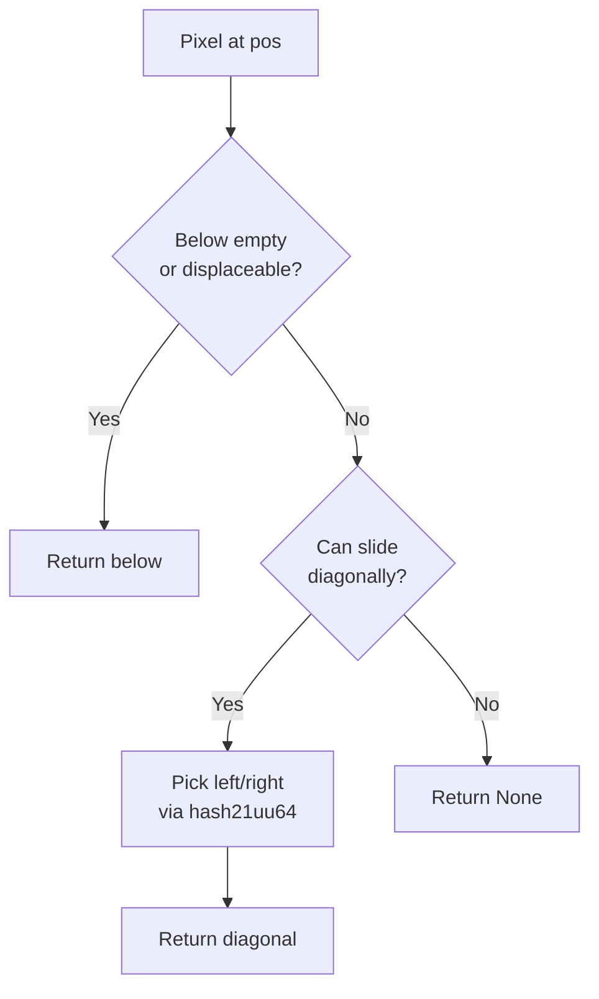

# Simulation Extensibility

Pluggable simulation rules and reusable library functions.

## Overview

The simulation system exposes extension points for custom cell simulation rules. Crate consumers can implement game-specific behaviors while reusing the engine's optimized infrastructure.

## Current Model

The default simulation uses `compute_swap` to determine pixel movement:

```
fn compute_swap(
    pos: WorldPos,
    canvas: &Canvas,
    materials: &MaterialRegistry,
    ctx: &SimContext,
) -> Option<WorldPos>
```

| Parameter | Purpose |
|-----------|---------|
| `pos` | Current pixel position |
| `canvas` | Read access to surrounding pixels |
| `materials` | Material property lookup |
| `ctx` | Tick count, RNG seed, configuration |

**Returns:** Target position to swap with, or `None` to stay in place.

## Simulation Trait

Custom simulations implement the `SimulationRule` trait:

```
trait SimulationRule {
    /// Layers this simulation reads (must be registered)
    fn required_layers() -> &'static [LayerId] {
        &[]  // Default: no layer dependencies
    }

    /// Layers this simulation writes (used for parallelization)
    fn writes_layers() -> &'static [LayerId] {
        &[]  // Default: read-only simulation
    }

    /// Compute movement for a single pixel
    fn compute_swap(
        &self,
        pos: WorldPos,
        canvas: &Canvas,
        materials: &MaterialRegistry,
        ctx: &SimContext,
    ) -> Option<WorldPos>;

    /// Optional: custom interaction logic
    fn compute_interaction(
        &self,
        pos: WorldPos,
        neighbor: WorldPos,
        canvas: &Canvas,
        materials: &MaterialRegistry,
        ctx: &SimContext,
    ) -> Option<Interaction> {
        None  // Default: use material registry interactions
    }
}
```

### Layer Dependencies

Simulations declare their layer requirements:

| Method | Purpose |
|--------|---------|
| `required_layers()` | Layers that must be registered for this simulation to run |
| `writes_layers()` | Layers this simulation modifies (for parallel scheduling) |

**Scheduling behavior:**

- Simulations with **disjoint write sets** can run in parallel
- Simulations with **overlapping write sets** run sequentially
- Missing required layers: configurable (skip silently or panic)

```
// Example: FallingSand requires Flags, writes Flags
impl SimulationRule for FallingSandSim {
    fn required_layers() -> &'static [LayerId] {
        &[LayerId::Flags]
    }

    fn writes_layers() -> &'static [LayerId] {
        &[LayerId::Flags]
    }

    fn compute_swap(...) -> Option<WorldPos> { ... }
}

// Example: HeatDiffusion requires Heat, writes Heat (can parallelize with above)
impl SimulationRule for HeatDiffusionSim {
    fn required_layers() -> &'static [LayerId] {
        &[LayerId::Heat]
    }

    fn writes_layers() -> &'static [LayerId] {
        &[LayerId::Heat]
    }

    fn compute_swap(...) -> Option<WorldPos> { ... }
}
```

See [Pixel Layers](pixel-layers.md) for layer registration and bundle configuration.
```

### Registration

Custom rules are registered at world creation:

```
// Use default falling sand rules
PixelWorldPlugin::new()

// Use custom simulation
PixelWorldPlugin::with_simulation::<MyCustomRules>()
```

### Execution Context

Custom rules execute within the same parallel scheduling infrastructure:

- Checkerboard phasing ensures thread safety
- Dirty flag optimization still applies
- Cross-chunk boundaries handled automatically

## Library Functions

Reusable building blocks for implementing custom rules:

### Hash Functions

Deterministic hashing for simulation randomness (`simulation/hash.rs`):

```
/// 2 inputs → 1 output
pub fn hash21uu64(a: u64, b: u64) -> u64

/// 4 inputs → 1 output
pub fn hash41uu64(a: u64, b: u64, c: u64, d: u64) -> u64
```

| Property | Guarantee |
|----------|-----------|
| Deterministic | Same inputs always produce same output |
| Well-distributed | Adjacent values produce uncorrelated outputs |
| Fast | FNV-1a style mixing, no heap allocation |

**Common patterns:**

```
// Per-pixel randomness (position + tick)
let h = hash21uu64(pos.x as u64, pos.y as u64);
let direction = h % 2;  // left or right

// Per-pixel + per-tick randomness
let h = hash41uu64(pos.x as u64, pos.y as u64, tick, 0);
let chance = (h % 100) < 30;  // 30% probability
```

**Use cases:**

- Random movement direction selection
- Probabilistic behavior (chance to ignite, decay)
- Visual noise generation

### `try_fall_and_slide(pos, canvas, materials) -> Option<WorldPos>`

Shared powder/liquid falling logic.



| Parameter | Purpose |
|-----------|---------|
| `pos` | Current position |
| `canvas` | Read surrounding pixels |
| `materials` | Density comparison |

**Returns:** Position to fall/slide to, or `None` if blocked.

### `can_swap_into(src, dst, materials) -> bool`

Density-based displacement check.

| Comparison | Result |
|------------|--------|
| src denser than dst | Can swap (heavier sinks) |
| src lighter than dst | Cannot swap |
| src is void | Cannot swap |
| dst is void | Can swap |

### `raycast(origin, direction, canvas, max_dist) -> RaycastHit`

Pixel-level raycasting.

| Field | Type | Description |
|-------|------|-------------|
| `hit_pos` | `Option<WorldPos>` | First non-void pixel hit |
| `distance` | `f32` | Distance traveled |
| `normal` | `(i8, i8)` | Surface normal at hit point |

**Use cases:**

- Line-of-sight checks
- Projectile collision
- Light propagation

### `disperse(pos, dispersion, canvas, ctx) -> Option<WorldPos>`

Parametric dispersion for gases and liquids.

| Parameter | Effect |
|-----------|--------|
| `dispersion: 0` | No horizontal spread |
| `dispersion: 1-3` | Slow spread (honey, mud) |
| `dispersion: 4-7` | Medium spread (water) |
| `dispersion: 8+` | Fast spread (gas, air) |

Uses `hash21uu64` for consistent random direction selection.

### `neighbors_matching(pos, canvas, predicate) -> u8`

Count neighbors matching a condition.

```
// Count adjacent water pixels
let water_count = neighbors_matching(pos, canvas, |p| p.material == WATER);

// Count burning neighbors
let fire_count = neighbors_matching(pos, canvas, |p| p.flags.burning);
```

Returns count 0-8 for the Moore neighborhood.

## Composition Patterns

### Layering Custom Rules

Custom rules can delegate to library functions:

```
impl SimulationRule for MyRules {
    fn compute_swap(&self, pos, canvas, materials, ctx) -> Option<WorldPos> {
        let pixel = canvas.get(pos);

        // Custom behavior: magnetic pixels attracted to iron
        if pixel.material == MAGNETIC {
            if let Some(iron_pos) = find_nearby_iron(pos, canvas) {
                return move_toward(pos, iron_pos, canvas);
            }
        }

        // Fall back to standard physics
        try_fall_and_slide(pos, canvas, materials)
    }
}
```

### Extension Layer Integration

Custom rules can read/write extension layers:

```
fn compute_swap(&self, pos, canvas, materials, ctx) -> Option<WorldPos> {
    let temp = self.temperature_layer.get(pos);

    // Hot pixels rise faster
    if temp > 200 && pixel.material == STEAM {
        return try_rise_fast(pos, canvas);
    }

    // Cold pixels sink
    if temp < 50 && pixel.material == COLD_AIR {
        return try_fall_and_slide(pos, canvas, materials);
    }

    default_gas_behavior(pos, canvas, materials, ctx)
}
```

### Conditional Material Behavior

Override behavior for specific materials:

```
fn compute_swap(&self, pos, canvas, materials, ctx) -> Option<WorldPos> {
    match canvas.get(pos).material {
        CUSTOM_SLIME => slime_behavior(pos, canvas, ctx),
        CUSTOM_METAL => metal_behavior(pos, canvas, ctx),
        _ => try_fall_and_slide(pos, canvas, materials),
    }
}
```

## Performance Notes

| Aspect | Consideration |
|--------|---------------|
| Inlining | Library functions are `#[inline]` for zero-cost abstraction |
| Branching | Match on material ID is fast (single u8 comparison) |
| Lookups | `canvas.get()` is bounds-checked; use `get_unchecked` in hot paths |
| RNG | `hash21uu64` is faster than thread-local RNG for spatial randomness |

## Related Documentation

- [Simulation](../simulation/simulation.md) - Core simulation passes and scheduling
- [Scheduling](../simulation/scheduling.md) - Parallel execution infrastructure
- [Materials](../simulation/materials.md) - Material properties used by library functions
- [Pixel Layers](pixel-layers.md) - Extension layers for custom state
- [Pixel Format](../foundational/pixel-format.md) - Base pixel data accessed by rules
- [Architecture Overview](../README.md)
