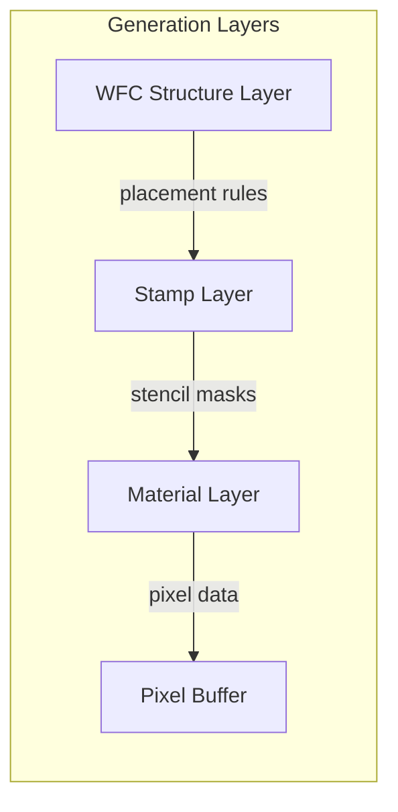
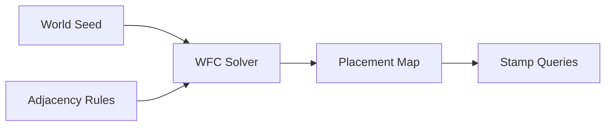
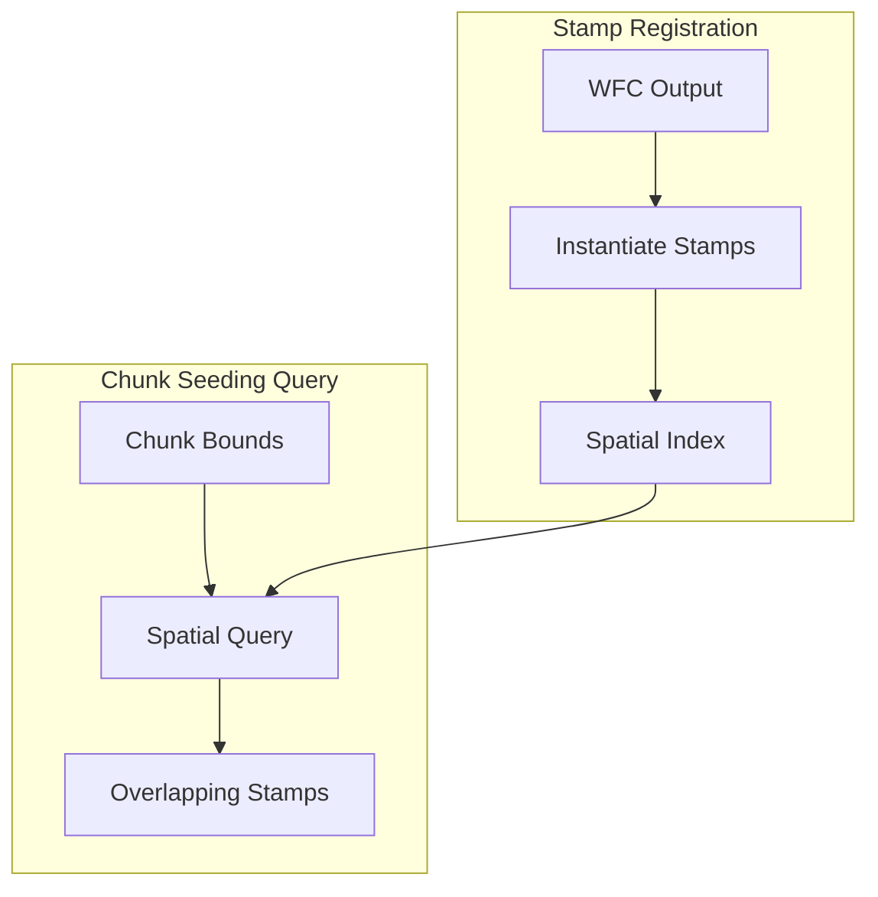
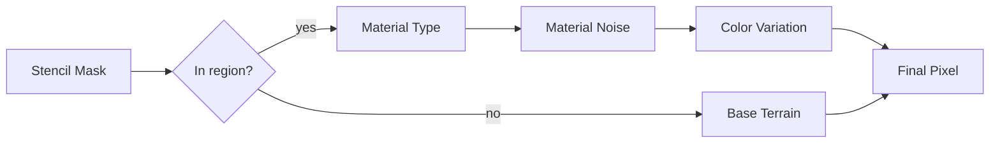
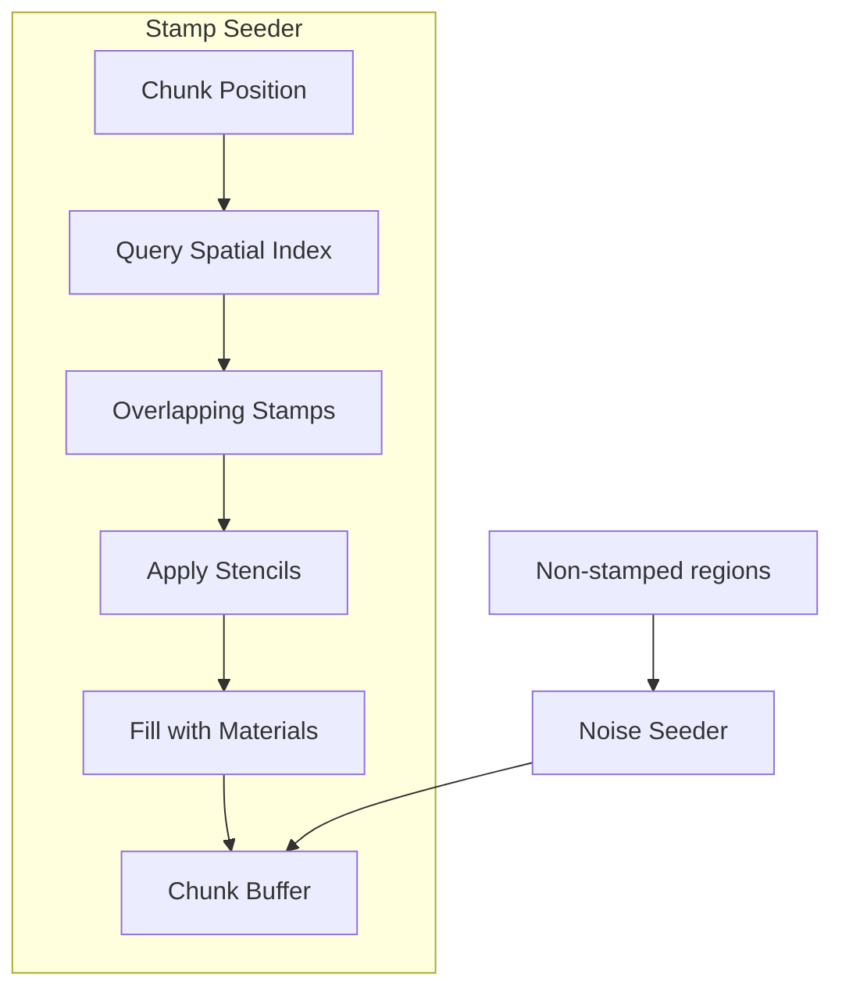
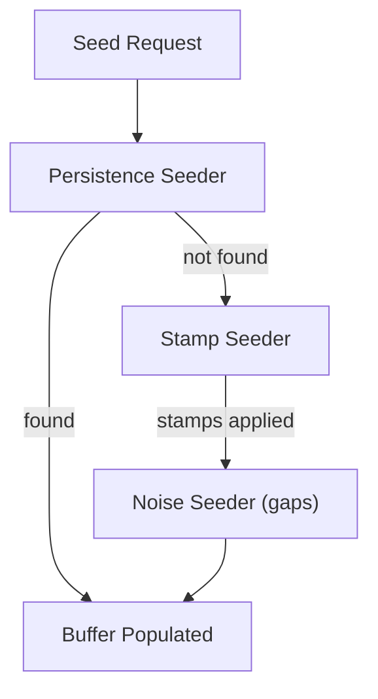

# PCG World Ideas

Advanced procedural content generation concepts for richer world generation.

## Overview

Beyond basic noise-based terrain, complex worlds benefit from a hierarchical generation approach where each layer adds detail while respecting constraints from the layer above.

## Hierarchical Generation

| Layer | Responsibility | Output |
|-------|----------------|--------|
| WFC Structure | Macro-level layout and constraints | Stamp placement map |
| Stamps | Preset formations with shape definitions | Stencil masks |
| Materials | Fill stencils with noised materials | Pixel data |

## WFC Structure Layer

Wave Function Collapse operates at a coarse grid level to determine macro-level structure.

### Role

- Defines regions, biomes, and structure placement
- Ensures global coherence (rivers connect, caves have entrances)
- Operates on tiles much larger than individual pixels
- Deterministic output from world seed

### Output

The WFC layer produces a **placement map** that tells the stamp layer:
- Which stamp types are allowed at each location
- Orientation and variation hints
- Connection requirements between adjacent stamps

## Stamp System

Stamps are preset formations that define world features at an intermediate scale.

### Components

| Component | Description |
|-----------|-------------|
| **Stamp** | A registered formation type (cave entrance, tree, building) |
| **Stencil** | Shape mask defining where the stamp applies |
| **Anchor** | World position and orientation of the stamp instance |
| **Metadata** | Material hints, variation seed, blend priority |

### Spatial Index

Stamps are registered in a spatial index for efficient querying during chunk seeding.

### Overlap Handling

When multiple stamps overlap the same region:

| Strategy | Behavior |
|----------|----------|
| Priority | Higher priority stamp overwrites lower |
| Blend | Stamps blend at boundaries using falloff |
| Composite | Stamps combine (e.g., vegetation on terrain) |

## Material & Coloration Layer

The material layer fills stencil regions with actual pixel data.

### Pipeline

For each pixel within a stamp's stencil:

1. **Material selection** - Stencil region maps to material type
2. **Noise variation** - Material-specific noise adds texture
3. **Color sampling** - Base color + noise-driven variation
4. **Boundary blending** - Smooth transitions at stencil edges

### Noise Composition

Different noise functions serve different purposes within material generation:

| Noise Purpose | Effect |
|---------------|--------|
| Texture | Fine-grained surface detail |
| Color shift | Subtle hue/saturation variation |
| Weathering | Edge erosion, wear patterns |
| Density | Sparse vs dense material placement |

## Integration with Seeder Trait

The stamp system integrates as another ChunkSeeder implementation.

### Stamp Seeder

### Seeder Composition

The stamp seeder fits into the seeder chain:

This enables:
- Persisted player modifications take priority
- Stamps provide structured content (buildings, caves, features)
- Noise seeder fills remaining terrain
- Seamless blending between all layers

## Design Considerations

### Determinism

All layers must produce identical output for the same world seed:
- WFC uses seeded random for constraint solving
- Stamp placement derives from WFC output
- Material noise uses world-position-based seeds

### Chunk Independence

Each chunk must be seedable independently:
- Spatial index queries are bounded to chunk region (plus margin for overlap)
- No chunk depends on another chunk's seeding state
- Enables parallel chunk seeding

### Memory Efficiency

Stamps exist as templates, not pre-rendered data:
- Stencils are compact shape definitions
- Materials are generated on-demand during seeding
- Only active chunks hold pixel data

## Related Documentation

- [Chunk Seeding](chunk-seeding.md) - Core seeder trait and basic implementations
- [Configuration Reference](configuration.md) - Tunable parameters
- [Architecture Overview](README.md)
