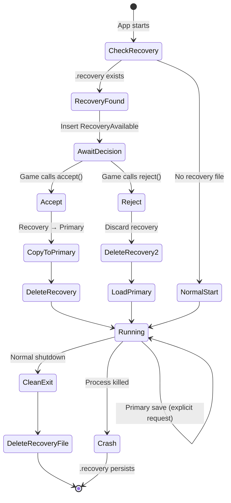
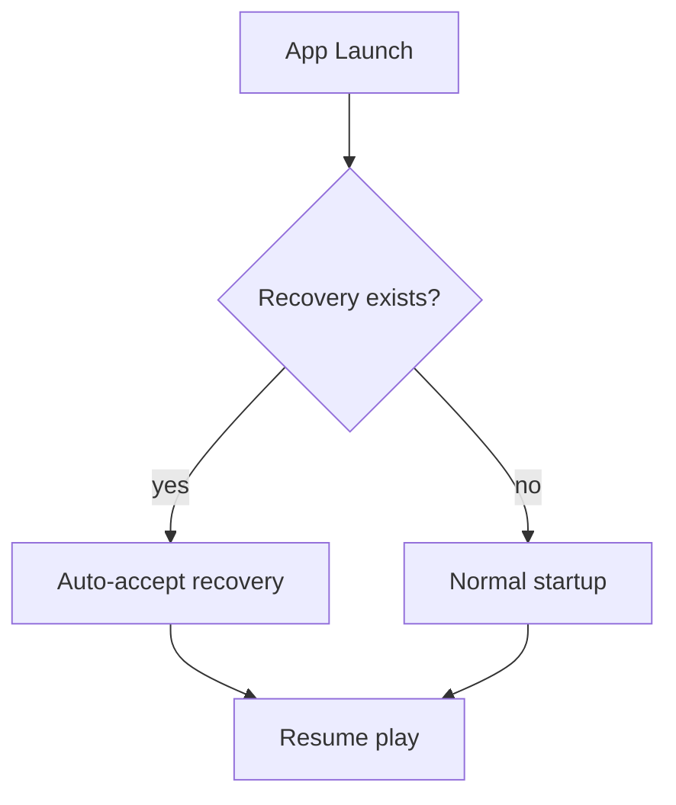
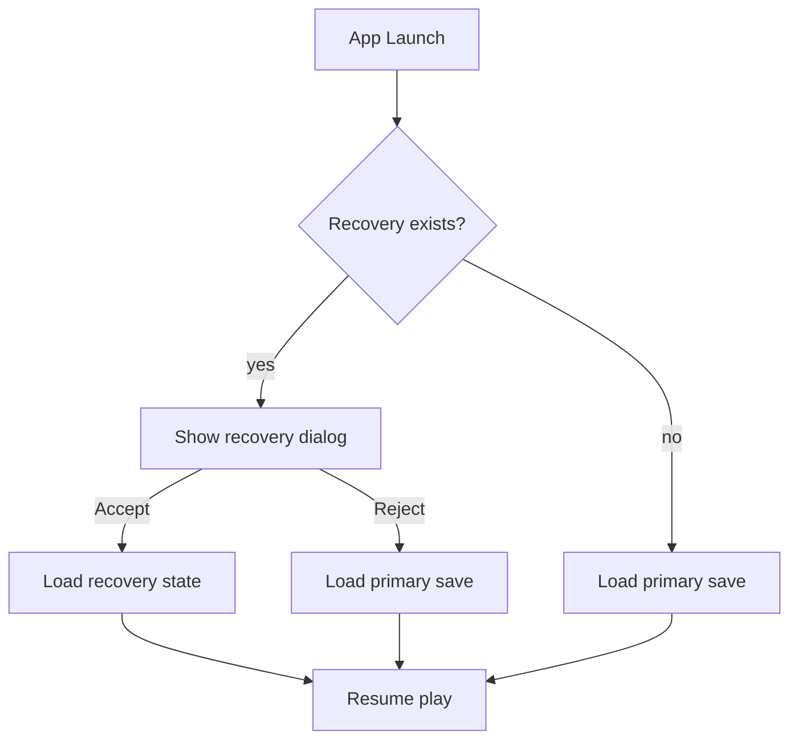
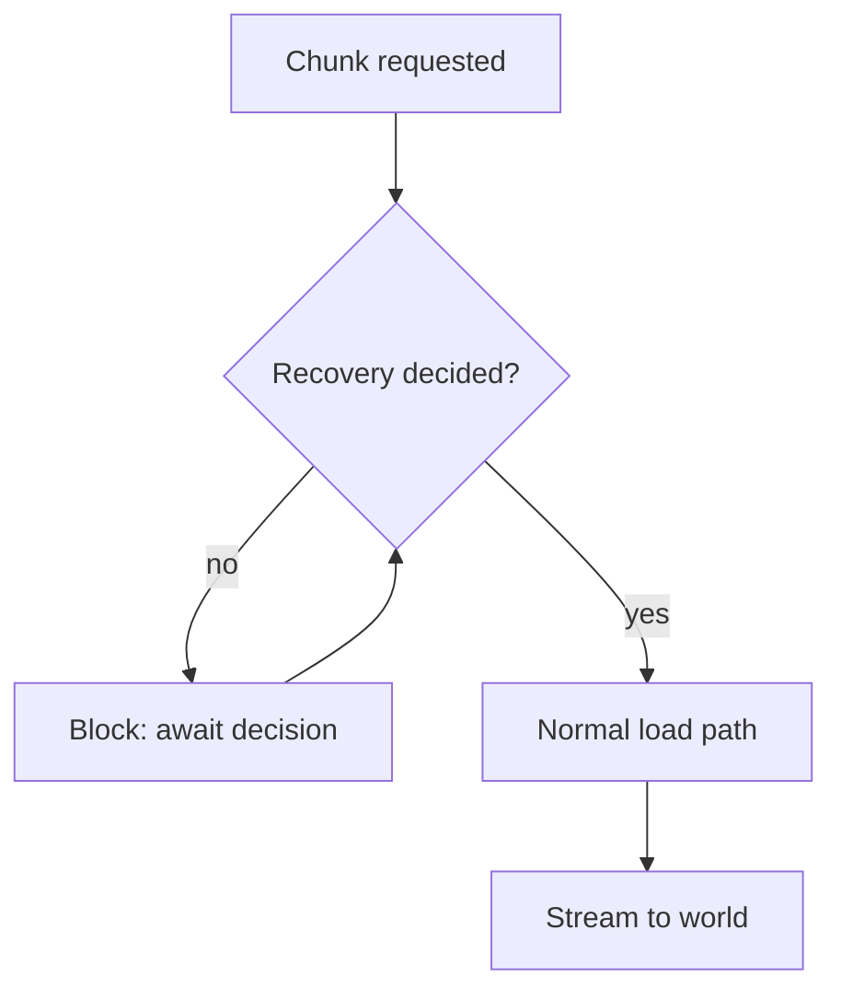

# Recovery Persistence

Crash recovery via continuous autosave to a separate recovery file.

## Overview

The recovery system maintains two save files:

- **Primary save** - Explicit checkpoints triggered by game logic or player request (like `git push`)
- **Recovery save** - Continuous autosave for crash recovery (`.recovery` suffix)

This separation ensures:

- Primary saves remain stable checkpoints that never corrupt mid-write
- Recovery saves provide safety net without polluting the primary save history
- Games can offer "recover from crash?" prompts without complex save management

## File Layout

```
~/.local/share/<app_name>/saves/
├── world.save           # Primary save (explicit checkpoints)
└── world.save.recovery  # Recovery file (continuous autosave)
```

## Recovery Lifecycle



## Game Type Patterns

### Roguelike (Auto-Recover)

For games where death is permanent and crashes shouldn't count as deaths:



### Persistent World (Prompt User)

For games where players may want to revert to an earlier checkpoint:



The dialog can display timestamps to help players decide:

| Option | Description |
|--------|-------------|
| **Recover** | Resume from crash point (recovery modified time) |
| **Load Save** | Return to last explicit save (primary modified time) |

## Save Timing

| Save Type | Trigger | Target File | Default Interval |
|-----------|---------|-------------|------------------|
| Recovery  | Periodic timer | `.recovery` | 30 seconds |
| Primary   | Explicit request | `.save` | Manual only |

### Why Separate Intervals?

- Recovery saves frequently to minimize lost progress on crash
- Primary saves only when game/player requests, preserving meaningful checkpoints
- Frequent recovery writes don't bloat the primary save

## Recovery File Behavior

### Persistence Rules

| Event | Recovery File |
|-------|---------------|
| Periodic interval elapsed | Written/updated |
| Explicit save requested | Unchanged (writes to primary) |
| Clean app shutdown | **Deleted** |
| Crash / kill -9 | Persists |
| Recovery accepted | **Deleted** after copy |
| Recovery rejected | **Deleted** |

### Why Delete on Clean Exit?

A recovery file implies abnormal termination. On clean shutdown:

1. Player chose to exit (data is in intended state)
2. Recovery file would trigger false "recover?" prompt on next launch
3. Deleting avoids confusing the player

## World Loading Gate

Chunk streaming waits for recovery decision:



This prevents loading from the wrong save file. The gate releases when:

- `RecoveryControl::accept()` is called (load from recovery)
- `RecoveryControl::reject()` is called (load from primary)
- No recovery file exists (no decision needed)

## Configuration

| Field | Type | Default | Description |
|-------|------|---------|-------------|
| `recovery.interval` | Duration | 30s | Time between recovery autosaves |
| `recovery` | Option | Some | Set to None to disable recovery |

## Public Types

### RecoveryAvailable

Resource inserted when a recovery file is detected at startup:

| Field | Type | Description |
|-------|------|-------------|
| `modified_time` | SystemTime | When recovery file was last written |
| `primary_modified_time` | Option<SystemTime> | When primary save was last written |

### RecoveryControl

Resource for accepting or rejecting recovery:

| Method | Effect |
|--------|--------|
| `accept()` | Load from recovery, delete recovery file |
| `reject()` | Delete recovery file, load from primary |
| `decided()` | Returns true if accept/reject was called |

## Related Documentation

- [Chunk Persistence](chunk-persistence.md) - Primary save file format
- [Pixel Bodies](../physics/pixel-bodies.md) - Entity persistence within saves
- [Streaming Window](../streaming/streaming-window.md) - Chunk loading that recovery gates
- [Glossary](../glossary.md) - Recovery terminology
- [Architecture Overview](../README.md)
