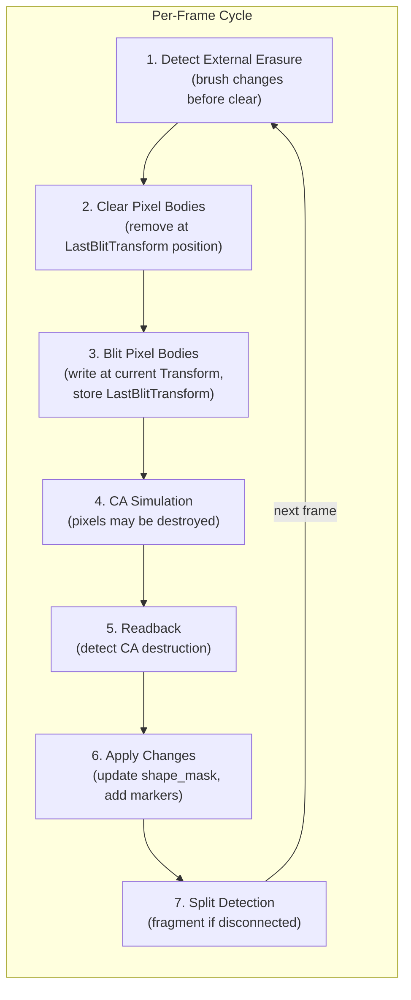
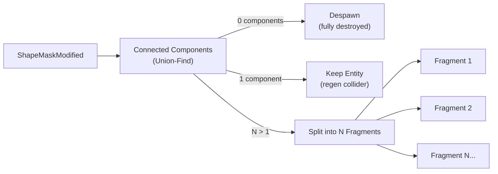
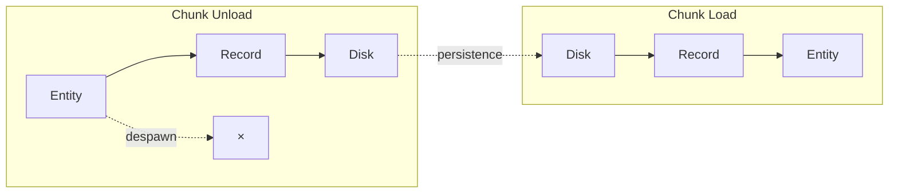
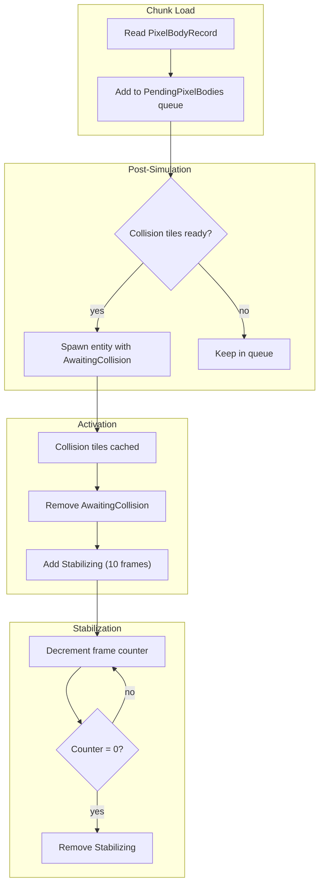

# Pixel Bodies

Dynamic physics objects with pixel content that participates in cellular automata simulation.

## Overview

Pixel bodies unify the physics and CA worlds. A pixel body is a rigid body whose visual representation consists of
individual pixels that participate fully in the CA simulation - they can burn, melt, conduct heat, and be destroyed
through material interactions. When pixels are destroyed, the object's shape changes, collision mesh updates, and the
object may split into fragments.

## Module Structure

```
pixel_body/
├── mod.rs        # Core data structures, markers, plugin
├── spawn.rs      # Entity spawning commands
├── loader.rs     # PNG image loading and pixel conversion
├── blit.rs       # Write/clear pixels to canvas
├── readback.rs   # Detect pixel destruction
├── split.rs      # Connected components and fragmentation
└── collider.rs   # Physics collider generation
```

## Data Structures

### PixelBody Component

The core component storing pixel data:

- **surface**: Object-local pixel buffer (`Surface<Pixel>`)
- **shape_mask**: Boolean array (row-major) indicating which pixels are solid
- **origin**: Offset from entity transform to pixel grid center, typically `(-width/2, -height/2)`

The `shape_mask` is the source of truth for collision and physics. When pixels are destroyed, only the mask is updated
(surface data may remain but is ignored).

### LastBlitTransform Component

Stores the exact `GlobalTransform` used during the last blit operation:

- Allows clear system to remove pixels at correct positions even if physics moved the body
- Used by readback to detect destruction at the actual blitted location
- Used by persistence to save position where pixels actually are
- **written_positions**: Vec of `(WorldPos, local_x, local_y)` tuples recording exact positions written during last blit
- Used by clear to remove only positions this body actually wrote
- Prevents same-material overlapping bodies from clearing each other's pixels

### State Markers

| Component | Purpose |
|-----------|---------|
| `ShapeMaskModified` | Shape mask was modified, triggers split detection |
| `NeedsColliderRegen` | Collider must be regenerated |
| `DestroyedPixels` | Temporary batch of destroyed pixel coordinates |
| `PendingPixelBody` | Waiting for image asset to load |
| `Persistable` | Body should be saved when chunk unloads |
| `AwaitingCollision` | Loaded body waiting for terrain collision tiles to cache |
| `Stabilizing` | Grace period (10 frames) after activation, skips CA readback |

### PixelBodyId

Stable identifier persisting across save/load cycles. Generated from a session seed + counter to prevent collisions.

## Simulation Cycle

Each frame processes pixel bodies through distinct phases:



### Phase 1: Detect External Erasure

Before clearing, check if external tools (brush, etc.) destroyed any blitted pixels:

- For each solid pixel in `shape_mask`
- Check if world pixel at blitted position is void or missing `PIXEL_BODY` flag
- Collect destroyed coordinates in `DestroyedPixels` component

### Phase 2: Clear

Remove pixels from the canvas using tracked positions from `LastBlitTransform`:

- Uses `written_positions` from `LastBlitTransform`, not full body bounds
- Only clears positions this specific body wrote
- Prevents same-material bodies from erasing each other
- Ensures no "ghost" pixels remain at old positions

### Phase 3: Blit

Write pixel body content to the canvas at current position:

- Compute world-space AABB of rotated body
- Use inverse transform to map world pixels back to local space
- Write solid pixels with `PIXEL_BODY` flag set
- Tracked blit returns list of actually written positions
- Store current `GlobalTransform` and written positions in `LastBlitTransform`

### Phase 4: CA Simulation

Standard cellular automata execution. Object pixels participate in:
- Material interactions (corrosion, ignition)
- Heat propagation
- Movement rules

Object pixels are indistinguishable from world pixels during simulation.

### Phase 5: Readback

Detect pixels destroyed by CA simulation:

- Use `LastBlitTransform` to find where pixels were written
- For each solid pixel: check if now void or missing `PIXEL_BODY` flag
- Bodies with `Stabilizing` marker skip CA readback detection (but external erasure detection still runs on all bodies)
- Merge with externally destroyed pixels
- Store in `DestroyedPixels` component

### Phase 6: Apply Changes

Update object state from destruction data:

- For each destroyed coordinate: set `shape_mask[i] = false`
- Remove `DestroyedPixels` component
- Insert `ShapeMaskModified` and `NeedsColliderRegen` markers

### Phase 7: Split Detection

Handle fragmentation when shape becomes disconnected:



Split procedure for N > 1 components:

- Clear parent body's blitted pixels from canvas
- Despawn parent entity
- For each connected component:
  - Create new `PixelBody` with tight bounding box
  - Copy pixels from parent (adjusted to fragment-local coords)
  - Generate physics collider
  - Compute world position from component centroid
  - **Blit fragment immediately** (prevents 1-frame flicker)
  - Spawn entity with inherited velocity/rotation

## Transform Integration

The separation of `GlobalTransform` (current) and `LastBlitTransform` (last write) is critical:

```mermaid
sequenceDiagram
    participant P as Physics
    participant BT as LastBlitTransform
    participant GT as GlobalTransform
    participant W as PixelWorld

    Note over BT,GT: Frame N

    rect rgb(50, 50, 80)
        Note right of W: Clear Phase
        W->>BT: Read stored transform
        W->>W: Clear at BT position
    end

    rect rgb(50, 80, 50)
        Note right of W: Blit Phase
        W->>GT: Read current transform
        W->>W: Write at GT position
        GT-->>BT: Store as new BT
    end

    rect rgb(80, 50, 50)
        Note right of P: Physics Step
        P->>GT: Update position
        Note right of GT: GT moves, BT unchanged
    end

    Note over BT,GT: Frame N+1
    Note right of W: Clear uses old BT
    Note right of W: Blit uses new GT
```



This ensures:
- Clear always removes pixels from where they were written
- Readback detects destruction at correct positions
- Physics movement doesn't cause orphan pixels

## Physics Integration

### Collider Generation

Shape mask is converted to a compound physics collider:

- Build boolean grid from `shape_mask` with 1-pixel border
- Run marching squares to extract contours
- Apply Douglas-Peucker simplification
- Triangulate polygons
- Offset vertices by `body.origin`
- Build compound collider from triangles

### Physics Features

| Feature | avian2d | rapier2d | No Physics |
|---------|---------|----------|------------|
| Rigid body | `RigidBody::Dynamic` | `RigidBody::Dynamic` | None |
| Velocity | `LinearVelocity`, `AngularVelocity` | `Velocity` | None |
| Collider | Compound triangles | Compound triangles | None |

Fragments inherit parent's velocity and rotation on split.

### Terrain Colliders

Separate from pixel body colliders, terrain uses tile-based static colliders:

- `PhysicsColliderRegistry` tracks terrain collider entities per tile
- Colliders spawn/despawn based on proximity to `CollisionQueryPoint` entities
- When terrain changes, nearby sleeping bodies are woken

## Persistence

### Save on Chunk Unload

When a chunk leaves the streaming window:

- Use `LastBlitTransform` for position (where pixels actually are)
- Create `PixelBodyRecord` with shape, pixels, velocity
- Queue for disk write
- Despawn entity

### Load on Chunk Load

When a chunk enters the streaming window:

- Retrieve `PixelBodyRecord` from storage
- Reconstruct `PixelBody` from record
- Generate collider
- Ensure ID generator won't reuse loaded ID
- Spawn entity with `LastBlitTransform::default()`



## Staged Loading

Bodies loaded from persistence can fall through terrain if spawned before collision tiles are ready. A two-phase loading
system prevents this.

### The Problem

When a chunk loads:
1. Pixel body record is read from disk
2. Entity spawns immediately
3. Physics applies gravity
4. **But**: terrain collision tiles may not be cached yet
5. Body falls through "solid" terrain until tiles ready

### The Solution

Queue bodies until their collision environment is ready:



### Marker Lifecycle

| Marker | Added When | Removed When | Effect |
|--------|------------|--------------|--------|
| `AwaitingCollision` | Body spawns from queue | Collision tiles cached for body's area | Body exists but CA interaction limited |
| `Stabilizing` | `AwaitingCollision` removed | 10 frames elapsed | Skips CA readback (prevents false destruction detection) |

### Why Stabilizing?

After collision tiles activate, the body may settle slightly. The CA readback could misinterpret this movement as pixel
destruction. The 10-frame grace period allows physics to stabilize before destruction detection resumes.

## System Ordering

All systems run in the Update schedule across three groups:

### Pre-Simulation Group
```
tick_pixel_worlds
  → save_pixel_bodies_on_chunk_unload
  → queue_pixel_bodies_on_chunk_load
  → update_simulation_bounds
```

### Simulation Group
```
detect_external_erasure
  → update_pixel_bodies (clear + blit)
  → run_simulation
  → sync_simulation_to_bodies
  → readback_pixel_bodies
  → apply_readback_changes
  → split_pixel_bodies
  → invalidate_dirty_tiles
```

### Post-Simulation Group
```
dispatch_collision_tasks
  → poll_collision_tasks
  → spawn_pending_pixel_bodies
  → sync_physics_colliders
  → flush_persistence_queue
```

## Key Invariants

- `LastBlitTransform` always reflects the last successful blit position
- `shape_mask` is the source of truth for solid pixels
- Fragments are blitted immediately on split (no visual gap)
- Connected components use 4-connectivity (orthogonal only)
- Collider generation may return `None` for empty/tiny shapes
- `PIXEL_BODY` flags exist only where an active entity has blitted pixels
- Chunk slots are cleared to `Pixel::VOID` on release (no stale flags)

## Edge Cases

| Scenario | Handling |
|----------|----------|
| Rotation | Nearest-neighbor sampling, no interpolation |
| Body fully destroyed | Despawn when 0 connected components |
| Fragment too small | Skip if `generate_collider()` returns `None` |
| Fast-moving body | Clear removes old position, blit writes new |
| Cross-chunk pixels | `PixelWorld` handles cross-chunk reads transparently |
| Chunk repositioning | Chunk slots cleared to `Pixel::VOID` on release (see below) |

### Chunk Repositioning and PIXEL_BODY Flags

When chunks are recycled (camera moves away and back), the chunk slot's pixel data must be fully cleared. The
`PIXEL_BODY` flag marks pixels as belonging to a pixel body entity. If stale flags persist in recycled chunk slots:

1. Camera moves away → chunk released to pool (body saved, entity despawned)
2. Camera moves back → slot reused for same world position
3. Seeding loads fresh pixel data for terrain
4. **Bug if not cleared**: Old `PIXEL_BODY` flags could persist, appearing as "ghost" pixels

The fix: `ChunkSlot::release()` fills all pixels with `Pixel::VOID` before returning to the pool, ensuring no stale
flags survive repositioning. See [Chunk Pooling](../chunk-management/chunk-pooling.md) for details.

## Related Documentation

- [Simulation](../simulation/simulation.md) - CA phases and scheduling
- [Collision](collision.md) - Marching squares mesh generation
- [Pixel Format](../foundational/pixel-format.md) - Pixel data structure
- [Materials](../simulation/materials.md) - Material properties
- [Chunk Persistence](../persistence/chunk-persistence.md) - Save/load system
- [Scheduling](../simulation/scheduling.md) - System ordering
