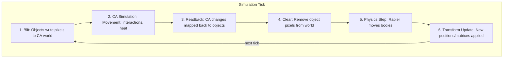
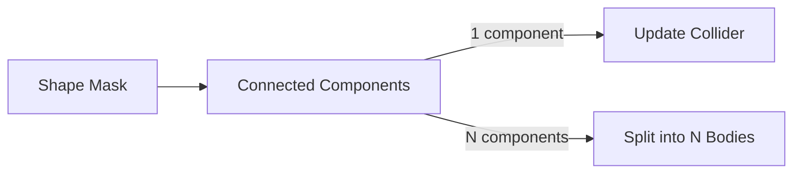

# Pixel Bodies

Dynamic physics objects with pixel content that participates in cellular automata simulation.

## Overview

Pixel bodies unify the physics and CA worlds. A pixel body is a rigid body whose visual representation consists of
individual pixels that participate fully in the CA simulation - they can burn, melt, conduct heat, and be destroyed
through material interactions. When pixels are destroyed, the object's shape changes, collision mesh updates, and the
object may split into fragments.

## Simulation Cycle

Each simulation tick processes pixel bodies through six phases:



### Phase 1: Blit (Object to World)

Each pixel body writes its pixels to the Canvas at world-transformed positions:

1. For each non-void pixel in the body's surface buffer
2. Transform local coordinates to world coordinates via affine matrix
3. Write to Canvas at world position

The blit operation uses nearest-neighbor sampling when rotation is involved.

### Phase 2: CA Simulation

Standard cellular automata passes execute on the Canvas. Object pixels participate in:

- Movement (falling, flowing based on material state)
- Material interactions (corrosion, ignition, diffusion)
- Heat propagation and effects (ignition, melting)

Object pixels are indistinguishable from world pixels during CA simulation.

### Phase 3: Readback (World to Object)

After CA simulation, changes are mapped back to object state:

1. Use the BlittedTransform (position where pixels were written, not current physics position)
2. For each world position within transformed bounds where `shape_mask=1`:
   - Read pixel from PixelWorld at world position
   - If pixel is void OR lacks `PIXEL_BODY` flag: mark as destroyed
3. Clear shape_mask bits for destroyed pixels
4. If any bits changed:
   - Insert `ShapeMaskModified` marker component
   - Insert `NeedsColliderRegen` marker component
5. Run connected component analysis
6. If multiple components: trigger object split

The readback uses `BlittedTransform` rather than current `GlobalTransform` to ensure we read from where pixels were actually written, not where physics has moved the body since blit.

### Phase 4: Clear (Remove from World)

Object pixels are removed from the Canvas before physics moves the bodies:

1. For each world position within the transformed bounds where `shape_mask=1`
2. Clear the pixel (set to void)

This prevents "ghost" pixels from remaining at the old position. World terrain that was overwritten during blit is
restored from the underlying chunk data. Debris pixels created during readback (ash, gas) remain as world terrain.

### Phase 5: Physics Step

Rapier physics simulation advances rigid body positions and rotations based on forces, collisions, and constraints.

### Phase 6: Transform Update

Updated positions and rotations from physics are applied to Bevy transforms, preparing for the next tick's blit phase.

## Data Structures

### PixelBody Component

```
PixelBody:
  surface: Surface<Pixel>      # Local pixel buffer (object-local coordinates)
  shape_mask: BitGrid          # Which pixels belong to object (vs world/void)
  origin: (i32, i32)           # Offset from entity transform to pixel grid
  width: u32
  height: u32
```

### Shape Mask

A bitgrid tracking object ownership of pixels:

| Bit Value | Meaning                           |
|-----------|-----------------------------------|
| 1         | Pixel belongs to the object       |
| 0         | Void or world pixel at this local position |

The shape mask is updated when:

- Pixels are destroyed by damage, burning, or decay
- Pixels transmute to different materials (melting)
- Pixels move away from their original position

### Transform Integration

Bevy's `GlobalTransform` provides the affine matrix mapping local pixel coordinates to world coordinates:

- **Blit**: `world_pos = transform.transform_point(local_pos + origin)`
- **Readback**: `local_pos = transform.inverse().transform_point(world_pos) - origin`

Rotation uses nearest-neighbor sampling - each world position maps to exactly one local pixel.

## Phase Integration

Pixel body operations integrate with existing simulation passes:


- **Blit** runs before CA simulation begins
- **Readback** runs after CA completes but before particles, ensuring destroyed pixels can emit particles (smoke, debris) in the same tick
- **Clear** runs after material interactions but before physics, removing object pixels from the world so physics operates on clean terrain

## Shape Tracking and Collider Updates

### Object Shape vs World Pixels

The shape mask explicitly tracks which pixels belong to the object. World pixels at the same location are separate:

- Object pixels participate in CA simulation
- When destroyed, object pixels leave the shape (shape_mask bit cleared)
- Destroyed pixels become world terrain "on top" (ash, gas, debris)

### Collider Recalculation

When the shape mask changes, the physics collider must be updated:

1. Run marching squares on the shape mask (same algorithm as terrain collision)
2. Simplify and triangulate the resulting outline
3. Update the Rapier collider component

### Object Splitting

When destruction breaks connectivity (e.g., object cut in half):



Split procedure:

1. Run connected component analysis on shape mask (union-find with path compression)
2. If 0 components: body fully destroyed, despawn entity
3. If 1 component: no split, regenerate collider if shape changed
4. If N > 1 components:
   - Despawn the original entity
   - For each component, spawn a new entity with:
     - PixelBody containing that component's pixels (tight bounds)
     - Physics collider generated from component shape
     - Inherited velocity from parent
     - New PixelBodyId from generator

## Edge Cases and Design Decisions

| Scenario | Approach |
|----------|----------|
| **Rotation handling** | Nearest-neighbor pixel sampling; no interpolation |
| **Object overlap** | Z-order priority determines which object writes to contested world positions |
| **Burning objects** | Pixels removed from edges via damage; become ash/gas as world terrain |
| **Object destruction** | Despawn entity when shape mask is entirely empty |
| **Fast-moving objects** | Clear phase removes old position; blit writes at new position; no interpolation between frames |
| **Partial overlap with terrain** | Object pixels overwrite terrain during blit; clear phase restores terrain from underlying chunk data |

## Related Documentation

- [Simulation](simulation.md) - Multi-pass simulation overview, CA phases
- [Scheduling](scheduling.md) - Checkerboard scheduling for parallel processing
- [Collision](collision.md) - Marching squares mesh generation
- [Pixel Format](pixel-format.md) - Pixel data structure
- [Materials](materials.md) - Material properties affecting pixel bodies
- [Glossary](glossary.md) - Terminology definitions
- [Architecture Overview](README.md)
