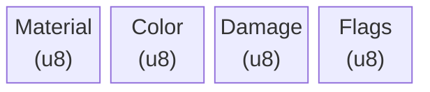

# Pixel Format

The fundamental data unit stored in chunk buffers.

## Overview

Each pixel in the simulation carries data for rendering, physics, and state tracking. The format is designed to be:

- **Compact** - Minimal memory footprint per pixel
- **Cache-friendly** - Aligned for efficient access patterns
- **Simulation-complete** - Contains all data needed for cellular automata rules

## Data Fields

| Field | Type | Purpose |
|-------|------|---------|
| Material | u8 | Type identifier, indexes into material registry |
| Color | u8 | Palette index, allows per-pixel color variation within material |
| Damage | u8 | Accumulated damage, increments on interactions, triggers destruction at threshold |
| Flags | u8 | Packed boolean states for simulation and rendering |

## Material Field

The material identifier determines pixel behavior:

- Indexes into a material registry (up to 256 materials)
- Material ID 0 is reserved for **void** (empty space)
- See [Materials](materials.md) for property definitions and interaction system

## Color Field

Palette-based coloring for rendering:

- Indexes into a color palette (up to 256 colors)
- Allows visual variation independent of material type
- Seeders can apply noise-driven color variation within material constraints

## Damage Field

Accumulated damage tracking:

- Starts at zero (pristine state)
- Increments from interactions (burning, impact, corrosion)
- At material-defined threshold: pixel is destroyed or transforms (stone → rubite, wood → ash)
- Some materials may be indestructible (damage ignored)

## Flag Bitmask

```
Bit layout (u8):
┌───┬───┬───┬───┬───┬───┬───┬───┐
│ 7 │ 6 │ 5 │ 4 │ 3 │ 2 │ 1 │ 0 │
├───┴───────┼───┼───────┼───────┼─────┼─────┤
│ reserved  │wet│burning│falling│solid│dirty│
└───────────┴───┴───────┴───────┴─────┴─────┘
```

### Simulation Flags

| Flag | Bit | Description |
|------|-----|-------------|
| `dirty` | 0 | Pixel is active and needs simulation this tick. Stable pixels have `dirty=0` and are skipped until a neighbor change wakes them. Major performance optimization - most pixels are stable at any given time. **Note:** This flag tracks *simulation activity*, not rendering. For rendering, dirty rects are tracked at the tile level - see [Spatial Hierarchy](spatial-hierarchy.md). |
| `solid` | 1 | Physical state classification. Solid pixels are static and support neighbors. Non-solid pixels (liquid/powder) flow and fall. Context-dependent: surrounded pixels may behave solid, exposed pixels fluid. |
| `falling` | 2 | Pixel has downward momentum. Cheaper than storing a velocity vector. Cleared when pixel comes to rest, set when displaced. |

### State Modifier Flags

| Flag | Bit | Description |
|------|-----|-------------|
| `burning` | 3 | Pixel is on fire. Propagates to flammable neighbors. Increments damage each tick. Clears when damage threshold reached or no fuel remains. |
| `wet` | 4 | Pixel is saturated with liquid. Modifies material behavior: wet sand clumps instead of flowing, wet materials may conduct electricity, fire cannot ignite wet pixels. |

### Reserved Bits

Bits 5-7 are reserved for future use:
- Potential: `frozen`, `emissive`, `supported`, `conductive`

## Memory Layout



**Total: 4 bytes per pixel**

For a chunk buffer, total memory = width × height × 4 bytes.

## System Interactions

| System | Fields Used | Purpose |
|--------|-------------|---------|
| Simulation | Material, Damage, Flags | Applies cellular automata rules, updates state |
| Rendering | Material, Color, Damage, Flags | Draws pixels to chunk texture with visual state feedback |

Both systems consume all pixel data. Rendering uses Damage to visually indicate wear (darkening, cracks) and Flags for state visualization (fire glow for `burning`, sheen for `wet`). Tile-level dirty rects determine which regions need texture re-upload - see [Spatial Hierarchy](spatial-hierarchy.md) for details.

## Related Documentation

- [Materials](materials.md) - Material properties, tags, and interaction system
- [Spatial Hierarchy](spatial-hierarchy.md) - World, chunk, tile, pixel organization
- [Simulation](simulation.md) - How pixels are processed each tick
- [Chunk Seeding](chunk-seeding.md) - How pixel data is initialized
- [Configuration Reference](configuration.md) - Bytes per pixel parameter
- [Architecture Overview](README.md)
