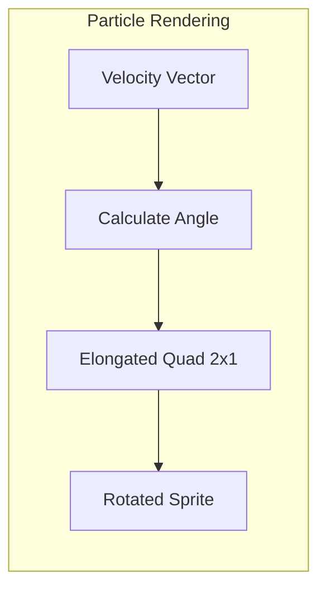
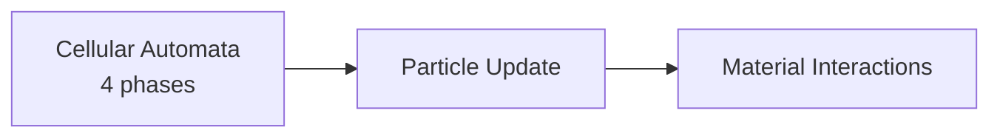

# Particles

Free-form particle system for dynamic effects that complement the cellular automata (CA) simulation.

## Overview

The simulation uses a dual model for pixel dynamics:

| System            | Model                                          | Best For                                          |
|-------------------|------------------------------------------------|---------------------------------------------------|
| Cellular Automata | Grid-based, per-pixel, checkerboard scheduling | Settled materials, interactions, stable physics   |
| Particles         | Free-form, velocity-based, simplified physics  | Dynamic effects, fast movement, transient visuals |

Particles handle effects where grid-based simulation is too restrictive:

- **Pouring fluids** - water/lava streams before settling into the grid
- **Explosion debris** - powder materials (dust, sand), rubble, fragments ejected by blasts
- **Gases** - smoke, steam, vapor trails with natural movement

Particles and pixels transition bidirectionally: pixels can become particles (emission), and particles can become
pixels (deposition).

## Particle Data Structure

```
Particle:
  position: (f32, f32)     # world coordinates, sub-pixel precision
  velocity: (f32, f32)     # movement per tick
  material: u8             # same material ID as pixels
  color: u8                # palette index for rendering
```

**Design notes:**

- **No lifetime field** - particles end only via deposition or leaving bounds
- **Sub-pixel position** - f32 allows smooth movement between grid cells
- **Material ID** - same registry as pixels, enables consistent behavior
- **Color stored** - avoids palette lookup per frame during rendering

## Transitions

### Pixel → Particle (Emission)

Pixels become particles when they need to move faster or more freely than the grid allows.

| Trigger         | Behavior                                                                               |
|-----------------|----------------------------------------------------------------------------------------|
| **Explosion**   | Pixels in blast radius become particles with outward velocity proportional to distance |
| **Pouring**     | Unsupported liquid/powder pixels with no neighbor below become particles               |
| **Gas release** | Certain reactions emit gas particles (steam from water + lava)                         |

**Emission pseudocode:**

```
fn emit_particle(pixel_pos: (i32, i32), velocity: (f32, f32)):
    pixel = world.get_pixel(pixel_pos)
    if pixel.material == VOID:
        return

    particle = Particle {
        position: (pixel_pos.x as f32 + 0.5, pixel_pos.y as f32 + 0.5),
        velocity: velocity,
        material: pixel.material,
        color: pixel.color,
    }

    world.set_pixel(pixel_pos, VOID)
    particles.spawn(particle)
```

### Particle → Pixel (Deposition)

Particles become pixels when they settle or collide with the grid.

| Condition         | Behavior                                                                       |
|-------------------|--------------------------------------------------------------------------------|
| **Collision**     | Particle hits non-void pixel → deposited atomically into nearest adjacent void |
| **Settling**      | Velocity near zero over void cell → convert to pixel at current position       |
| **Out of bounds** | Particle leaves active region → discarded (no deposition)                      |

**Deposition pseudocode:**

```
fn try_deposit(particle: &Particle) -> bool:
    grid_pos = (particle.position.x as i32, particle.position.y as i32)
    target = world.get_material(grid_pos)

    if target == VOID:
        # Direct deposition into void
        # Writes Material layer (always)
        world.set_material(grid_pos, particle.material)

        # Writes Color layer (if registered)
        if color_layer.is_registered():
            world.set_color(grid_pos, particle.color)

        # Writes Flags layer (if registered)
        if flags_layer.is_registered():
            world.set_flags(grid_pos, DIRTY)

        return true

    # Collision with solid - find adjacent void
    for neighbor in adjacent_cells(grid_pos):
        if world.get_material(neighbor) == VOID:
            world.set_material(neighbor, particle.material)
            # ... write other layers as above
            return true

    return false  # no valid deposition site
```

**Layer writes during deposition:**

| Layer | Source | Behavior |
|-------|--------|----------|
| Material | `particle.material` | Always written |
| Color | `particle.color` | Written if Color layer registered |
| Damage | `0` | Written if Damage layer registered |
| Flags | `DIRTY` | Written if Flags layer registered |

## Physics Simulation

### Forces

Each tick, particles are updated with simplified physics:

```
fn update_particle(particle: &mut Particle, dt: f32):
    material = registry[particle.material]

    # Apply gravity (material-specific)
    particle.velocity.y += material.particle_gravity * dt

    # Apply drag / air resistance (see Configuration for air_drag value)
    particle.velocity *= (1.0 - air_drag * dt)

    # Update position
    particle.position += particle.velocity * dt
```

### Material Gravity Modifiers

Different materials have different particle gravity behavior:

| Material Type | `particle_gravity` | Behavior                          |
|---------------|--------------------|-----------------------------------|
| Stone/Metal   | 1.0                | Falls normally                    |
| Water         | 0.8                | Slightly slower fall              |
| Steam         | -0.3               | Rises (negative gravity)          |
| Smoke         | -0.2               | Rises slowly                      |
| Dust*         | 0.6                | Falls slowly, more air resistance |

*Dust is a specific material with behavior type `powder` (not a behavior type itself). See [Materials](materials.md).

### Collision Detection

Particles only collide with the pixel grid, not with each other:

```
fn check_collision(particle: &Particle) -> bool:
    grid_pos = (particle.position.x as i32, particle.position.y as i32)
    return world.get_pixel(grid_pos).material != VOID
```

**Why no inter-particle collisions:**

- Performance: O(n²) collision checks prohibitive for many particles
- Visual fidelity: particles are transient effects, not physical objects
- Simplicity: single collision system against the grid

## Rendering

Particles render as elongated quads for a motion blur effect.

**Implementation:** Bevy API research deferred to Phase 8. Implementation will use `Mesh2d` with instance buffer or sprite batching depending on Bevy version at implementation time.

```
Particle Quad:
  width:  2 pixels (motion blur elongation)
  height: 1 pixel
  orientation: velocity vector direction
  color: palette[particle.color]
```

**Rendering approach:**

1. Calculate orientation angle from velocity: `atan2(velocity.y, velocity.x)`
2. Draw quad at particle position, rotated to face movement direction
3. Use same palette as pixel rendering for visual consistency



## Gas Handling

Gases use a dual approach based on their behavior:

### Rising Gas → Particles

Best for dynamic, transient gas effects:

| Gas Type     | Behavior                                |
|--------------|-----------------------------------------|
| Steam        | Rises quickly, disperses, leaves bounds |
| Smoke plumes | Rises, spreads outward, fades at edges  |
| Vapor trails | Short-lived visual effect               |

**Advantages:**

- Natural upward movement with buoyancy (`particle_gravity < 0`)
- Smooth sub-pixel movement
- Automatically cleans up at world bounds

### Dense Gas Clouds → Cellular Automata

Best for persistent, interactive gas volumes:

| Gas Type      | Behavior                                 |
|---------------|------------------------------------------|
| Fog           | Settles, persists, slow dispersion       |
| Poison clouds | Needs to interact with organic materials |
| Settled gas   | Benefits from CA neighbor interactions   |

**Advantages:**

- Uses `gas` material state for built-in dispersion
- Participates in material interactions (damage, reactions)
- Persists until explicitly transformed

**Choosing the approach:**

| Need                            | Use                 |
|---------------------------------|---------------------|
| Fast vertical movement          | Particles           |
| Dispersion over time            | CA with `gas` state |
| Material interactions           | CA with `gas` state |
| Visual effects (trails, plumes) | Particles           |
| Persistent clouds               | CA with `gas` state |

## Integration with Simulation

### Scheduling

The particle pass runs once per tick, after the cellular automata pass:



### Simulation Pass

```
fn particle_pass():
    # Update all particles
    for particle in particles:
        update_particle(particle, dt)

        # Check for deposition
        if check_collision(particle):
            if try_deposit(particle):
                particles.remove(particle)
            else:
                # Bounce or discard
                particles.remove(particle)

        # Check bounds
        if not in_active_region(particle.position):
            particles.remove(particle)
```

### Memory Management

Particles use a simple pool allocator:

- Fixed-size particle pool (see [Configuration](../foundational/configuration.md) for `pool_size`)
- When pool is full, new emissions are silently rejected (with a warning logged)
- No heap allocation during simulation

## Related Documentation

- [Simulation](simulation.md) - Main simulation passes and scheduling
- [Materials](materials.md) - Material properties including `particle_gravity`
- [Pixel Format](../foundational/pixel-format.md) - Pixel structure that particles convert to/from
- [Spatial Hierarchy](../foundational/spatial-hierarchy.md) - World coordinate system
- [Architecture Overview](../README.md)
