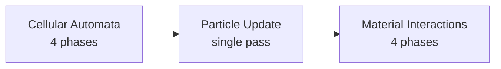

# Simulation

Multi-pass simulation system with cellular automata (CA), material interactions, and auxiliary layers.

## Overview

The simulation runs multiple passes per tick, each handling different aspects:

| Pass                  | Frequency     | Scope             | Purpose                                      |
|-----------------------|---------------|-------------------|----------------------------------------------|
| Cellular Automata     | Every tick    | Dirty pixels only | Physics: falling, flowing, displacement      |
| Particles             | Every tick    | All particles     | Free-form movement, emission, deposition     |
| Material Interactions | Every tick    | Active pixels     | Reactions: corrosion, ignition, diffusion    |
| Decay                 | Every N ticks | All pixels        | Time-based transformations: evaporation, rot |
| Heat Propagation      | Every M ticks | Heat layer        | Thermal diffusion and conduction             |

## Simulation Layers

Beyond the main pixel buffer, chunks maintain auxiliary data layers for effects that operate at different scales.

### Heat Layer

A downsampled thermal map stored per chunk.

**Structure:**

- Resolution: `CHUNK_SIZE` / 4 (e.g., 512×512 chunk → 128×128 heat cells)
- Each cell represents a 4x4 pixel region
- Stored as `u8` temperature values (0 = cold, 255 = hot)

**Heat sources:**

- Burning pixels (`burning` flag) emit heat to their cell
- Materials with `base_temperature > 0` (lava, molten metal) continuously emit heat
- External sources (fire spells, explosions) inject heat directly

**Propagation:**

```
for each heat cell:
    # Accumulate heat from pixel sources in this cell
    source_heat = sum(material.base_temperature for pixels with base_temp > 0)
    source_heat += burning_heat * count(pixels with burning flag)

    # Gather heat from neighbors (simplified diffusion)
    neighbor_avg = (north + south + east + west) / 4

    # Blend source heat with diffused heat
    # cooling_factor: 0.0-1.0, e.g., 0.95 - see Configuration
    new_temp = max(source_heat, (self + neighbor_avg) / 2 * cooling_factor)

    # Clamp and store
    cell.temperature = clamp(new_temp, 0, 255)
```

**Effects on pixels:**

After heat propagation, apply effects to pixels based on their cell's temperature:

```
for each pixel in cell:
    material = registry[pixel.material]
    temp = cell.temperature

    # Ignition check
    if material.ignition_threshold > 0:
        if temp >= material.ignition_threshold:
            pixel.flags.burning = true

    # Melting check
    if material.melting_threshold > 0:
        if temp >= material.melting_threshold:
            pixel.material = material.melting_product
            pixel.damage = 0
            pixel.flags.dirty = true
```

**Ignition** (flammable materials only):

| Material | Threshold | Behavior            |
|----------|-----------|---------------------|
| Wood     | 40        | Catches fire easily |
| Cloth    | 30        | Very flammable      |
| Leaves   | 25        | Extremely flammable |
| Oil      | 35        | Flammable liquid    |

Non-flammable materials (stone, metal, sand) have `ignition_threshold: 0` - they cannot burn, but they conduct and
display heat visually.

**Melting** (state transitions):

| Material | Threshold | Product      |
|----------|-----------|--------------|
| Ice      | 30        | Water        |
| Stone    | 240       | Lava         |
| Metal    | 220       | Molten metal |
| Sand     | 250       | Glass        |

**Heat glow** (rendering):

Non-flammable materials display heat visually without burning:

- Metals and stones glow orange/red/white based on temperature
- Rendering samples the heat layer to tint pixel color
- Provides visual feedback that material is hot before melting

**Why downsampled:**

- Heat diffuses over distance - per-pixel resolution wasteful
- 16x reduction in memory and computation
- Smooth gradients more physically plausible than per-pixel heat

### Future Layers

Potential additional layers following the same pattern:

- **Moisture** - humidity affecting fire spread, plant growth
- **Light** - for photosensitive materials, plant simulation
- **Pressure** - for explosions, fluid compression

---

## Cellular Automata Pass

Thread-safe falling sand simulation using checkerboard scheduling.

### Falling Sand Basics

Each material state has movement rules:

| State    | Behavior                                     |
|----------|----------------------------------------------|
| `solid`  | Static, does not move, supports neighbors    |
| `powder` | Falls down, piles up, slides off slopes      |
| `liquid` | Falls down, flows sideways, fills containers |
| `gas`    | Rises, disperses in all directions           |

Each tick, active pixels (dirty flag set) check neighbors and potentially swap positions based on gravity and density.

### Dirty Flag Optimization

Only pixels with `dirty=1` are processed:

- Stable pixels (at rest, no active neighbors) have `dirty=0`
- When a pixel moves, it sets `dirty=1` on itself and affected neighbors
- Drastically reduces work - most pixels are stable at any time

### Parallel Scheduling

The cellular automata pass uses checkerboard scheduling with four phases (A, B, C, D) to enable safe parallel
processing. Tiles of the same phase are never adjacent, so they can be processed concurrently without race conditions.

See [Scheduling](scheduling.md) for full details on phase patterns, execution timeline, thread safety guarantees, and
cross-chunk boundary handling

---

## Particle Pass

Updates free-form particles for dynamic effects. Runs after cellular automata, before material interactions.

### Purpose

Particles handle movement that doesn't fit the grid-based cellular automata model:

- Pouring fluids and powders
- Explosion debris
- Rising gases (smoke, steam)

### Scheduling

Particles are processed in a single pass (no checkerboard needed - particles don't interact with each other):



### Per-Tick Operations

1. **Physics update** - apply gravity, drag, update position
2. **Collision check** - test against pixel grid
3. **Deposition** - convert colliding/settling particles to pixels
4. **Bounds check** - remove particles that leave active region

See [Particles](particles.md) for full documentation on emission, deposition, physics, and rendering.

---

## Material Interactions Pass

Processes reactions between adjacent materials. Runs after cellular automata within the same tick.

### Interaction Resolution

For each active pixel A adjacent to pixel B:

1. Look up A's material in registry
2. Check A's interactions for B's specific material ID (override)
3. If no override, check A's interactions for any of B's tags
4. Apply first matching effect
5. Reciprocally check B's interactions with A

### Effect Types

| Effect      | Implementation                                          |
|-------------|---------------------------------------------------------|
| `corrode`   | Increment target's damage by `rate`                     |
| `ignite`    | Set target's `burning` flag if `ignition_threshold > 0` |
| `diffuse`   | Probabilistically swap positions (mixing)               |
| `transform` | Change target's material ID                             |
| `displace`  | Force position swap regardless of density               |
| `none`      | Explicitly skip (for overrides)                         |

### Integration with Automata

Material interactions run on the same checkerboard schedule:

- Same phase guarantees as movement
- Interaction effects applied after movement resolution
- Dirty flags propagated for affected pixels

See [Materials](materials.md) for interaction definitions and examples.

---

## Decay Pass

Time-based material transformations independent of pixel activity.

### Scheduling

- Runs every N ticks (configurable via `decay_tick_rate`, e.g., every 60 ticks - see [Configuration](../foundational/configuration.md))
- Ignores dirty flags - processes all pixels
- Processes all loaded chunks, even if "stable"

### Algorithm

```
for each pixel in world:
    material = registry[pixel.material]
    if material.decay_chance > 0:
        if random() < material.decay_chance:
            pixel.material = material.decay_product
            pixel.damage = 0              # reset damage
            pixel.flags.dirty = true      # wake for main simulation
```

### Design Rationale

**Why probabilistic:**

- No age field in pixel format (would cost 1+ bytes per pixel)
- Natural variation - not all water evaporates simultaneously
- Tunable via `decay_chance`

**Why separate pass:**

- Decay is infrequent compared to physics
- Ignoring dirty flags ensures stable pixels still age
- Decouples decay timing from simulation tick rate

**Why ignore dirty rects:**

- Pixels at rest for 1000 ticks should still decay
- Dirty optimization is for physics, not time-based effects
- Infrequent enough that full-world scan is acceptable

See [Materials](materials.md) for decay property definitions.

---

## Dirty Rect Tracking

Tiles track dirty rectangles for **simulation scheduling only** (separate from per-pixel dirty flags):

- When a pixel changes within a tile, that tile's dirty rect expands
- Dirty rects determine which pixel regions to consider in subsequent passes
- More efficient than per-pixel tracking, finer than whole-chunk

**Note:** Dirty rects do not drive rendering uploads. Rendering uses whole-chunk texture upload -
see [Rendering](../rendering/rendering.md).

See [Spatial Hierarchy](../foundational/spatial-hierarchy.md) for tile system details.

---

## Performance Characteristics

| Aspect             | Benefit                                      |
|--------------------|----------------------------------------------|
| Parallelism        | All tiles of same phase process concurrently |
| Scaling            | Linear scaling with CPU cores                |
| Memory access      | Each thread works on isolated memory regions |
| Synchronization    | Only 4 barrier points per automata tick      |
| Dirty optimization | Skip stable pixels entirely                  |
| Downsampled layers | Heat/moisture at 1/16 resolution             |

## Related Documentation

- [Materials](materials.md) - Material properties, tags, and interaction definitions
- [Particles](particles.md) - Free-form particle system for dynamic effects
- [Pixel Bodies](../physics/pixel-bodies.md) - Dynamic physics objects with pixel content
- [Pixel Format](../foundational/pixel-format.md) - Data structure processed by simulation
- [Spatial Hierarchy](../foundational/spatial-hierarchy.md) - World, chunk, tile, pixel organization
- [Scheduling](scheduling.md) - Checkerboard tile phasing for parallel simulation
- [Chunk Pooling](../chunk-management/chunk-pooling.md) - Memory management for chunk buffers
- [Streaming Window](../streaming/streaming-window.md) - Which chunks are active for simulation
- [Configuration Reference](../foundational/configuration.md) - Tunable simulation parameters
- [Architecture Overview](../README.md)
