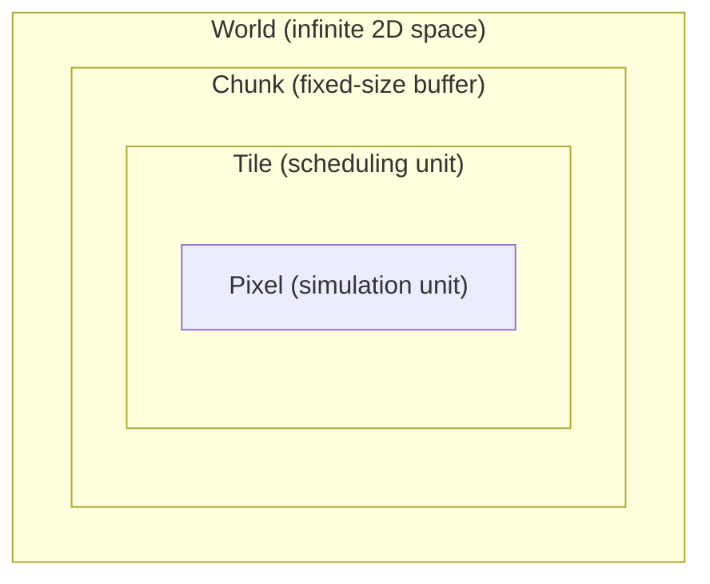
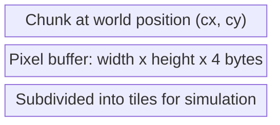
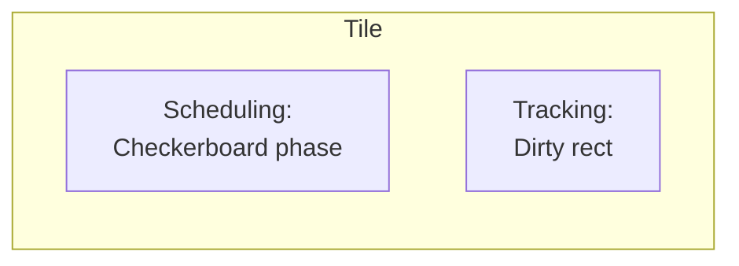
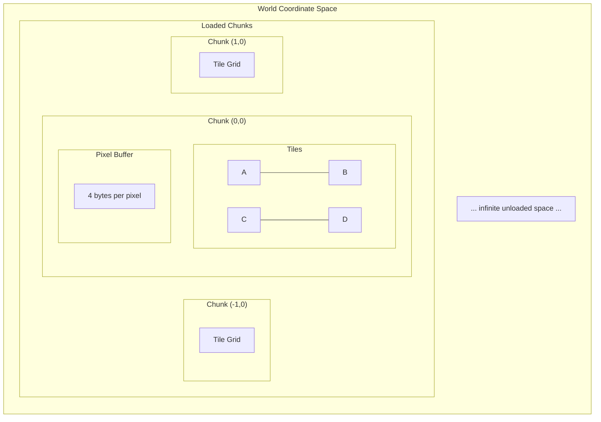

# Spatial Hierarchy

The four-level spatial organization for addressing, storage, and simulation.

## Overview

The world is organized into a nested hierarchy where each level serves specific purposes:



| Level     | Description                  | Role                                          |
|-----------|------------------------------|-----------------------------------------------|
| **World** | Infinite 2D coordinate space | Global addressing                             |
| **Chunk** | Fixed-size pixel buffer      | Unit of pooling, streaming, persistence       |
| **Tile**  | Subdivision of chunk         | Checkerboard scheduling + dirty rect tracking |
| **Pixel** | Individual simulation unit   | Cellular automata state                       |

## World

The world is an infinite 2D coordinate space with no direct memory representation.

- World coordinates can identify any position (signed integers)
- Provides global addressing system for all other levels
- Chunks are placed within the world at chunk-aligned positions
- The streaming window determines which portion of the world is active

## Chunk

A chunk is a fixed-size rectangular buffer of pixels.



**Responsibilities:**

- **Memory pooling** - Chunks are reused from an object pool to avoid allocation
- **Streaming unit** - The streaming window loads/unloads whole chunks
- **Persistence unit** - Chunks are saved/loaded as complete units
- **Rendering unit** - Each chunk maps to a texture

**Properties:**

- Has a world position (chunk coordinates)
- Contains a contiguous pixel buffer
- Subdivided into a grid of tiles

## Tile

A tile is a subdivision of a chunk, serving two purposes.



### Checkerboard Scheduling

Tiles are assigned to one of four phases (A, B, C, D) in a checkerboard pattern. During simulation, tiles of the same
phase can be processed in parallel because they are never adjacent. See [Scheduling](scheduling.md) for details.

### Dirty Rect Tracking

Each tile maintains a dirty rectangle for **simulation scheduling only**:

1. **Simulation boundary** - Determines which pixels are candidates for processing

**Note:** Dirty rects do not drive rendering uploads. Rendering uses whole-chunk texture upload -
see [Rendering](rendering.md).

**Lifecycle per simulation pass:**

1. The current dirty rect defines the scheduling boundary (which pixels to consider)
2. Before processing begins, the dirty rect is **reset to empty**
3. As pixels change during simulation, the dirty rect **grows to encapsulate** each change (AABB expansion)
4. The resulting dirty rect becomes the scheduling boundary for the next pass

```
Pass N uses rect:     Reset before pass:    Pass N builds new rect:
+------------+        +------------+        +------------+
|  +------+  |        |            |        |    +--+    |
|  | proc |  |   →    |   empty    |   →    |    |X |    |  <- grows as pixels change
|  +------+  |        |            |        |    +--+    |
+------------+        +------------+        +------------+
```

**Initial state:** New tiles start with dirty rect covering the entire tile, ensuring all pixels are processed on first
pass.

**Note:** This is distinct from the per-pixel `dirty` flag. The pixel dirty flag indicates whether a specific pixel
needs evaluation. Tile dirty rects define the spatial bounds for simulation scheduling.

## Pixel

The fundamental unit of the cellular automata simulation.

- 4 bytes: material, color, damage, flags
- Stores state needed for simulation and rendering
- See [Pixel Format](pixel-format.md) for complete documentation

## Coordinate Systems

All coordinate systems use the **Y+ up** convention. See [Coordinate System Convention](coordinates.md) for the full
specification.

Multiple coordinate systems operate at different levels:

| Coordinate Type | Range                             | Usage                           |
|-----------------|-----------------------------------|---------------------------------|
| **World**       | Infinite (signed)                 | Global pixel addressing         |
| **Chunk**       | Infinite (signed)                 | Which chunk contains a position |
| **Tile**        | 0 to `CHUNK_SIZE/TILE_SIZE - 1`   | Which tile within a chunk       |
| **Local**       | 0 to `CHUNK_SIZE - 1`             | Pixel position within a chunk   |

### Coordinate Conversions

Uses compile-time constants `CHUNK_SIZE` and `TILE_SIZE` (see [Configuration](configuration.md)).

```
World → Chunk:
  chunk_x = floor(world_x / CHUNK_SIZE)
  chunk_y = floor(world_y / CHUNK_SIZE)

World → Local (within chunk):
  local_x = world_x mod CHUNK_SIZE
  local_y = world_y mod CHUNK_SIZE

Local → Tile:
  tile_x = floor(local_x / TILE_SIZE)
  tile_y = floor(local_y / TILE_SIZE)
```

## Diagram: Hierarchy Nesting



## Related Documentation

- [Pixel Format](pixel-format.md) - Per-pixel data structure
- [Simulation](simulation.md) - Multi-pass simulation overview
- [Scheduling](scheduling.md) - Checkerboard tile phasing for parallel simulation
- [Chunk Pooling](chunk-pooling.md) - Chunk memory management
- [Streaming Window](streaming-window.md) - Active region around camera
- [Architecture Overview](README.md)
