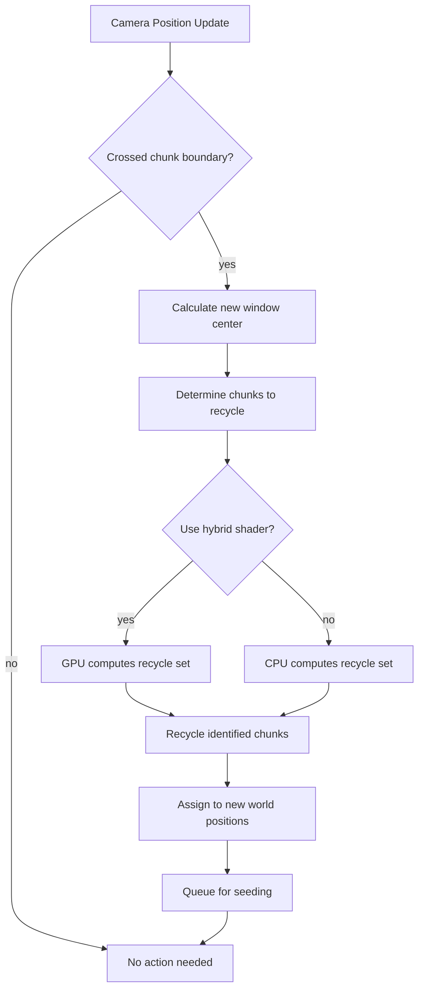
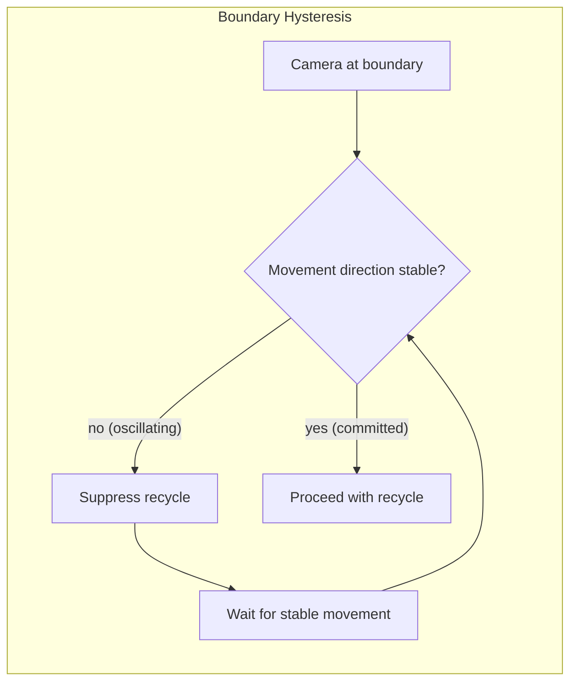
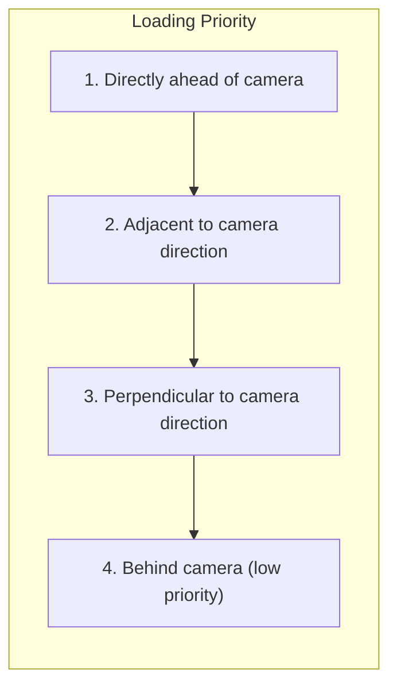

# Streaming Window

Camera-tracking active region for infinite world exploration.

## Overview

The streaming window is a fixed-size region of loaded chunks that follows the camera. As the player explores, chunks behind the camera are recycled and reassigned to positions ahead.

## Active Region Structure

The active region is defined by:

- **Window dimensions** - Width and height in chunks
- **Total chunk count** - Must match the chunk pool size
- **World coverage** - Window dimensions × chunk dimensions in pixels

See [Configuration Reference](configuration.md) for tunable parameters.

## Camera Tracking



### Boundary Detection

The window center is quantized to chunk coordinates. When the camera moves far enough that the center should shift:

1. **Calculate delta** - How many chunks the window needs to shift (usually 1)
2. **Identify obsolete chunks** - Chunks that will fall outside the new window bounds
3. **Determine new positions** - World coordinates for recycled chunks
4. **Prioritize by direction** - Chunks ahead of camera movement load first

## Hybrid Shader Approach

For complex window calculations, a compute shader can determine which chunks need recycling:

| Approach | When to Use |
|----------|-------------|
| CPU | Small shifts (1 chunk), simple cases |
| GPU (hybrid) | Large teleports, complex window shapes |

The shader receives camera position and outputs a list of chunk indices to recycle.

## Hysteresis Buffer

Prevents rapid recycling when the camera oscillates near a chunk boundary:



**Why hysteresis matters:**
- Camera jitter at boundaries would cause constant chunk recycling
- Recycling is expensive (disk I/O, seeding computation)
- Small buffer zone absorbs oscillation without triggering recycling

### Implementation

- Track camera velocity direction over several frames
- Only trigger recycling when direction is consistent
- Configurable threshold for direction stability

## Loading Priority

When multiple chunks need loading, prioritize by:



| Priority | Chunks | Rationale |
|----------|--------|-----------|
| Highest | Directly ahead | Player will see these first |
| High | Diagonally ahead | Likely visible soon |
| Medium | Perpendicular | May become visible |
| Low | Behind | Player moving away |

## Window Visualization

```
        Camera movement →

    +---+---+---+---+---+---+
    | L | L | . | . | . | N |  L = Low priority (recycle candidates)
    +---+---+---+---+---+---+  N = New (high priority load)
    | L | L | . | . | . | N |  . = Active chunks
    +---+---+---+---+---+---+
    | L | L | . | [C] | . | N |  [C] = Camera position
    +---+---+---+---+---+---+
    | L | L | . | . | . | N |
    +---+---+---+---+---+---+

```

As the camera moves right:
- Left column (L) becomes candidates for recycling
- Right column (N) represents new world positions to load
- Center chunks remain active

## Related Documentation

- [Chunk Pooling](chunk-pooling.md) - Provides chunks for the streaming window
- [Chunk Seeding](chunk-seeding.md) - Initializes newly assigned chunks
- [Configuration Reference](configuration.md) - Window and hysteresis parameters
- [Architecture Overview](README.md)
