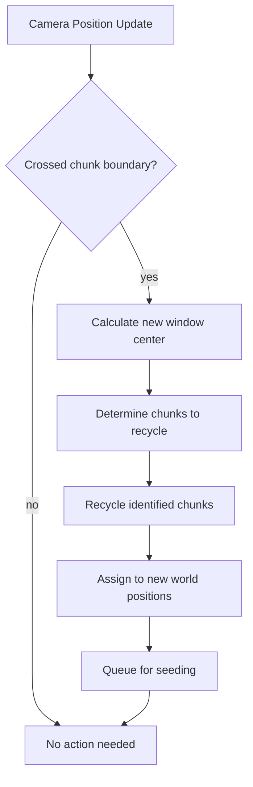

# Streaming Window

Camera-tracking region for infinite world exploration.

## Overview

The **streaming window** defines which chunks are currently loaded and active. It follows the camera as the player
explores, recycling chunks behind the camera and assigning them to positions ahead.

The terms "streaming window" and "active region" are used interchangeably throughout the documentation:

- **Streaming window** emphasizes the loading/unloading mechanism
- **Active region** emphasizes the set of currently loaded chunks

## Active Region Structure

The active region (streaming window) is a fixed-size rectangular grid:

- **Window dimensions** - `WINDOW_WIDTH` × `WINDOW_HEIGHT` chunks (6×4 for landscape)
- **Total chunk count** - `POOL_SIZE` (= `WINDOW_WIDTH * WINDOW_HEIGHT`)
- **World coverage** - (`WINDOW_WIDTH` × `CHUNK_SIZE`) × (`WINDOW_HEIGHT` × `CHUNK_SIZE`) pixels

The grid maintains internal positional consistency—it always remains a complete rectangle. As the camera moves, chunks
roll from one edge to the opposite edge rather than being individually loaded/unloaded.

See [Configuration Reference](configuration.md) for compile-time constants.

## Camera Tracking



### Boundary Detection

The window center is quantized to chunk coordinates. When the camera moves far enough that the center should shift:

1. **Calculate delta** - How many chunks the window needs to shift (usually 1)
2. **Identify obsolete chunks** - Chunks that will fall outside the new window bounds
3. **Determine new positions** - World coordinates for recycled chunks
4. **Prioritize by direction** - Chunks ahead of camera movement load first

### Center-Adjusted Repositioning

By default, chunk membership is determined by floor division—a camera at position (100, 100) belongs to chunk (0, 0)
whose corner is at the origin. This creates asymmetric streaming: the camera can move further toward the chunk's far
edge before triggering a reposition than toward its near edge.

To achieve symmetric repositioning, offset the camera position by half a chunk before computing chunk membership:

```
effective_position = camera_position + (CHUNK_SIZE / 2)
chunk_position = floor(effective_position / CHUNK_SIZE)
```

This shifts effective chunk boundaries from corners (0, 512, 1024...) to centers (-256, 256, 768...). The camera now "
belongs" to whichever chunk center it's closest to, and repositioning occurs at equal distances in all directions.

## Hysteresis Buffer

Prevents rapid recycling when the camera oscillates near a chunk boundary:


**Why hysteresis matters:**

- Camera jitter at boundaries would cause constant chunk recycling
- Recycling is expensive (disk I/O, seeding computation)
- Small buffer zone absorbs oscillation without triggering recycling

### Implementation

- Track camera velocity direction over several frames
- Only trigger recycling when direction is consistent
- Configurable threshold for direction stability [needs clarification: threshold value]

## Loading Priority

When multiple chunks need loading, prioritize by:


| Priority | Chunks           | Rationale                   |
|----------|------------------|-----------------------------|
| Highest  | Directly ahead   | Player will see these first |
| High     | Diagonally ahead | Likely visible soon         |
| Medium   | Perpendicular    | May become visible          |
| Low      | Behind           | Player moving away          |

## Window Visualization

```
        Camera movement →

    +---+---+---+---+---+---+
    | R | . | . |[C]| . | N |  R = Roll candidates (left edge)
    +---+---+---+---+---+---+  N = New positions (right edge)
    | R | . | . | . | . | N |  . = Active chunks
    +---+---+---+---+---+---+  [C] = Camera position
    | R | . | . | . | . | N |
    +---+---+---+---+---+---+
    | R | . | . | . | . | N |
    +---+---+---+---+---+---+
          6 × 4 chunk grid
```

As the camera moves right:

- Left column (R) rolls to become the new right column (N)
- The grid shifts but maintains its 6×4 rectangular shape
- Chunks are reassigned to new world positions and reseeded

## Related Documentation

- [Chunk Pooling](chunk-pooling.md) - Provides chunks for the streaming window
- [Chunk Seeding](chunk-seeding.md) - Initializes newly assigned chunks
- [Configuration Reference](configuration.md) - Window and hysteresis parameters
- [Architecture Overview](README.md)
