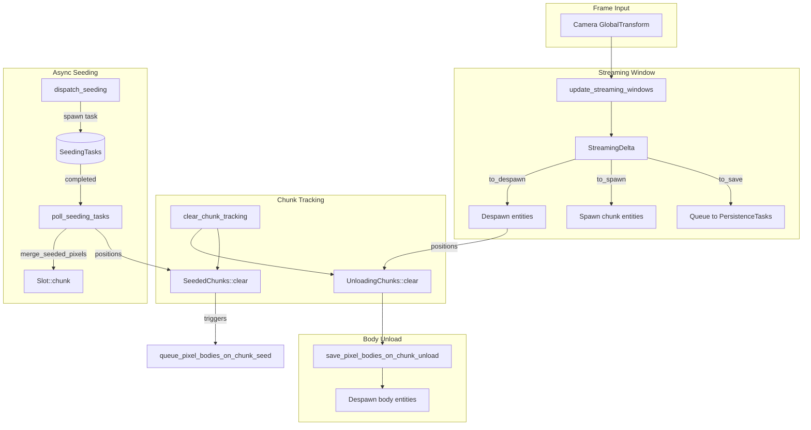
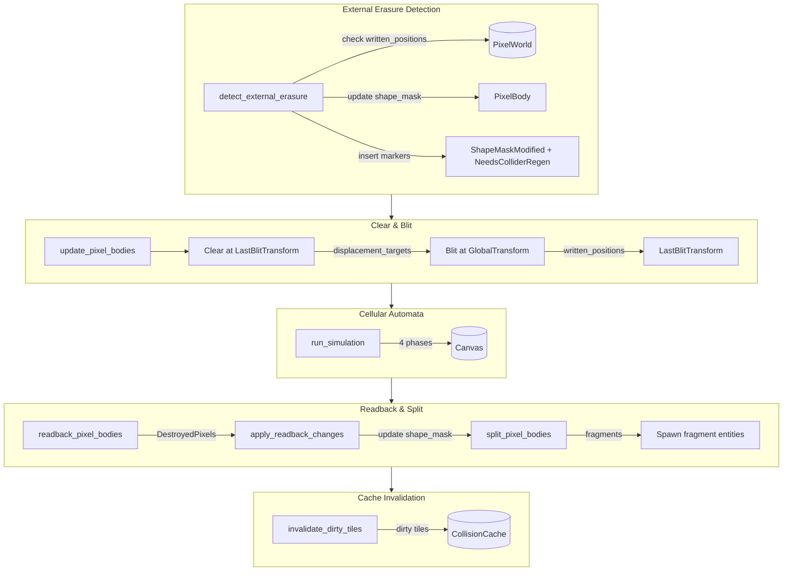
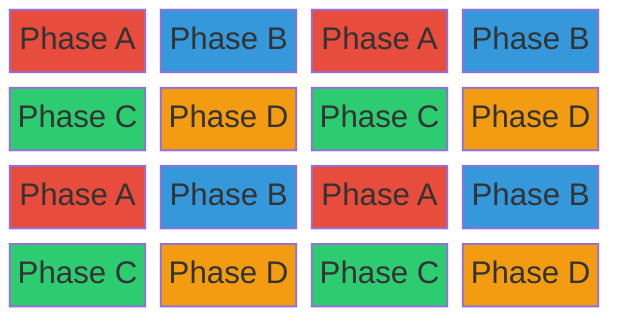
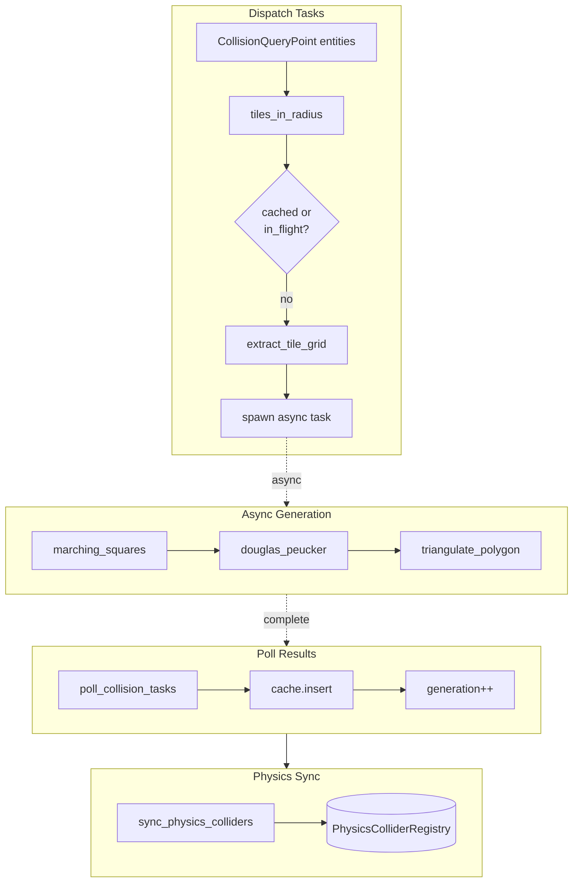
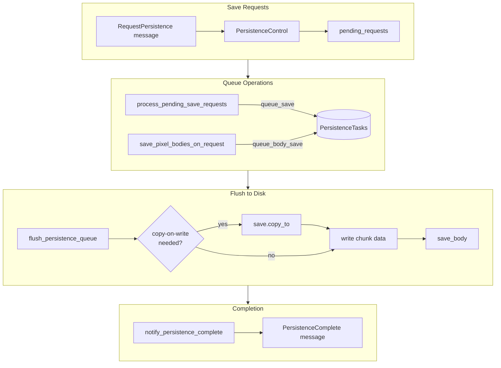
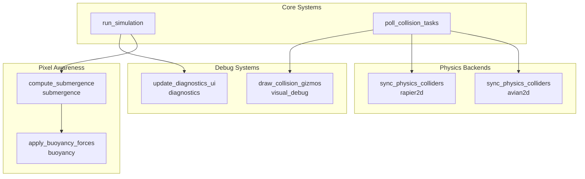
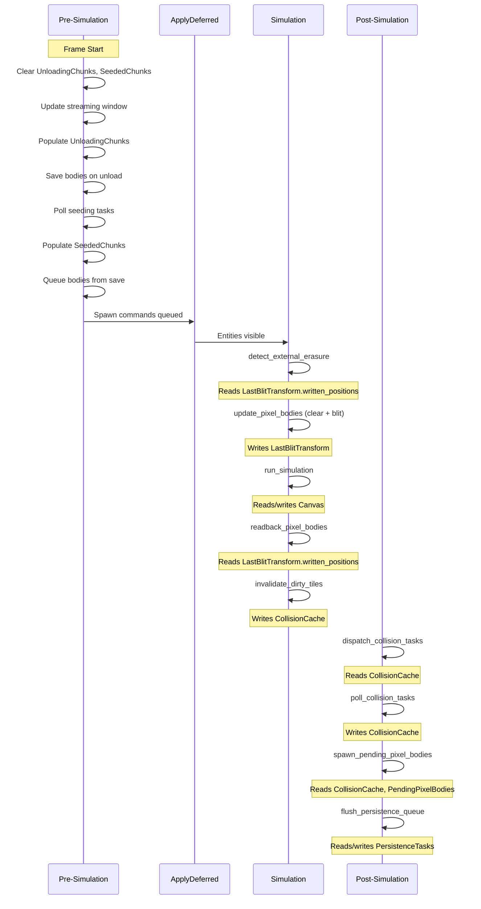
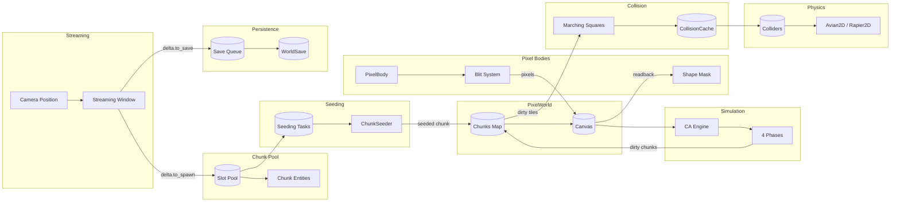

# Systems Flow

Complete frame update loop mapping for `bevy_pixel_world`, documenting system execution order, cross-subsystem data flow, and design rationale.

## Overview and Purpose

This document maps the complete frame update loop - every system that runs, when it runs, and what data flows between them. Unlike module-specific documentation that explains subsystem internals, this document focuses on:

- **Execution order**: The precise sequence of systems within each phase
- **Cross-cutting data flow**: How resources and components bridge subsystem boundaries
- **Design rationale**: Why systems are ordered this way and what tradeoffs were made

Use this document to understand how a single frame transforms from camera position to rendered pixels, and how entities flow through the spawn-simulate-persist lifecycle.

For module internals, see the [Architecture README](README.md).

---

## Frame Update Loop - The Big Picture

Each frame executes three chained system groups with explicit `ApplyDeferred` barriers:

```mermaid
gantt
    title Frame Update Pipeline
    dateFormat X
    axisFormat %s

    section Pre-Simulation
    Chunk Tracking: a1, 0, 1
    Streaming: a2, 1, 3
    Seeding: a3, 3, 5
    Body Loading: a4, 5, 6
    Bounds Update: a5, 6, 7

    section Barrier
    ApplyDeferred: barrier, 7, 8

    section Simulation
    External Erasure: b1, 8, 9
    Clear & Blit: b2, 9, 10
    CA Simulation: b3, 10, 13
    Readback: b4, 13, 14
    Split: b5, 14, 15
    Invalidate Tiles: b6, 15, 16

    section Post-Simulation
    Collision Dispatch: c1, 16, 17
    Collision Poll: c2, 17, 18
    Body Spawn: c3, 18, 19
    GPU Upload: c4, 19, 20
    Persistence: c5, 20, 22
```



### System Group Contents

```mermaid
flowchart TB
    subgraph PreSim["Pre-Simulation"]
        direction TB

        subgraph FrameReset["Frame Reset"]
            PS1["Reset tracking"]
            PS2["Process save messages"]
        end

        subgraph GPUInit["GPU Init (once)"]
            PS3["Upload palette"]
        end

        subgraph Streaming["Streaming"]
            PS4["Update chunk window"]
            PS5["Save unloading bodies"]
            PS6["Cull distant entities"]
        end

        subgraph Seeding["Chunk Seeding"]
            PS7["Dispatch async seeds"]
            PS8["Poll completed seeds"]
            PS9["Queue bodies from disk"]
        end

        subgraph SimSetup["Simulation Setup"]
            PS10["Set CA bounds"]
            PS11["Finalize new bodies"]
        end

        PS1 --> PS2
        PS2 --> PS3 --> PS4
        PS4 --> PS5 --> PS6
        PS6 --> PS7 --> PS8 --> PS9
        PS9 --> PS10 --> PS11
    end

    subgraph Barrier["Entity Visibility Barrier"]
        AD["ApplyDeferred"]
    end

    subgraph Sim["Simulation"]
        direction TB

        subgraph BodyPrep["Body Preparation"]
            S1["Detect brush erasure"]
            S2["Clear + blit pixels"]
        end

        subgraph CA["Cellular Automata"]
            S3["Run 4-phase CA"]
            S3b["process_burning<br/>(every tick)"]
            S3c{"heat tick?"}
            S3d["propagate_heat"]
            S3e["ignite_from_heat"]
            S3 --> S3b --> S3c
            S3c -->|"yes"| S3d --> S3e
            S3c -->|"no"| S3end["done"]
            S3e --> S3end
            style S3end fill:none,stroke:none
        end

        subgraph Readback["Destruction Readback"]
            S4["Detect destroyed pixels"]
            S5["Update shape masks"]
            S6["Split fragments"]
        end

        subgraph CacheInval["Cache Maintenance"]
            S7["Invalidate collision tiles"]
        end

        S1 --> S2 --> S3
        S3 --> S4 --> S5 --> S6 --> S7
    end

    subgraph PostSim["Post-Simulation"]
        direction TB

        subgraph Collision["Collision Generation"]
            P1["Dispatch mesh tasks"]
            P2["Poll mesh results"]
            P3["Spawn ready bodies"]
        end

        subgraph Render["Rendering"]
            P4["Upload pixels + heat to GPU"]
        end

        subgraph Persist["Persistence"]
            P5["Queue chunks"]
            P6["Queue bodies"]
            P7["Flush to disk"]
            P8["Signal complete"]
        end

        P1 --> P2 --> P3
        P3 --> P4
        P4 --> P5 --> P6 --> P7 --> P8
    end

    PreSim --> Barrier --> Sim --> PostSim
```



**System Reference:**

| Group | Description | Function | Module |
|-------|-------------|----------|--------|
| Frame Reset | Reset tracking | `clear_chunk_tracking` | `world::persistence_systems` |
| Frame Reset | Process save messages | `handle_persistence_messages` | `world::persistence_systems` |
| GPU Init | Upload palette | `initialize_palette` | `world::plugin` |
| Streaming | Update chunk window | `update_streaming_windows` | `world::plugin` |
| Streaming | Save unloading bodies | `save_pixel_bodies_on_chunk_unload` | `world::persistence_systems` |
| Streaming | Cull distant entities | `update_entity_culling` | `culling` |
| Chunk Seeding | Dispatch async seeds | `dispatch_seeding` | `world::plugin` |
| Chunk Seeding | Poll completed seeds | `poll_seeding_tasks` | `world::plugin` |
| Chunk Seeding | Queue bodies from disk | `queue_pixel_bodies_on_chunk_seed` | `world::body_loader` |
| Simulation Setup | Set CA bounds | `update_simulation_bounds` | `world::plugin` |
| Simulation Setup | Finalize new bodies | `finalize_pending_pixel_bodies` | `pixel_body::spawn` |
| Barrier | Entity visibility | `ApplyDeferred` | bevy built-in |
| Body Preparation | Detect brush erasure | `detect_external_erasure` | `pixel_body::readback` |
| Body Preparation | Clear + blit pixels | `update_pixel_bodies` | `pixel_body::blit` |
| Cellular Automata | Run 4-phase CA | `run_simulation` | `world::plugin` |
| Cellular Automata | Burning propagation | `process_burning` | `simulation::burning` |
| Cellular Automata | Heat diffusion | `propagate_heat` | `simulation::heat` |
| Cellular Automata | Heat ignition | `ignite_from_heat` | `simulation::heat` |
| Destruction Readback | Detect destroyed pixels | `readback_pixel_bodies` | `pixel_body::readback` |
| Destruction Readback | Update shape masks | `apply_readback_changes` | `pixel_body::readback` |
| Destruction Readback | Split fragments | `split_pixel_bodies` | `pixel_body::split` |
| Cache Maintenance | Invalidate collision tiles | `invalidate_dirty_tiles` | `collision::systems` |
| Collision Generation | Dispatch mesh tasks | `dispatch_collision_tasks` | `collision::systems` |
| Collision Generation | Poll mesh results | `poll_collision_tasks` | `collision::systems` |
| Collision Generation | Spawn ready bodies | `spawn_pending_pixel_bodies` | `world::body_loader` |
| Rendering | Upload pixels + heat to GPU | `upload_dirty_chunks` | `world::plugin` |
| Persistence | Queue chunks | `process_pending_save_requests` | `world::persistence_systems` |
| Persistence | Queue bodies | `save_pixel_bodies_on_request` | `world::persistence_systems` |
| Persistence | Flush to disk | `flush_persistence_queue` | `world::persistence_systems` |
| Persistence | Signal complete | `notify_persistence_complete` | `world::persistence_systems` |

---

## Pre-Simulation Phase

The pre-simulation phase prepares the world for simulation: loading chunks, seeding procedural content, spawning pixel bodies, and establishing simulation bounds.

### Streaming Window Flow



### Systems Detail

| System | Purpose | Key Resources |
|--------|---------|---------------|
| `clear_chunk_tracking` | Reset per-frame tracking resources | `UnloadingChunks`, `SeededChunks` |
| `handle_persistence_messages` | Convert `RequestPersistence` messages to pending requests | `PersistenceControl` |
| `initialize_palette` | Upload material colors to GPU (once) | `SharedPaletteTexture`, `Materials` |
| `update_streaming_windows` | Camera-based chunk lifecycle | `PixelWorld`, `PersistenceTasks` |
| `save_pixel_bodies_on_chunk_unload` | Save bodies in unloading chunks | `UnloadingChunks`, `PersistenceTasks` |
| `update_entity_culling` | Enable/disable entities outside viewport | `CullingConfig` |
| `dispatch_seeding` | Spawn async seeding tasks | `SeedingTasks` (max 2) |
| `poll_seeding_tasks` | Complete seeding, merge pixels | `SeedingTasks`, `SeededChunks` |
| `queue_pixel_bodies_on_chunk_seed` | Load body records from save | `SeededChunks`, `PendingPixelBodies` |
| `update_simulation_bounds` | Set CA bounds from camera viewport | `PixelWorld` |
| `finalize_pending_pixel_bodies` | Process `SpawnPixelBody` commands | `PendingPixelBody` |

### Design Decisions

**Why pre-simulation?**
- Chunks must be seeded before simulation reads their pixels
- Body records must be queued before simulation tries to blit them
- Simulation bounds must be set before CA restricts processing

**Async seeding rationale:**
- `MAX_SEEDING_TASKS = 2` limits concurrent tasks to prevent frame spikes
- `merge_seeded_pixels` preserves `PIXEL_BODY` pixels that were blitted before seeding completed (bodies can blit to unseeded chunks)
- Headless mode uses synchronous seeding for deterministic tests

**ApplyDeferred barrier:**
- `finalize_pending_pixel_bodies` spawns entities with commands
- `ApplyDeferred` ensures these entities are visible to simulation systems
- Without this barrier, newly spawned bodies would be skipped for one frame

### Cross-Cutting Data

| Resource | Written By | Read By | Invariant |
|----------|------------|---------|-----------|
| `SeededChunks` | `poll_seeding_tasks` | `queue_pixel_bodies_on_chunk_seed` | Cleared each frame, populated with newly seeded positions |
| `UnloadingChunks` | `update_streaming_windows` | `save_pixel_bodies_on_chunk_unload` | Cleared each frame, populated with despawned positions |
| `SimulationState` | User code | `run_simulation` run condition | `is_running()` gates CA execution |

---

## Simulation Phase

The simulation phase processes pixel bodies and runs cellular automata. This is where physics objects interact with the pixel world.

### Pixel Body Simulation Cycle



### CA Phase Scheduling

The cellular automata runs four sequential phases, each processing non-adjacent tiles in parallel:



Tiles of the same phase are never adjacent, guaranteeing thread-safe read/write access within each phase. See [Scheduling](simulation/scheduling.md) for details.

After the 4-phase CA, `simulate_tick` runs heat and burning sub-steps:

1. **`process_burning`** (every tick, per chunk) — spreads fire to flammable neighbors with per-neighbor probability (`ignite_spread_chance`), transforms fully-burned pixels to ash
2. **`propagate_heat`** (every `heat_tick_interval` ticks) — accumulates heat from burning pixels, diffuses across the 16×16 heat grid with a `cooling_factor`, and propagates heat across chunk boundaries
3. **`ignite_from_heat`** (immediately after `propagate_heat`) — ignites flammable pixels when their heat cell meets or exceeds the material's `ignition_threshold`

### Design Decisions

**Clear-then-blit separation:**
- Old positions (from `LastBlitTransform`) are cleared first
- New positions (from current `GlobalTransform`) are blitted second
- Cleared positions become displacement targets for fluid pixels

**LastBlitTransform purpose:**
- Stores the transform used during the previous blit
- `written_positions` tracks exact world positions written
- Prevents same-material bodies from clearing each other's pixels
- Enables accurate readback (only check positions this body actually wrote)

**written_positions tracking:**
- Each body only clears pixels it wrote, not all pixels under its footprint
- Prevents body A from clearing body B's pixels when they share the same material
- Critical for multi-body scenarios with overlapping paths

**Stabilizing marker:**
- Loaded bodies get 10 frames of grace period (`Stabilizing::frames_remaining`)
- During stabilization, `readback_pixel_bodies` skips the body
- Allows physics to separate overlapping bodies before checking for destruction
- External erasure (`detect_external_erasure`) still works during stabilization

### Cross-Cutting Data

| Component/Resource | Written By | Read By | Invariant |
|--------------------|------------|---------|-----------|
| `LastBlitTransform` | `update_pixel_bodies` | `detect_external_erasure`, `readback_pixel_bodies` | Always contains previous frame's blit state |
| `ShapeMaskModified` | `detect_external_erasure`, `apply_readback_changes` | `split_pixel_bodies` | Present when shape mask was modified this frame |
| `NeedsColliderRegen` | `detect_external_erasure`, `apply_readback_changes` | `spawn_pending_pixel_bodies` | Present when collider needs regeneration |
| `Canvas` | `simulate_tick` | `simulate_tick` (internal) | Temporary view over seeded chunks |
| `HeatConfig` | User code / default | `propagate_heat`, `ignite_from_heat`, `process_burning` | Configuration resource, not mutated at runtime |
| `Chunk::heat` | `propagate_heat` | `ignite_from_heat`, `upload_dirty_chunks` | 16×16 heat grid per chunk (4×4 pixel cells), ephemeral (not persisted) |
| `PixelFlags::BURNING` | `ignite_from_heat`, `process_burning` | `propagate_heat`, `process_burning`, `readback_pixel_bodies` | Set on actively burning pixels |

---

## Post-Simulation Phase

The post-simulation phase generates collision meshes, spawns pending bodies, uploads pixels to GPU, and persists data.

### Collision Mesh Pipeline



### Persistence Flow



### Design Decisions

**Async collision rationale:**
- Marching squares + triangulation is expensive
- Async tasks prevent frame spikes when many tiles need generation
- `in_flight` set prevents duplicate task spawning
- Generation counter detects stale results (tile invalidated while task running)

**Tile granularity:**
- Collision meshes are per-tile (32x32 pixels), not per-chunk
- Finer granularity means smaller invalidation regions
- `CollisionQueryPoint` entities trigger mesh generation in radius around them

**Generation counter for staleness:**
- Global counter incremented on each cache insert
- Each mesh stores its generation number
- Invalidation removes from cache AND from `in_flight`
- If task completes but tile not in `in_flight`, result is discarded

**Staged body loading:**
- Bodies load in stages: `PendingPixelBodies` → `AwaitingCollision` → active
- `PendingPixelBodies`: waiting for collision tiles to be cached
- Once tiles ready, body spawns with physics enabled
- Prevents bodies from falling through terrain on load

### Cross-Cutting Data

| Resource | Written By | Read By | Invariant |
|----------|------------|---------|-----------|
| `CollisionCache` | `poll_collision_tasks`, `invalidate_dirty_tiles` | `dispatch_collision_tasks`, `spawn_pending_pixel_bodies` | Contains valid meshes for cached tiles |
| `CollisionTasks` | `dispatch_collision_tasks` | `poll_collision_tasks` | Active async tasks |
| `PersistenceTasks` | Multiple save systems | `flush_persistence_queue` | Queued save operations |
| `PendingPixelBodies` | `queue_pixel_bodies_on_chunk_seed` | `spawn_pending_pixel_bodies` | Bodies waiting for collision |

---

## Feature-Gated Systems Integration

Optional features add systems at specific integration points:



### Feature Integration Points

| Feature | Systems Added | Schedule Position | Dependencies |
|---------|---------------|-------------------|--------------|
| `avian2d` | `sync_physics_colliders` | After `poll_collision_tasks` | `CollisionCache`, `PhysicsColliderRegistry` |
| `rapier2d` | `sync_physics_colliders` | After `poll_collision_tasks` | `CollisionCache`, `PhysicsColliderRegistry` |
| `submergence` | `compute_submergence` | After simulation | `PixelWorld`, perimeter sampling |
| `buoyancy` | `apply_buoyancy_forces` | After submergence | `Submergence` component |
| `visual_debug` | `draw_collision_gizmos` | `PostUpdate` | `CollisionCache`, `Gizmos` |
| `diagnostics` | Metrics collection in simulation | Inline with core systems | `SimulationMetrics`, `CollisionMetrics` |

### Plugin-Based Integration

Each feature follows the plugin pattern:
- Systems are added conditionally via `#[cfg(feature = "...")]`
- Resources are initialized via plugin setup
- Run conditions gate execution (e.g., `simulation_not_paused`)

---

## Resource Lifecycle

Key resources flow through the frame in a specific order:



### Key Invariants

| Resource | Invariant | Enforced By |
|----------|-----------|-------------|
| `UnloadingChunks` | Contains only this frame's unloaded chunks | `clear_chunk_tracking` at frame start |
| `SeededChunks` | Contains only this frame's seeded chunks | `clear_chunk_tracking` at frame start |
| `LastBlitTransform` | Matches previous frame's blit | Updated at end of `update_pixel_bodies` |
| `CollisionCache` | No stale meshes for dirty tiles | `invalidate_dirty_tiles` after simulation |
| `PendingPixelBodies` | No duplicate body IDs | Checked in `queue_pixel_bodies_on_chunk_seed` |

---

## Data Flow Across Subsystem Boundaries

Complete data flow showing how information propagates across subsystem boundaries:



---

## Tradeoffs and Design Rationale

### Heat Propagation

**Chosen:** Coarse heat grid with throttled diffusion, per-tick burning

**Rationale:**
- **Coarse heat grid (4×4 pixel cells):** 16×16 grid per chunk reduces computation and memory. Bilinear GPU sampling of the R8Unorm heat texture smooths the visual output without per-pixel cost
- **Tick interval throttling:** Heat diffuses every 6th tick (`heat_tick_interval`) to reduce cost without visible quality loss. Burning propagation runs every tick for responsiveness
- **Heat is ephemeral:** Not persisted to save files. Burning pixels re-emit heat naturally on load, so the heat field reconstructs itself within a few ticks

### Clear-Blit Separation vs In-Place Update

**Chosen:** Clear at old position, blit at new position

**Rationale:**
- In-place would require tracking which pixels moved vs stayed
- Separation enables per-body displacement targets
- Cleared positions become displacement targets for fluids
- Each body uses only its own voids for displacement

### Staged Body Loading

**Chosen:** `PendingPixelBodies` → active with `Stabilizing`

**Rationale:**
- Immediate spawn would let bodies fall through ungenerated collision
- `PendingPixelBodies` waits for collision tiles
- `Stabilizing` (10 frames) prevents false destruction detection
- Overlapping loaded bodies need time to separate via physics

### Pixel Body System Ordering Constraints

The pixel body systems have strict ordering requirements that aren't obvious from their names. Getting this wrong causes subtle bugs:

**Why `detect_external_erasure` before `update_pixel_bodies`:**
```
Frame N:
  1. User erases pixels via brush (modifies Canvas directly)
  2. detect_external_erasure sees missing PIXEL_BODY flags
  3. Updates shape_mask immediately
  4. update_pixel_bodies skips erased pixels during blit

Wrong order:
  1. User erases pixels
  2. update_pixel_bodies re-blits the "erased" pixels (ghost pixels!)
  3. detect_external_erasure sees nothing wrong
```

**Why `readback_pixel_bodies` after `run_simulation`:**
- CA may destroy body pixels (fire burns wood, acid dissolves)
- Readback detects these by checking `written_positions` against current Canvas state
- Must happen after CA completes but before next frame's blit

**Why `apply_readback_changes` separate from `readback_pixel_bodies`:**
- `readback_pixel_bodies` only detects, doesn't mutate `PixelBody`
- `apply_readback_changes` actually modifies `shape_mask`
- Separation allows merging external erasure + CA destruction before applying

**Why `split_pixel_bodies` after `apply_readback_changes`:**
- Split checks for disconnected components in `shape_mask`
- Must see the updated mask (with destroyed pixels removed)
- Spawns fragment entities that need collision on next frame

**Why `Without<AwaitingCollision>` filter on `update_pixel_bodies`:**
- Bodies waiting for collision shouldn't blit to Canvas
- Blitting without physics would let them "fall" through terrain visually
- Filter ensures only physics-ready bodies participate in simulation

**The critical invariant:** `LastBlitTransform.written_positions` must always reflect exactly which pixels were written in the previous `update_pixel_bodies` call. External erasure and readback both rely on this being accurate.

---

## Timing and Performance Considerations

### Simulation Bounds

The CA only processes tiles within the camera viewport:
- `update_simulation_bounds` extracts viewport from orthographic projection
- `collect_tiles_by_phase` filters to viewport intersection
- Significant savings for large streaming windows

### Collision Radius

`CollisionConfig::proximity_radius` limits mesh generation:
- Default radius 3 = 7x7 tile area = 49 tiles max
- Entities with `CollisionQueryPoint` trigger generation
- Only generates meshes near physics objects

### Seeding Throttling

`MAX_SEEDING_TASKS = 2` limits concurrent seeding:
- Prevents CPU saturation during rapid camera movement
- Unseeded chunks get placeholder until seeding completes
- Bodies can blit to unseeded chunks (merged later)

### Diagnostics

When `diagnostics` feature is enabled:
- `SimulationMetrics` tracks CA time, upload time
- `CollisionMetrics` tracks generation time, task count
- egui overlay displays real-time metrics

See [Configuration](foundational/configuration.md) for tunable parameters.

---

## Related Documentation

### Foundational

- [Coordinates](foundational/coordinates.md) - Coordinate system convention
- [Spatial Hierarchy](foundational/spatial-hierarchy.md) - World/chunk/tile/pixel organization
- [Configuration](foundational/configuration.md) - Tunable parameters

### Simulation

- [Simulation](simulation/simulation.md) - CA algorithm overview
- [Scheduling](simulation/scheduling.md) - Checkerboard parallel scheduling
- [Materials](simulation/materials.md) - Material behavior definitions

### Physics

- [Pixel Bodies](physics/pixel-bodies.md) - Dynamic physics object design
- [Collision](physics/collision.md) - Marching squares mesh generation
- [Pixel Displacement](physics/pixel-displacement.md) - Fluid displacement system
- [Buoyancy](physics/buoyancy.md) - Submergence-based forces

### Chunk Management

- [Streaming Window](streaming/streaming-window.md) - Camera-tracking chunk loading
- [Chunk Pooling](chunk-management/chunk-pooling.md) - Memory pooling strategy
- [Chunk Seeding](chunk-management/chunk-seeding.md) - Procedural generation

### Persistence

- [Chunk Persistence](persistence/chunk-persistence.md) - Save file format
- [Named Saves](persistence/named-saves.md) - Copy-on-write save management

### Awareness

- [Submergence](pixel-awareness/submergence.md) - Perimeter-based liquid detection
