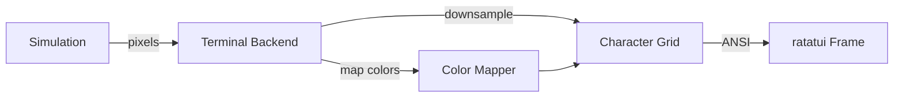

# Rendering Backends Ideas

> **Status:** Ideas for future consideration. Not part of core architecture.

Abstract render targets for different output modes (terminal, headless).

## Overview

The rendering system is abstracted behind a backend trait, allowing the same simulation to output to different targets:

| Backend | Output | Use Case |
|---------|--------|----------|
| GPU (default) | Bevy textures + shaders | Full graphical application |
| Terminal | ANSI/Unicode characters | CLI tools, SSH demos, accessibility |
| Headless | No output | Testing, server-side simulation |

## Current State: GPU Backend

The default backend renders via Bevy's GPU pipeline:

| Component | Implementation |
|-----------|----------------|
| Render target | `ChunkMaterial` custom material |
| Shader | `chunk.wgsl` - palette lookup, heat glow, wet sheen |
| Upload | Whole-chunk texture upload on change |
| Effects | Post-processing for glow, bloom |

See [Rendering](../rendering/rendering.md) for full GPU pipeline documentation.

## Backend Trait

The `RenderBackend` trait defines the contract for rendering implementations:

```
trait RenderBackend {
    /// Called when a chunk's pixels change
    fn upload_chunk(&mut self, chunk_pos: ChunkPos, pixels: &ChunkBuffer);

    /// Called when a chunk leaves the active region
    fn release_chunk(&mut self, chunk_pos: ChunkPos);

    /// Called each frame to present the current state
    fn present(&mut self, camera: &CameraState);
}
```

### Responsibilities

| Method | Purpose |
|--------|---------|
| `upload_chunk` | Transfer pixel data to backend-specific storage |
| `release_chunk` | Free resources when chunk is recycled |
| `present` | Render visible chunks from camera's perspective |

### Not Backend Responsibilities

- Simulation logic (handled by simulation systems)
- Camera movement (handled by camera systems)
- Chunk lifecycle (handled by streaming window)

## Terminal Backend

A terminal backend enables falling sand in text mode:

### Architecture



### Color Mapping

Terminal colors are limited compared to GPU palettes:

| Strategy | Description |
|----------|-------------|
| Nearest match | Map palette colors to nearest ANSI-256 color |
| Material-based | Assign fixed terminal color per material type |
| Dithering | Use half-block characters for pseudo-colors |

### Resolution Downsampling

Terminal cells are larger than pixels:

| Approach | Characters | Pixels per Cell |
|----------|------------|-----------------|
| Full block | `█` | 1x1 (coarse) |
| Half blocks | `▄▀` | 1x2 (vertical) |
| Quadrants | `▖▗▘▝▙▚▛▜▞▟` | 2x2 (fine) |
| Braille | `⠀⠁⠂...⣿` | 2x4 (finest) |

Higher density requires more computation but provides sharper output.

### Character Selection

For quadrant/braille modes, select characters based on pixel presence:

```
For each terminal cell:
    sample = sample_pixels(cell_bounds)
    pattern = threshold(sample)  # which sub-cells are "filled"
    char = lookup_character(pattern)
    fg_color = dominant_color(filled_pixels)
    bg_color = dominant_color(empty_pixels)
```

### Integration Points

| System | Terminal Adaptation |
|--------|---------------------|
| Camera | Map world coords to terminal viewport |
| Input | Terminal key events to world interactions |
| Palette | Material-to-terminal-color mapping table |

## Extension Points

Custom backends can add capabilities beyond the base trait:

| Extension | Example |
|-----------|---------|
| Custom shaders | CRT effects, pixelation filters |
| Post-processing | Bloom, chromatic aberration |
| Alternative pipelines | Deferred rendering, ray marching |
| Export formats | Video recording, GIF export |

## Related Documentation

- [Rendering](../rendering/rendering.md) - GPU backend implementation details
- [Pixel Camera](../rendering/pixel-camera.md) - Camera state passed to backends
- [Pixel Format](../foundational/pixel-format.md) - Pixel data structure backends receive
- [Architecture Overview](../README.md)
