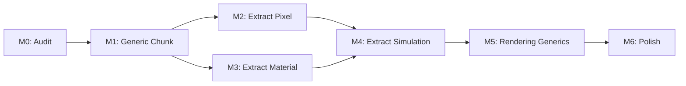

# Implementation Plan: Modularity Refactor

Refactor `bevy_pixel_world` from monolithic pixel simulation to generic spatial infrastructure.

See [layer-storage.md](layer-storage.md) for storage details.
See [pixel-layers architecture](../arhitecture/modularity/pixel-layers.md) for design rationale.

---

## Philosophy

**Radical modularity:** The framework provides spatial data structures and iteration primitives. Minimal trait requirements.

- **Minimal `PixelData` trait** — only `is_solid`, `is_dirty`, `set_dirty`
- **No material system** — games define their own
- **No simulations** — games implement their own rules
- **No bitpacking** — games bring their own (bitflags, manual, etc.)

**Clone-and-modify model:** While `bevy_pixel_world` will be published to crates.io, the intended workflow is:

1. Clone the repository
2. Modify the demo game crate
3. Build your own game from that foundation

The demo game is not an afterthought — it's the reference implementation showing how to use the framework primitives.

---

## Current State

**Framework (`bevy_pixel_world`):**
- Monolithic `Pixel` struct: `{ material, color, damage, flags }`
- Hardcoded simulation logic
- `Surface<Pixel>` as chunk storage
- Material system embedded in framework

**Game (`game`):**
- Depends on framework's `Pixel` type
- Cannot define custom pixel layouts
- Cannot customize material system

**POC (`pixel_macro`):**
- Proof-of-concept for bitpacking (not shipped with framework)
- Games bring their own: `bitflags!`, manual bit ops, etc.
- Demo game shows one approach

---

## Target State

**Framework provides:**
- `PixelData` trait — minimal interface (see below)
- `Surface<T>` — generic 2D storage
- `Chunk<T>` — chunk management
- `Canvas<T>` — multi-chunk world
- `PixelWorld<T>` — Bevy resource wrapper
- Iteration primitives (checkerboard phasing)
- Collision mesh generation (uses `is_solid`)
- Dirty tracking infrastructure (uses `is_dirty`, `set_dirty`)
- Rendering pipeline (game provides color extraction)
- Chunk pooling and persistence infrastructure

**Minimal trait requirement:**

```rust
pub trait PixelData: Copy + Default + 'static {
    /// Is this pixel solid? Used for collision mesh generation.
    fn is_solid(&self) -> bool;

    /// Does this pixel need simulation this tick?
    fn is_dirty(&self) -> bool;

    /// Mark pixel as dirty/clean for scheduling.
    fn set_dirty(&mut self, dirty: bool);
}
```

**Framework does NOT provide:**
- Any pixel type definition
- Material system
- Simulation logic
- Bitpacking macros (use `bitflags!` or manual)
- Specific flags beyond solid/dirty

**Game (reference implementation) provides:**
- `GamePixel` struct implementing `PixelData`
- Material system and registry
- All simulations (falling sand, burning, heat)
- All game-specific flags and metadata
- Example of how to wire everything together

---

## Phase Overview

| Phase | Focus | Deliverable |
|-------|-------|-------------|
| M0 | Audit & Isolate | Identify all framework→pixel coupling |
| M1 | Generic Chunk | `Chunk<T>`, `Canvas<T>`, `PixelWorld<T>` with minimal bounds |
| M2 | Extract Pixel | Move `Pixel` struct to game crate |
| M3 | Extract Material | Move material system to game crate |
| M4 | Extract Simulation | Move all simulations to game crate |
| M5 | Rendering Generics | Generic texture upload (game provides color extraction) |
| M6 | Polish | Documentation, examples, cleanup |

---

## Phase M0: Audit & Isolate

Find all places framework code touches pixel internals.

### Analysis Commands

```bash
# Find all Pixel field accesses
rg "\.material|\.color|\.damage|\.flags" crates/bevy_pixel_world/src/

# Find all Pixel type references
rg "Pixel\b" crates/bevy_pixel_world/src/ --type rust

# Find material system usage
rg "Material|material_registry" crates/bevy_pixel_world/src/

# Find simulation logic
rg "simulate|falling|burning|spread" crates/bevy_pixel_world/src/
```

### Categorization

Sort findings into:

| Category | Action |
|----------|--------|
| Storage operations | Keep, make generic |
| Iteration logic | Keep, make generic |
| Rendering upload | Keep, add color extraction callback |
| Pixel field access | Move to game |
| Material lookups | Move to game |
| Simulation rules | Move to game |

### Deliverable

Document listing all coupling points and their resolution strategy.

---

## Phase M1: Generic Chunk

Make core storage types generic with minimal bounds.

### Minimal Bounds

```rust
// The ONLY requirements on T
pub trait PixelData: Copy + Default + 'static {}
impl<T: Copy + Default + 'static> PixelData for T {}

// Or just use the bounds directly (no trait needed)
pub struct Chunk<T: Copy + Default + 'static> { ... }
```

No semantic requirements. No mandated fields. Just data that can be copied and defaulted.

### Type Changes

```rust
// Before
pub struct Chunk { data: Surface<Pixel>, ... }
pub struct Canvas { chunks: HashMap<ChunkPos, Chunk>, ... }
pub struct PixelWorld { canvas: Canvas, ... }

// After
pub struct Chunk<T> { data: Surface<T>, ... }
pub struct Canvas<T> { chunks: HashMap<ChunkPos, Chunk<T>>, ... }
pub struct PixelWorld<T> { canvas: Canvas<T>, ... }
// where T: Copy + Default + 'static
```

### Plugin

```rust
pub struct PixelWorldPlugin<T: Copy + Default + 'static> {
    config: PixelWorldConfig,
    _marker: PhantomData<T>,
}

// Game usage:
app.add_plugins(PixelWorldPlugin::<GamePixel>::new(config));
```

### Files

| File | Change |
|------|--------|
| `src/primitives/surface.rs` | Already generic |
| `src/primitives/chunk.rs` | `Chunk<T>` |
| `src/world/canvas.rs` | `Canvas<T>` |
| `src/world/mod.rs` | `PixelWorld<T>` |
| `src/world/plugin.rs` | `PixelWorldPlugin<T>` |

### Verification

```bash
cargo build -p bevy_pixel_world
# Will fail until Pixel is moved, but generics should be valid
```

---

## Phase M2: Extract Pixel

Move `Pixel` struct from framework to game.

### Create Game Pixel

```rust
// game/src/pixel.rs
use pixel_macro::{define_pixel, flags8, nibbles};

flags8!(PixelFlags {
    dirty, solid, falling, burning, wet, pixel_body
});

nibbles!(DamageVariant { damage, variant });

define_pixel!(GamePixel {
    material: u8,
    color: u8,
    damage_variant: DamageVariant,
    flags: PixelFlags,
});
```

### Framework Cleanup

Remove from framework:
- `src/pixel/mod.rs` (or gut it)
- `Pixel` struct definition
- `PixelFlags` definition
- Any pixel-specific logic

### Temporary Shim

During transition, framework can re-export game's pixel:

```rust
// bevy_pixel_world/src/lib.rs (temporary)
pub use game::pixel::GamePixel as Pixel;
```

Remove shim once all framework code is generic.

### Files

| File | Change |
|------|--------|
| `game/src/pixel.rs` | New: `GamePixel` definition |
| `game/src/lib.rs` | Add `mod pixel;` |
| `bevy_pixel_world/src/pixel/` | Remove or stub |

---

## Phase M3: Extract Material

Move material system entirely to game.

### Current Material System

```
bevy_pixel_world/src/
├── material/
│   ├── mod.rs
│   ├── registry.rs
│   └── properties.rs
```

### Move to Game

```
game/src/
├── material/
│   ├── mod.rs
│   ├── registry.rs
│   ├── properties.rs
│   └── definitions.rs  # Actual material data
```

### Framework Has No Material Concept

The framework doesn't know what a "material" is. It stores generic `T` values.

If games want materials, they:
1. Define a material registry
2. Store material IDs in their pixel type
3. Look up properties when simulating

### Files

| File | Change |
|------|--------|
| `game/src/material/` | New: entire material system |
| `bevy_pixel_world/src/material/` | Delete |

---

## Phase M4: Extract Simulation

Move all simulation logic to game.

### Current Simulations

```
bevy_pixel_world/src/simulation/
├── mod.rs
├── falling.rs      → game
├── burning.rs      → game
├── heat.rs         → game
├── hash.rs         → keep (utility)
└── scheduling.rs   → keep (infrastructure)
```

### Framework Keeps

**Iteration infrastructure:**
- Checkerboard phasing primitives
- Tile iteration helpers
- Hash utilities for deterministic randomness

**No simulation rules:**
- Framework doesn't know pixels can "fall"
- Framework doesn't know pixels can "burn"
- All behavior is game-defined

### Game Implements

```rust
// game/src/simulation/falling.rs
pub fn falling_sand_system(world: &mut PixelWorld<GamePixel>, ...) {
    // Game-specific falling logic using game's pixel type
}
```

### Files

| File | Change |
|------|--------|
| `game/src/simulation/` | New: all simulation logic |
| `bevy_pixel_world/src/simulation/` | Keep only infrastructure |

---

## Phase M5: Rendering Generics

Generic texture upload with game-provided color extraction.

### Problem

Framework needs to upload pixel colors to GPU, but doesn't know pixel structure.

### Solution: Color Callback

```rust
pub struct PixelWorldPlugin<T: Copy + Default + 'static> {
    config: PixelWorldConfig,
    /// Extracts RGBA color from pixel for GPU upload
    color_fn: fn(&T) -> [u8; 4],
    _marker: PhantomData<T>,
}

impl<T: Copy + Default + 'static> PixelWorldPlugin<T> {
    pub fn new(config: PixelWorldConfig, color_fn: fn(&T) -> [u8; 4]) -> Self {
        Self { config, color_fn, _marker: PhantomData }
    }
}

// Game usage:
fn extract_color(pixel: &GamePixel) -> [u8; 4] {
    palette.lookup(pixel.color)
}

app.add_plugins(PixelWorldPlugin::new(config, extract_color));
```

### Alternative: Trait

```rust
pub trait HasColor {
    fn to_rgba(&self) -> [u8; 4];
}

pub struct PixelWorldPlugin<T: Copy + Default + 'static + HasColor> { ... }
```

But this adds a trait requirement. Function pointer is more flexible.

### Files

| File | Change |
|------|--------|
| `src/rendering/upload.rs` | Use color callback |
| `src/world/plugin.rs` | Add color_fn parameter |

---

## Phase M6: Polish

Documentation, examples, final cleanup.

### Demo Game as Reference

The game crate becomes comprehensive documentation:

```
game/
├── src/
│   ├── pixel.rs         # How to define pixels
│   ├── material/        # How to build material system
│   ├── simulation/      # How to implement simulations
│   │   ├── falling.rs
│   │   ├── burning.rs
│   │   └── heat.rs
│   └── main.rs          # How to wire it all together
└── README.md            # "Start here"
```

### Framework Examples

Minimal examples showing framework primitives:

```
bevy_pixel_world/examples/
├── minimal.rs           # Simplest possible setup
├── custom_pixel.rs      # Define your own pixel type
└── iteration.rs         # Using iteration primitives
```

### Documentation Updates

- README: Emphasize clone-and-modify workflow
- Architecture docs: Remove PixelBase references
- API docs: Document generic interfaces

---

## Testing Strategy

### Framework Tests

Test generic infrastructure:
- `Surface<T>` operations with various T
- `Chunk<T>` lifecycle
- Iteration primitives
- Persistence (serialize/deserialize generic data)

### Game Tests

Test reference implementation:
- Pixel macro output
- Material registry
- Simulation correctness
- Integration with framework

### Verification Commands

```bash
# Framework builds without game
cargo build -p bevy_pixel_world

# Game builds with framework
cargo build -p game

# All tests pass
cargo test --workspace

# Demo runs
cargo run -p game
```

---

## Risk Mitigation

| Risk | Mitigation |
|------|------------|
| Generic bounds too restrictive | Start minimal (Copy + Default + 'static), add only if needed |
| Performance regression | Benchmark before/after, function pointers should inline |
| API churn | Complete refactor in feature branch, merge when stable |
| User confusion | Strong documentation, demo game as canonical example |

---

## Dependencies



---

## Related Documentation

- [Layer Storage Architecture](layer-storage.md) - Storage design details
- [Pixel Layers](../arhitecture/modularity/pixel-layers.md) - Layer system overview
- [Simulation Extensibility](../arhitecture/modularity/simulation-extensibility.md) - Simulation API
- [Implementation Methodology](methodology.md) - Testing principles
