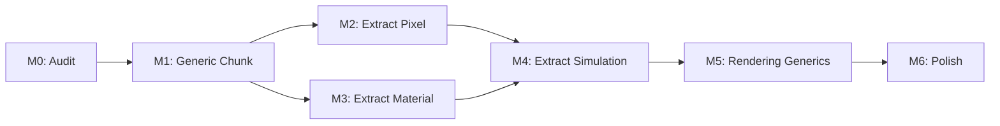

# Implementation Plan: Modularity Refactor

> **Status: Not Yet Implemented**
>
> This is the implementation plan for refactoring to radical modularity. Current code uses hardcoded `Pixel` struct with `material`, `color`, `damage`, `flags`.

Refactor `bevy_pixel_world` from monolithic pixel simulation to generic spatial infrastructure.

See [pixel-layers architecture](../architecture/modularity/pixel-layers.md) for design rationale.

---

## Philosophy

**Radical modularity:** The framework provides spatial data structures and iteration primitives. Games define everything else.

| Framework Provides | Framework Does NOT Provide |
|-------------------|---------------------------|
| `Surface<T>`, `Chunk<T>`, `Canvas<T>`, `PixelWorld<T>` | Any pixel type definition |
| Optional traits: `PixelCollision`, `PixelDirty` | Material system |
| Iteration primitives (checkerboard phasing) | Simulations |
| Collision mesh generation (via `is_solid`) | Bitpacking macros |
| Dirty tracking (via `is_dirty`, `set_dirty`) | Game-specific flags |
| Raw pixel upload to GPU | Color transformation |
| Palette utilities (LUT, generator) | |

**Minimal bounds:** `T: Copy + Default + 'static`

**Clone-and-modify model:** The demo game is the reference implementation. Users clone and modify it.

---

## Current vs Target State

### Current State

```
Framework (bevy_pixel_world):
├── Pixel struct: { material, color, damage, flags }  ← HARDCODED
├── Material system                                    ← HARDCODED
├── Simulations (falling, burning, heat)              ← HARDCODED
└── Surface<Pixel>

Game:
└── Cannot customize anything
```

### Target State

```
Framework (bevy_pixel_world):
├── Surface<T>, Chunk<T>, Canvas<T>, PixelWorld<T>    ← GENERIC
├── Optional traits: PixelCollision, PixelDirty       ← OPT-IN
├── Iteration primitives                              ← INFRASTRUCTURE
├── Raw pixel upload + palette utilities              ← RENDERING
└── No pixel definition, no materials, no simulations

Game (reference implementation):
├── Pixel struct with bitflags                        ← GAME-DEFINED
├── Material system                                   ← GAME-DEFINED
├── Simulations (falling, burning, heat)              ← GAME-DEFINED
└── Shows how to wire everything together
```

---

## Core Design

### Optional Traits

```rust
/// For collision mesh generation (marching squares)
pub trait PixelCollision {
    fn is_solid(&self) -> bool;
}

/// For dirty-based simulation scheduling
pub trait PixelDirty {
    fn is_dirty(&self) -> bool;
    fn set_dirty(&mut self, dirty: bool);
}
```

Implement what you need:
- Want collision meshes? Implement `PixelCollision`
- Want dirty-based scheduling? Implement `PixelDirty`
- Need neither? Just use `T: Copy + Default + 'static`

### Storage Patterns

**1. Pixel Struct (AoS) — Primary**

Game-defined struct stored in contiguous array. All fields swap atomically.

```rust
// Game crate defines this
use bitflags::bitflags;

bitflags! {
    #[derive(Clone, Copy, Default)]
    pub struct PixelFlags: u8 {
        const DIRTY      = 0x01;
        const SOLID      = 0x02;
        const FALLING    = 0x04;
        const BURNING    = 0x08;
        const WET        = 0x10;
        const PIXEL_BODY = 0x20;
    }
}

#[repr(C)]
#[derive(Clone, Copy, Default)]
pub struct Pixel {
    pub material: u8,
    pub color: u8,
    pub damage: u8,
    pub flags: PixelFlags,
}

impl PixelCollision for Pixel {
    fn is_solid(&self) -> bool { self.flags.contains(PixelFlags::SOLID) }
}

impl PixelDirty for Pixel {
    fn is_dirty(&self) -> bool { self.flags.contains(PixelFlags::DIRTY) }
    fn set_dirty(&mut self, v: bool) { self.flags.set(PixelFlags::DIRTY, v); }
}
```

**2. Separate Layers (SoA) — Optional**

For data with different lifetime/resolution:

```rust
// Heat at 1/4 resolution (one value per 4x4 region)
struct HeatLayer;
impl Layer for HeatLayer {
    type Element = u8;
    const SAMPLE_RATE: u32 = 4;
}

// Velocity follows pixel swaps
struct VelocityLayer;
impl Layer for VelocityLayer {
    type Element = (i8, i8);
    const SAMPLE_RATE: u32 = 1;
    const SWAP_FOLLOW: bool = true;
}
```

### Memory Layout

For a 512x512 chunk with 4-byte pixel:

```
Chunk<Pixel> (512x512):
┌────────────────────────────────────────────────────────┐
│ pixels: [Pixel; 262144]                                │  ← 1 MB
│ ┌──────────┬───────┬────────┬───────┐                  │
│ │ material │ color │ damage │ flags │ x 262144         │
│ └──────────┴───────┴────────┴───────┘                  │
├────────────────────────────────────────────────────────┤
│ heat: [u8; 16384]  (sample_rate: 4)                    │  ← 16 KB (optional)
└────────────────────────────────────────────────────────┘
```

| Pixel Size | Per Chunk (512x512) |
|------------|---------------------|
| 2 bytes | 512 KB |
| 4 bytes (demo) | 1 MB |
| 8 bytes | 2 MB |

### Swap Mechanics

Single memory operation for entire pixel struct:

```rust
impl<T: Copy + Default + 'static> Canvas<T> {
    pub fn swap(&mut self, a: WorldPos, b: WorldPos) {
        // Single memcpy for entire pixel struct
        if a.chunk() == b.chunk() {
            let chunk = self.get_mut(a.chunk());
            chunk.pixels.swap(a.local_index(), b.local_index());
        } else {
            let (ca, cb) = self.get_two_mut(a.chunk(), b.chunk());
            std::mem::swap(
                &mut ca.pixels[a.local_index()],
                &mut cb.pixels[b.local_index()],
            );
        }
        // Also swap any layers marked swap_follow: true
        self.swap_following_layers(a, b);
    }
}
```

### Rendering Integration

Raw pixel bytes uploaded to GPU. Shader interprets them directly.

```wgsl
// Shader reads raw pixel data
let pixel_data: u32 = textureLoad(pixel_texture, coord, 0).r;
let color_index = (pixel_data >> 8u) & 0xFFu;  // byte 1

// Use palette LUT (framework provides texture)
let rgba = textureSample(palette_lut, sampler, vec2f(f32(color_index) / 255.0, 0.0));
```

---

## Implementation Phases



| Phase | Focus | Deliverable |
|-------|-------|-------------|
| M0 | Audit & Isolate | Document all framework→pixel coupling |
| M1 | Generic Chunk | `Chunk<T>`, `Canvas<T>`, `PixelWorld<T>` |
| M2 | Extract Pixel | Move `Pixel` struct to game crate |
| M3 | Extract Material | Move material system to game crate |
| M4 | Extract Simulation | Move all simulations to game crate |
| M5 | Rendering Generics | Raw pixel upload, shader interprets bytes |
| M6 | Polish | Documentation, examples, cleanup |

---

### Phase M0: Audit & Isolate

Find all places framework code touches pixel internals.

```bash
# Find all Pixel field accesses
rg "\.material|\.color|\.damage|\.flags" crates/bevy_pixel_world/src/

# Find material system usage
rg "Material|material_registry" crates/bevy_pixel_world/src/

# Find simulation logic
rg "simulate|falling|burning|spread" crates/bevy_pixel_world/src/
```

Categorize findings:

| Category | Action |
|----------|--------|
| Storage operations | Keep, make generic |
| Iteration logic | Keep, make generic |
| Rendering upload | Keep, upload raw bytes |
| Pixel field access | Move to game |
| Material lookups | Move to game |
| Simulation rules | Move to game |

**Deliverable:** Document listing all coupling points and resolution strategy.

---

### Phase M1: Generic Chunk

Make core storage types generic.

```rust
// Before
pub struct Chunk { data: Surface<Pixel>, ... }
pub struct Canvas { chunks: HashMap<ChunkPos, Chunk>, ... }

// After
pub struct Chunk<T: Copy + Default + 'static> { data: Surface<T>, ... }
pub struct Canvas<T: Copy + Default + 'static> { ... }
pub struct PixelWorld<T: Copy + Default + 'static> { ... }
```

Plugin becomes generic:

```rust
pub struct PixelWorldPlugin<T: Copy + Default + 'static> {
    config: PixelWorldConfig,
    _marker: PhantomData<T>,
}

// Game usage
app.add_plugins(PixelWorldPlugin::<Pixel>::new(config));
```

| File | Change |
|------|--------|
| `src/primitives/surface.rs` | Already generic |
| `src/primitives/chunk.rs` | `Chunk<T>` |
| `src/world/canvas.rs` | `Canvas<T>` |
| `src/world/mod.rs` | `PixelWorld<T>` |
| `src/world/plugin.rs` | `PixelWorldPlugin<T>` |

---

### Phase M2: Extract Pixel

Move `Pixel` struct from framework to game.

**Create in game crate:**

```rust
// game/src/pixel.rs
#[repr(C)]
#[derive(Clone, Copy, Default)]
pub struct Pixel {
    pub material: u8,
    pub color: u8,
    pub damage: u8,
    pub flags: PixelFlags,
}
```

**Remove from framework:**
- `src/pixel/mod.rs`
- `Pixel` struct definition
- `PixelFlags` definition

---

### Phase M3: Extract Material

Move material system entirely to game.

```
// Move from framework to game
bevy_pixel_world/src/material/  →  game/src/material/
```

The framework doesn't know what a "material" is. Games define their own.

---

### Phase M4: Extract Simulation

Move all simulation logic to game.

```
bevy_pixel_world/src/simulation/
├── mod.rs
├── falling.rs      → game
├── burning.rs      → game
├── heat.rs         → game
├── hash.rs         → keep (utility)
└── scheduling.rs   → keep (infrastructure)
```

Framework keeps iteration infrastructure. Game implements all rules.

---

### Phase M5: Rendering Generics

No CPU-side color transformation. Upload raw pixel bytes.

| Framework Provides | Game Provides |
|-------------------|---------------|
| Raw pixel texture upload | `#[repr(C)]` pixel struct |
| Dirty tracking | Palette data |
| Palette LUT generation | Shader that knows layout |

---

### Phase M6: Polish

Demo game becomes comprehensive documentation:

```
game/
├── src/
│   ├── pixel.rs         # How to define pixels
│   ├── material/        # How to build material system
│   ├── simulation/      # How to implement simulations
│   └── main.rs          # How to wire it all together
└── README.md            # "Start here"
```

---

## Testing Strategy

```bash
# Framework builds without game
cargo build -p bevy_pixel_world

# Game builds with framework
cargo build -p game

# All tests pass
cargo test --workspace

# Demo runs
cargo run -p game
```

**Framework tests:** Generic infrastructure (`Surface<T>`, `Chunk<T>`, iteration, persistence)

**Game tests:** Reference implementation (pixel struct, materials, simulations)

---

## Risk Mitigation

| Risk | Mitigation |
|------|------------|
| Generic bounds too restrictive | Start minimal (`Copy + Default + 'static`), add only if needed |
| Performance regression | Benchmark before/after |
| API churn | Complete refactor in feature branch |
| User confusion | Strong documentation, demo game as canonical example |

---

## Related Documentation

- [Pixel Layers Architecture](../architecture/modularity/pixel-layers.md) - Layer system design
- [Simulation Extensibility](../architecture/modularity/simulation-extensibility.md) - Simulation API
- [Implementation Methodology](methodology.md) - Testing principles
