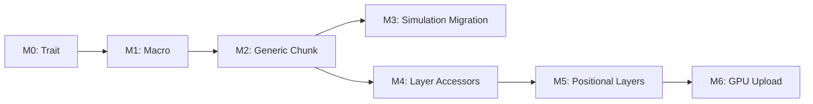

# Implementation Plan: Modularity Refactor

Refactor `bevy_pixel_world` from monolithic pixel struct to generic layer system.

See [layer-storage.md](layer-storage.md) for architectural details.
See [pixel-layers architecture](../arhitecture/modularity/pixel-layers.md) for design rationale.

---

## Current State

**Framework (`bevy_pixel_world`):**
- Monolithic `Pixel` struct: `{ material, color, damage, flags }`
- Hardcoded simulation in framework
- `Surface<Pixel>` as chunk storage
- No layer abstraction

**Game (`game`):**
- Depends on framework's `Pixel` type
- Cannot define custom pixel layouts
- Cannot add/remove layers

**POC (`pixel_macro`):**
- `flags8!` — 8 named flags in 1 byte
- `nibbles!` — 2 nibbles in 1 byte
- `define_pixel!` — compose fields into `#[repr(C)]` struct
- 26 passing tests

---

## Target State

**Framework:**
- `PixelBase` trait (minimal interface)
- `define_pixel!`, `define_bundle!` macros
- Generic `Chunk<P: PixelBase>`, `Canvas<P>`, `PixelWorld<P>`
- Layer accessor types (`LayerMut<L>`, `LayerRef<L>`)
- Positional layer support (downsampled grids)
- Zero simulations (moved to game)

**Game:**
- Defines `GamePixel` via `define_pixel!` macro
- Defines all layers (color, damage, heat, etc.)
- Owns all simulation code (falling sand, heat diffusion)
- Full control over pixel layout

---

## Phase Overview

| Phase | Focus | Deliverable |
|-------|-------|-------------|
| M0 | Trait Extraction | `PixelBase` trait, framework compiles with trait bounds |
| M1 | Macro Integration | `pixel_macro` integrated, `define_pixel!` generates `PixelBase` impl |
| M2 | Generic Chunk | `Chunk<P>`, `Canvas<P>`, `PixelWorld<P>` |
| M3 | Simulation Migration | Move all simulations to game crate |
| M4 | Layer Accessors | `LayerMut<L>`, `LayerRef<L>` for semantic field access |
| M5 | Positional Layers | Downsampled grids (heat, pressure) |
| M6 | GPU Upload | Per-layer upload scheduling |

---

## Phase M0: Trait Extraction

Extract minimal trait from current `Pixel` usage.

### Analysis

Audit framework code to find all `Pixel` field accesses:

```bash
rg "\.material|\.color|\.damage|\.flags" crates/bevy_pixel_world/src/
```

### PixelBase Trait

```rust
// src/pixel/base.rs
pub trait PixelBase: Copy + Default + 'static {
    fn is_void(&self) -> bool;

    // Framework needs these for scheduling/collision
    fn dirty(&self) -> bool;
    fn set_dirty(&mut self, v: bool);
    fn solid(&self) -> bool;
    fn set_solid(&mut self, v: bool);
    fn falling(&self) -> bool;
    fn set_falling(&mut self, v: bool);

    // Material lookup
    fn material(&self) -> MaterialId;
    fn set_material(&mut self, v: MaterialId);
}
```

### Migration Steps

1. Create `src/pixel/base.rs` with `PixelBase` trait
2. Implement `PixelBase` for existing `Pixel` struct
3. Add trait bounds to functions that use `Pixel` directly
4. Verify: `cargo build -p bevy_pixel_world`

### Files

| File | Change |
|------|--------|
| `src/pixel/mod.rs` | Add `mod base;` |
| `src/pixel/base.rs` | New: `PixelBase` trait |
| `src/pixel.rs` | `impl PixelBase for Pixel` |

### Verification

```bash
cargo build -p bevy_pixel_world
cargo test -p bevy_pixel_world
```

---

## Phase M1: Macro Integration

Integrate `pixel_macro` crate, enhance `define_pixel!` to implement `PixelBase`.

### Dependencies

Add `pixel_macro` as dependency:

```toml
# bevy_pixel_world/Cargo.toml
[dependencies]
pixel_macro = { path = "../pixel_macro" }
```

### Macro Enhancement

Extend `define_pixel!` to auto-implement `PixelBase` when required fields present:

```rust
define_pixel!(GamePixel {
    material: u8,
    dirty: bool,
    solid: bool,
    falling: bool,
    // ... game fields
});

// Macro generates:
// impl PixelBase for GamePixel { ... }
```

### Validation

Macro validates required fields at compile time:
- `material: u8` required
- Framework flags (`dirty`, `solid`, `falling`) required
- Missing fields → compile error with clear message

### Files

| File | Change |
|------|--------|
| `Cargo.toml` (workspace) | Add `pixel_macro` to members |
| `bevy_pixel_world/Cargo.toml` | Add `pixel_macro` dependency |
| `pixel_macro/src/lib.rs` | Add `PixelBase` auto-impl |

### Verification

```bash
cargo test -p pixel_macro
cargo build -p bevy_pixel_world
```

---

## Phase M2: Generic Chunk

Make core types generic over pixel type.

### Type Changes

```rust
// Before
pub struct Chunk { data: Surface<Pixel>, ... }
pub struct Canvas { chunks: HashMap<ChunkPos, Chunk>, ... }
pub struct PixelWorld { canvas: Canvas, ... }

// After
pub struct Chunk<P: PixelBase> { data: Surface<P>, ... }
pub struct Canvas<P: PixelBase> { chunks: HashMap<ChunkPos, Chunk<P>>, ... }
pub struct PixelWorld<P: PixelBase> { canvas: Canvas<P>, ... }
```

### Plugin Parameterization

```rust
// Before
pub struct PixelWorldPlugin { config: PixelWorldConfig }

// After
pub struct PixelWorldPlugin<P: PixelBase> {
    config: PixelWorldConfig,
    _marker: PhantomData<P>,
}

// Usage in game:
app.add_plugins(PixelWorldPlugin::<GamePixel>::default());
```

### Migration Strategy

1. Add `<P: PixelBase>` to `Chunk`, verify compiles
2. Propagate to `Canvas`, `PixelWorld`
3. Update `PixelWorldPlugin`
4. Update all systems to be generic
5. Temporarily instantiate with `Pixel` to maintain compatibility

### Files

| File | Change |
|------|--------|
| `src/primitives/chunk.rs` | `Chunk<P: PixelBase>` |
| `src/world/canvas.rs` | `Canvas<P: PixelBase>` |
| `src/world/mod.rs` | `PixelWorld<P: PixelBase>` |
| `src/world/plugin.rs` | `PixelWorldPlugin<P>` |
| All systems | Add generic bounds |

### Verification

```bash
cargo build -p bevy_pixel_world
cargo run -p bevy_pixel_world --example painting
```

---

## Phase M3: Simulation Migration

Move all simulations from framework to game crate.

### Current Simulations in Framework

```
src/simulation/
├── mod.rs
├── falling.rs      → Move to game
├── burning.rs      → Move to game
├── heat.rs         → Move to game
├── hash.rs         → Keep (utility)
└── scheduling.rs   → Keep (infrastructure)
```

### Framework Keeps

- Scheduling infrastructure (phases, tiles)
- Hash utilities
- Iteration primitives
- Dirty tracking

### Game Gets

- All CA rules (falling, spreading, burning)
- Material interactions
- Heat diffusion
- Any game-specific behavior

### Migration Steps

1. Create `game/src/simulation/` directory
2. Copy simulation files from framework
3. Update imports to use game's pixel type
4. Remove simulations from framework
5. Framework exports only infrastructure

### Files

| File | Change |
|------|--------|
| `game/src/simulation/mod.rs` | New: simulation module |
| `game/src/simulation/falling.rs` | Moved from framework |
| `game/src/simulation/burning.rs` | Moved from framework |
| `bevy_pixel_world/src/simulation/` | Remove CA rules, keep infra |

### Verification

```bash
cargo build -p bevy_pixel_world
cargo build -p game
cargo run -p game
```

---

## Phase M4: Layer Accessors

Add typed accessors for semantic field access.

### Accessor Types

```rust
/// Mutable access to a layer
pub struct LayerMut<'w, L: Layer, P: PixelBase> {
    canvas: &'w mut Canvas<P>,
    _marker: PhantomData<L>,
}

/// Read-only access to a layer
pub struct LayerRef<'w, L: Layer, P: PixelBase> {
    canvas: &'w Canvas<P>,
    _marker: PhantomData<L>,
}
```

### Layer Trait

```rust
pub trait Layer: 'static {
    type Element: Copy + Default;
    const NAME: &'static str;
}

pub trait HasLayer<L: Layer>: PixelBase {
    fn get_layer(&self) -> L::Element;
    fn set_layer(&mut self, v: L::Element);
}
```

### Macro Generation

`define_pixel!` generates `HasLayer` impls for each field:

```rust
define_pixel!(GamePixel {
    color: u8,
    damage: u8,
    // ...
});

// Generates:
// struct ColorLayer;
// impl Layer for ColorLayer { type Element = u8; }
// impl HasLayer<ColorLayer> for GamePixel { ... }
```

### Files

| File | Change |
|------|--------|
| `src/layer/mod.rs` | New: layer module |
| `src/layer/traits.rs` | `Layer`, `HasLayer` traits |
| `src/layer/access.rs` | `LayerMut`, `LayerRef` |
| `pixel_macro/src/lib.rs` | Generate `HasLayer` impls |

---

## Phase M5: Positional Layers

Add support for downsampled spatial data.

### Positional Layer Trait

```rust
pub trait PositionalLayer: 'static {
    type Element: Copy + Default;
    const NAME: &'static str;
    const SAMPLE_RATE: u32;  // 1, 4, 8, etc.
}
```

### Storage

Stored separately from pixel data (SoA):

```rust
pub struct Chunk<P: PixelBase> {
    pixels: Surface<P>,
    positional: PositionalStorage,
}

struct PositionalStorage {
    layers: HashMap<TypeId, Box<dyn Any>>,
}
```

### Registration

```rust
PixelWorldPlugin::<GamePixel>::builder()
    .with_positional::<HeatLayer>()     // 4x downsample
    .with_positional::<PressureLayer>() // 8x downsample
    .build()
```

### Files

| File | Change |
|------|--------|
| `src/layer/positional.rs` | `PositionalLayer` trait |
| `src/primitives/chunk.rs` | Add `PositionalStorage` |
| `src/world/plugin.rs` | Positional registration |

---

## Phase M6: GPU Upload

Per-layer upload scheduling.

### Upload Schedule

```rust
pub enum UploadSchedule {
    EveryTick,           // Upload if dirty
    Throttled(u32),      // Every N ticks if dirty
    Never,               // CPU-only
}
```

### Configuration

```rust
PixelWorldPlugin::<GamePixel>::builder()
    .pixel_upload(UploadSchedule::EveryTick)
    .positional_upload::<HeatLayer>(UploadSchedule::Throttled(4))
    .build()
```

### Files

| File | Change |
|------|--------|
| `src/rendering/upload.rs` | Upload scheduling |
| `src/world/plugin.rs` | Upload configuration |

---

## Testing Strategy

### Unit Tests

Each phase adds tests for new functionality:
- M0: `PixelBase` trait impl tests
- M1: Macro validation tests
- M2: Generic type instantiation
- M4: Layer accessor tests
- M5: Positional layer storage tests

### Integration Tests

- `painting` example works after each phase
- Game crate builds and runs after M3
- Full simulation works end-to-end

### Verification Commands

```bash
# After each phase
cargo build -p bevy_pixel_world
cargo test -p bevy_pixel_world
cargo run -p bevy_pixel_world --example painting

# After M3+
cargo build -p game
cargo run -p game
```

---

## Risk Mitigation

| Risk | Mitigation |
|------|------------|
| Generic explosion | Keep bounds minimal, use associated types |
| Breaking changes | Maintain `Pixel` type as default until M3 complete |
| Performance regression | Benchmark after M2, M3 |
| Compile time increase | Monitor, consider feature flags |

---

## Dependencies



---

## Related Documentation

- [Layer Storage Architecture](layer-storage.md) - Detailed storage design
- [Pixel Layers](../arhitecture/modularity/pixel-layers.md) - Layer system overview
- [Simulation Extensibility](../arhitecture/modularity/simulation-extensibility.md) - Simulation API
- [Implementation Methodology](methodology.md) - Testing principles
