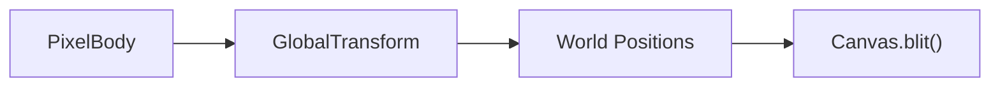
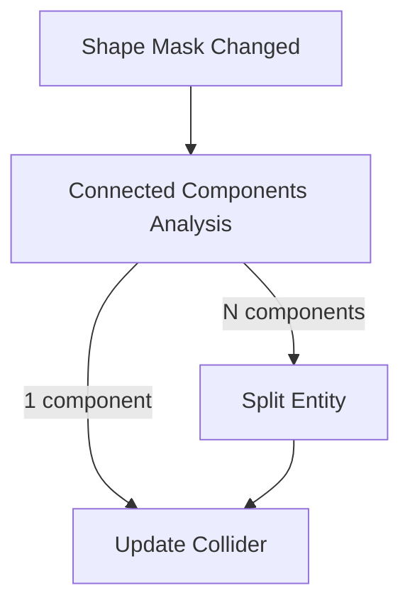

# Implementation Plan: Pixel Bodies

Dynamic physics objects with pixel content that participates in CA simulation.

See [methodology.md](methodology.md) for testing and API design principles.
See [pixel-bodies architecture doc](../arhitecture/pixel-bodies.md) for design rationale.

---

## Phase Summary

| Phase | Focus | Deliverable |
|-------|-------|-------------|
| 1 | Static Bodies | PNG sprites as physics objects in painting.rs |
| 2 | Cutting & Splitting | Brush removes pixels, objects split when disconnected |

---

## Phase 1: Static Pixel Bodies

Physics objects with pixel content that maintains shape (no CA destruction yet).

### 1.1 Data Structures

**PixelBody Component:**
```
PixelBody {
    surface: Surface<Pixel>   // Object-local pixel buffer
    shape_mask: BitVec        // Which pixels belong to object (row-major)
    origin: IVec2             // Offset from entity origin to pixel grid center
    width: u32
    height: u32
}
```

**Location:** `crates/bevy_pixel_world/src/pixel_body/mod.rs`

### 1.2 PNG Loading

Load PNG image as pixel data:

1. Load image via Bevy asset system
2. Convert RGBA to material + color:
   - Alpha < 128 → void (not in shape mask)
   - Otherwise → solid material with color from RGB
3. Build `Surface<Pixel>` and `BitVec` shape mask

**Location:** `crates/bevy_pixel_world/src/pixel_body/loader.rs`

### 1.3 Blit System

Write pixel body to Canvas each tick:



For each pixel where `shape_mask[i] = 1`:
1. Compute local position from index
2. Apply transform (translation + rotation via nearest-neighbor)
3. Write to Canvas at world position

**Ordering:** Before CA simulation (integrate into existing schedule)

**Location:** `crates/bevy_pixel_world/src/pixel_body/blit.rs`

### 1.4 Clear System

Remove pixel body from Canvas after CA simulation:

For each pixel where `shape_mask[i] = 1`:
1. Compute world position (same as blit)
2. Set Canvas pixel to void

**Ordering:** After CA simulation, before physics step

**Location:** `crates/bevy_pixel_world/src/pixel_body/blit.rs` (same file, separate system)

### 1.5 Collider Generation

Generate physics collider from shape mask:

1. Build 2D grid from shape mask
2. Run marching squares (reuse existing `collision::marching` module)
3. Simplify polylines (reuse `collision::simplify`)
4. Create Rapier/Avian `Collider::convex_decomposition` or `Collider::trimesh`

**When:** On spawn, and when shape changes (Phase 2)

**Location:** `crates/bevy_pixel_world/src/pixel_body/collider.rs`

### 1.6 Demo Integration

Modify `examples/painting.rs`:

1. Add PNG sprite assets (simple shapes: crate, rock, log)
2. New spawn key (e.g., `P`) spawns PixelBody at cursor
3. PixelBody entities have:
   - `PixelBody` component
   - `RigidBody::Dynamic`
   - Generated `Collider`
   - `Transform`

### Files to Create/Modify

| File | Change |
|------|--------|
| `src/pixel_body/mod.rs` | New module, PixelBody component |
| `src/pixel_body/loader.rs` | PNG to PixelBody conversion |
| `src/pixel_body/blit.rs` | Blit and clear systems |
| `src/pixel_body/collider.rs` | Shape mask to collider |
| `src/lib.rs` | Export pixel_body module |
| `examples/painting.rs` | Demo integration |
| `assets/sprites/` | PNG test sprites |

### Verification

```bash
cargo run -p bevy_pixel_world --example painting
```

- [ ] Press P to spawn pixel body at cursor
- [ ] Pixel body falls under gravity
- [ ] Pixel body collides with terrain
- [ ] Pixel body visible as pixels (not mesh)
- [ ] Multiple pixel bodies collide with each other

---

## Phase 2: Cutting and Splitting

Brush removes pixels from objects; objects split when connectivity breaks.

### 2.1 Readback System

After CA simulation, detect changes to pixel body pixels:

1. Get `BlittedTransform` (position where pixels were written during blit)
2. For each pixel where `shape_mask[i] = true`:
   - Compute world position via inverse transform
   - Read pixel from `PixelWorld::get_pixel()`
   - If pixel is void OR lacks `PIXEL_BODY` flag: clear `shape_mask[i]`
3. If any bits changed:
   - Insert `ShapeMaskModified` marker component
   - Insert `NeedsColliderRegen` marker component

Marker component:
- `ShapeMaskModified`: triggers split detection system

The readback uses `BlittedTransform` rather than current `GlobalTransform` to ensure we read from where pixels were actually written, not where physics has moved the body since blit.

**Note:** For Phase 2, only brush erasure causes changes. CA destruction (burning, melting) deferred to future phase.

### 2.2 Connected Components

When shape mask changes, check connectivity:



Algorithm: Union-find with path compression on shape mask grid.

Data structures:
- `ConnectedComponent`: bounds (x, y, w, h), pixel positions
- `SplitResult`: `Vec<ConnectedComponent>` sorted by size (largest first)

Returns components sorted by pixel count descending.
Uses 4-connectivity (orthogonal neighbors only).

**Location:** `crates/bevy_pixel_world/src/pixel_body/split.rs`

### 2.3 Entity Splitting

When N > 1 components detected:

1. Despawn the original entity
2. For each component:
   - Calculate tight bounding box
   - Create new `PixelBody` with component dimensions
   - Copy pixel data from original surface
   - Calculate new origin (centered on fragment)
   - Compute world position from component centroid
   - Generate collider via `generate_collider()`
   - Spawn entity with: `PixelBody`, `Collider`, `RigidBody::Dynamic`,
     inherited velocity, new `PixelBodyId`, `Persistable`, `BlittedTransform::default()`

Fragment spawning inherits parent's linear and angular velocity.

### Edge Cases

| Scenario | Handling |
|----------|----------|
| Body fully destroyed (0 components) | Despawn entity |
| No split (1 component, shape changed) | Regenerate collider only |
| No changes | Remove `ShapeMaskModified`, no action |
| Fragment too small for collider | Despawn if `generate_collider()` returns `None` |
| Body at chunk boundary | `PixelWorld::get_pixel()` handles cross-chunk reads |

### 2.4 Collider Regeneration

Trigger collider rebuild when shape changes:

1. Detect shape_mask modification in readback
2. Queue collider regeneration (avoid per-frame rebuilds)
3. Regenerate via same pipeline as Phase 1.5

### Files to Create/Modify

| File | Change |
|------|--------|
| `src/pixel_body/readback.rs` | New - detect pixel changes |
| `src/pixel_body/split.rs` | New - connected components, entity splitting |
| `src/pixel_body/collider.rs` | Add regeneration trigger |

### Verification

```bash
cargo run -p bevy_pixel_world --example painting
```

- [ ] Spawn pixel body, erase pixels with RMB
- [ ] Erased pixels disappear from object
- [ ] Collider updates to match new shape
- [ ] Cut object in half → two separate physics bodies
- [ ] Each fragment falls independently
- [ ] Fragments collide with terrain and each other

---

## Future Phases (Not in Scope)

- CA destruction (burning pixels leave shape, become ash)
- Heat conduction through pixel bodies
- Structural integrity (stress-based breaking)
- Pixel body persistence (save/load)
