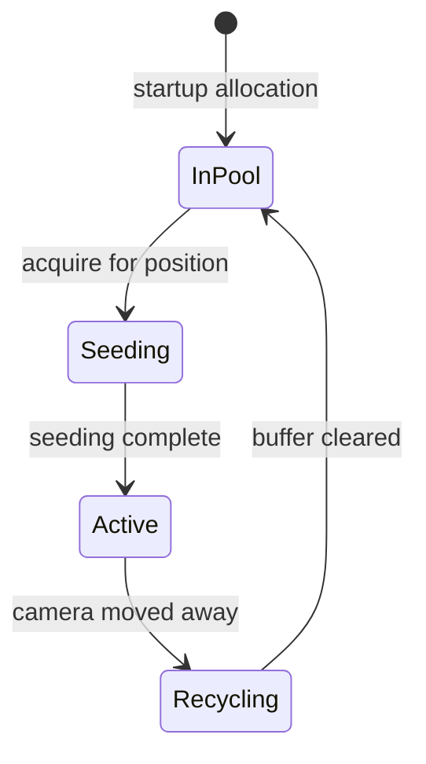

# POC Implementation Plan: Pixel Sandbox

A focused POC targeting an interactive infinite sandbox with cursor-based material painting, visual debugging, and procedural terrain.

## POC Goal

**Deliverable:** Infinite tiled sandbox game where the player:

- Navigates with WASD (no character, free camera)
- Paints materials with cursor (brush size control)
- Sees comprehensive debug overlays (chunk boundaries, dirty rects, tile phases)
- Explores procedurally generated terrain (FastNoise2: air/solid + caves + material layers)

**UI:** egui panel with material selector, brush size slider, debug toggles

See [methodology.md](methodology.md) for testing and API design principles.

---

## Implementation Phases

| Phase | Focus                      | Visible Result                    |
|-------|----------------------------|-----------------------------------|
| 0     | Foundational Primitives    | UV quad rendered at 60 TPS        |
| 1     | Core Data Structures       | -                                 |
| 2     | Chunk Management           | Chunks stream as camera moves     |
| 3     | Terrain Generation         | Layered procedural terrain        |
| 4     | Rendering                  | Visible world                     |
| 5     | Interaction                | Cursor painting works             |
| 6     | Simulation                 | Falling sand physics              |

---

## Phase 0: Foundational Primitives

The foundation is a **Surface** (blittable pixel buffer) and a **Chunk** (container for surfaces). Validated by rendering a UV-colored quad at 60 TPS.

### 0.1: Surface (Blittable Pixel Buffer)

A generic 2D buffer of elements that can be written to.

**Files:** `pixel_world/src/surface.rs`

```rust
pub struct Surface<T> {
    data: Box<[T]>,
    width: u32,
    height: u32,
}

#[repr(C)]
#[derive(Clone, Copy, Default)]
pub struct Rgba {
    pub r: u8,
    pub g: u8,
    pub b: u8,
    pub a: u8,
}

pub type RgbaSurface = Surface<Rgba>;
```

**API:** `new`, `get`, `set`, `width`, `height`, `as_bytes` (for GPU upload)

**Acceptance Criteria:**

- [ ] Index calculation: `y * width + x`
- [ ] Out-of-bounds returns `None`/`false` (no panic)
- [ ] `as_bytes()` returns contiguous slice for GPU upload

---

### 0.2: Blitter (Surface Drawing API)

Fragment-shader-style API for writing into surfaces.

**Files:** `pixel_world/src/blitter.rs`

```rust
pub struct Rect {
    pub x: u32,
    pub y: u32,
    pub width: u32,
    pub height: u32,
}

pub struct Blitter<'a, T> {
    surface: &'a mut Surface<T>,
}
```

**API:**

- `blit(rect, |x, y, u, v| -> T)` - iterate rect, call closure with absolute coords (x,y) and normalized coords (u,v 0.0-1.0)
- `fill(rect, value)` - solid fill
- `clear(value)` - clear entire surface

**Acceptance Criteria:**

- [ ] `blit()` provides correct (x, y, u, v) to closure
- [ ] Rect outside bounds is clamped (partial draw, no panic)

---

### 0.3: Chunk (Container)

A spatial unit containing surfaces.

**Files:** `pixel_world/src/chunk.rs`

```rust
pub struct Chunk {
    pub pixels: RgbaSurface,
}
```

---

### 0.4: Texture Upload & Display

Bevy integration for GPU rendering.

**Files:** `pixel_world/src/render.rs`

**API:**

- `create_texture(images, width, height)` - create RGBA8 texture with nearest-neighbor sampling
- `upload_surface(surface, image)` - copy surface bytes to texture

---

### 0.5: 60 TPS UV Quad Demo

**Files:** `pixel_world/examples/uv_quad.rs`

Bevy app that blits an animated UV-colored quad into a chunk at 60 TPS. The quad bounces around with a pulsing blue channel.

**Verification:** `cargo run -p pixel_world --example uv_quad`

- [ ] UV quad displays with correct gradient (red→right, green→down)
- [ ] Animation runs at stable 60 TPS
- [ ] Blue channel pulses over time

---

## Phase 1: Core Data Structures

### 1.1: Pixel Format

**Files:** `pixel_world/src/pixel.rs`

```rust
#[repr(C)]
pub struct Pixel {
    pub material: u8,
    pub color: u8,
    pub damage: u8,
    pub flags: PixelFlags,
}

bitflags! {
    pub struct PixelFlags: u8 {
        const DIRTY   = 0b00000001;
        const SOLID   = 0b00000010;
        const FALLING = 0b00000100;
        const BURNING = 0b00001000;
        const WET     = 0b00010000;
    }
}
```

- [ ] `size_of::<Pixel>() == 4`
- [ ] `Pixel::VOID` constant (all zeros)

---

### 1.2: Coordinate Types

**Files:** `pixel_world/src/coords.rs`

```rust
pub struct WorldPos(pub i64, pub i64);   // global pixel coordinates
pub struct ChunkPos(pub i32, pub i32);   // chunk grid coordinates
pub struct LocalPos(pub u16, pub u16);   // pixel within chunk
pub struct TilePos(pub u8, pub u8);      // tile within chunk
```

- [ ] `WorldPos::to_chunk_and_local()` handles negative coordinates correctly
- [ ] Roundtrip: `world -> (chunk, local) -> world` is identity

---

### 1.3: Configuration

**Files:** `pixel_world/src/config.rs`

```rust
pub struct PixelWorldConfig {
    pub chunk_size: u32,     // 512 default
    pub tile_size: u32,      // 16 default
    pub pool_size: u32,      // 81 default (9x9)
    pub window_chunks: u32,  // 9 default
    pub world_seed: u64,
}
```

- [ ] `validate()` checks constraints (power-of-2, pool >= window²)

---

### 1.4: Material Registry

**Files:** `pixel_world/src/material.rs`

```rust
pub struct Material {
    pub name: &'static str,
    pub state: MaterialState,
    pub color_range: (u8, u8),
    pub solid: bool,
}

pub enum MaterialState { Solid, Powder, Liquid, Gas }
```

POC materials: Void, Air, Soil, Rock, DenseRock, Bedrock, Sand, Water

---

## Phase 2: Chunk Management

### Chunk Lifecycle



### 2.1: Chunk Pool

**Files:** `pixel_world/src/chunk/pool.rs`

Pre-allocates `pool_size` buffers at startup. Provides `acquire()` and `release()` for buffer lifecycle.

---

### 2.2: Streaming Window

**Files:** `pixel_world/src/streaming.rs`

Tracks camera position and maintains `active_chunks: HashMap<ChunkPos, ChunkHandle>`. Calculates which chunks to load/unload based on camera movement. Hysteresis prevents thrashing at boundaries.

---

### 2.3: Chunk Lifecycle System

**Files:** `pixel_world/src/systems/lifecycle.rs`


Systems run in `FixedUpdate` in this order. Fires `ChunkLoadedEvent` / `ChunkUnloadedEvent`.

---

## Phase 3: Terrain Generation

### 3.1: Chunk Seeder Trait

**Files:** `pixel_world/src/chunk/seeder.rs`

```rust
pub trait ChunkSeeder: Send + Sync {
    fn seed(&self, pos: ChunkPos, buffer: &mut ChunkBuffer, config: &PixelWorldConfig);
}
```

---

### 3.2: FastNoise2 Terrain Seeder

**Files:** `pixel_world/src/terrain/noise_seeder.rs`

**Dependencies:** `fastnoise2` crate

**Terrain layers (Y increases upward):**

| Y Range | Material | Caves |
|---------|----------|-------|
| > surface | Air | - |
| surface to -50 | Soil | yes |
| -50 to -150 | Rock | yes |
| -150 to -300 | Dense Rock | sparse |
| < -300 | Bedrock | no |

**Algorithm:** Sample 2D height noise for surface, 3D noise for caves.

- [ ] Deterministic: same (seed, chunk_pos) = same terrain
- [ ] No visible seams at chunk boundaries

---

## Phase 4: Rendering

### 4.1: Chunk Textures

**Files:** `pixel_world/src/render/texture.rs`

Each active chunk has a `Handle<Image>`. Full chunk upload on any change (POC simplicity).

---

### 4.2: Chunk Sprites

**Files:** `pixel_world/src/render/sprite.rs`

Spawn sprite when chunk becomes Active, despawn when recycled. Position at `chunk_pos * chunk_size`.

---

### 4.3: Debug Overlays

**Files:** `pixel_world/src/render/debug_overlay.rs`

Toggleable overlays:
- Chunk boundaries (colored lines)
- Chunk info (position text)
- Dirty rects (simulation regions)
- Tile phases (A=red, B=green, C=blue, D=yellow)

---

## Phase 5: Interaction

### 5.1: Camera Controller

**Files:** `game/src/sandbox/camera.rs`

WASD movement, Shift for speed boost, scroll wheel zoom. Camera position drives streaming window.

---

### 5.2: Cursor World Position

**Files:** `game/src/sandbox/cursor.rs`

Convert screen cursor to world coordinates via camera transform. Update `CursorWorldPos` resource each frame.

---

### 5.3: Material Brush

**Files:** `game/src/sandbox/brush.rs`

Left click paints selected material, right click erases (Air). Circular brush with configurable size.

---

### 5.4: egui Sandbox UI

**Files:** `game/src/sandbox/ui.rs`

**Dependencies:** `bevy_egui`

Side panel with: material selector grid, brush size slider, debug overlay toggles, chunk stats.

---

## Phase 6: Simulation

### 6.1: Tile Phase Assignment

**Files:** `pixel_world/src/simulation/phase.rs`

Checkerboard pattern (A/B/C/D) ensures adjacent tiles are never same phase, enabling parallel processing.


---

### 6.2: Falling Sand CA

**Files:** `pixel_world/src/simulation/automata.rs`

Process tiles phase-by-phase (A, then B, then C, then D).

**Behaviors:**
- **Powder:** falls down, piles at angle of repose
- **Liquid:** falls down, flows sideways
- **Solid:** doesn't move

- [ ] Dirty flag optimization: skip non-dirty pixels
- [ ] Cross-chunk movement handled correctly

---

## Verification Strategy

After each phase:

1. Run examples - visual verification
2. `cargo run -p game` - integrated behavior works
3. Manual QA - interact with the system

**POC Complete When:**

- [ ] Camera moves smoothly with WASD
- [ ] Terrain generates with visible layers and caves
- [ ] Cursor painting places/removes materials
- [ ] Debug overlays show chunk boundaries
- [ ] Sand falls and piles realistically
- [ ] Water flows and pools

---

## Deferred to Post-POC

- Heat system and heat propagation
- Particle physics (emission, deposition)
- Material interactions (corrosion, ignition, transformation)
- Decay system
- Persistence/saving
- Advanced materials beyond basic 8
- Parallel simulation (rayon)
