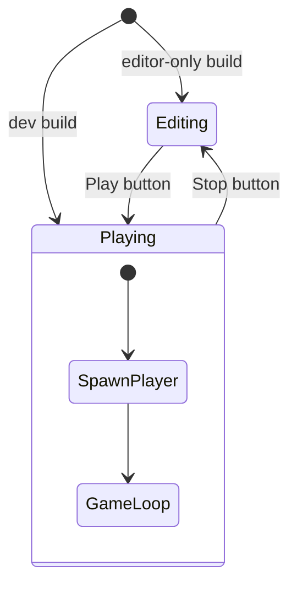

# bevy-yoleck Level Editor Integration

Integrate bevy-yoleck 0.29.0 (compatible with Bevy 0.17) to enable visual level editing. Replace procedural entity spawning with editable level files.

---

## Entity Types

### PlayerSpawnPoint

- Position-only marker (no runtime physics)
- Uses `Vpeol2dPosition` for drag-to-place editing
- Player spawns at this location when entering play mode

### Platform

- Editable properties: position, width, height, color
- Populate system spawns `Sprite` + `RigidBody::Fixed` + `Collider::cuboid`
- Edit UI: egui sliders for dimensions and color picker

---

## Mode Management



- **Editing**: Yoleck UI active, entities selectable/draggable, player not spawned
- **Playing**: Yoleck hidden, player spawned at spawn point, game systems active

### State Transitions

**Enter Playing**:
1. Query `PlayerSpawnPoint` position
2. Spawn Player entity at that position
3. Enable player movement/input systems

**Exit Playing**:
1. Despawn Player entity (and children)
2. Camera returns to editor controls

---

## Feature Structure

```toml
[features]
editor = ["dep:bevy-yoleck"]
dev = ["bevy/dynamic_linking", "visual_debug", "diagnostics", "editor"]
```

| Build | Editor Available | Default Mode |
|-------|------------------|--------------|
| `dev` (default) | Yes | Playing |
| `--features editor` | Yes | Editing |
| Release (no features) | No | Playing (load-only) |

---

## Module Structure

```
crates/game/src/
├── editor/
│   ├── mod.rs              # EditorPlugin, GameMode state
│   ├── entities/
│   │   ├── mod.rs          # Entity type registration
│   │   ├── spawn_point.rs  # PlayerSpawnPoint
│   │   └── platform.rs     # PlatformData + populate + edit
│   └── ui.rs               # Mode toggle buttons
├── player/
│   └── spawn.rs            # spawn_player_at_spawn_point
└── main.rs                 # Add EditorPlugin
```

---

## Level Files

- Location: `assets/levels/`
- Format: `.yol` (JSON, yoleck standard)
- Index: `assets/levels/index.yoli` (auto-managed)

---

## Editor UI Layout

```
┌─────────────────────────────────────────┐
│ [▶ Play] [■ Stop]           [Diagnostics]│
├─────────────────────────────────────────┤
│                                         │
│          Viewport                       │
│          (drag entities)                │
│                                         │
├─────────────────────────────────────────┤
│ Inspector                               │
│ - Position: x, y                        │
│ - Width: [slider]                       │
│ - Height: [slider]                      │
│ - Color: [picker]                       │
└─────────────────────────────────────────┘
```

---

## Files to Modify

| File | Changes |
|------|---------|
| `crates/game/Cargo.toml` | Add bevy-yoleck dependency, editor feature |
| `crates/game/src/main.rs` | Add EditorPlugin, remove platform spawn |
| `crates/game/src/player/spawn.rs` | Query spawn point instead of config |
| `crates/game/src/player/mod.rs` | Gate systems on Playing state |
| `crates/game/src/world/mod.rs` | Remove platform spawning |
| `crates/game/src/core/mod.rs` | Gate camera_follow on Playing |

## New Files

| File | Purpose |
|------|---------|
| `crates/game/src/editor/mod.rs` | EditorPlugin, state definitions |
| `crates/game/src/editor/entities/mod.rs` | Entity type registration |
| `crates/game/src/editor/entities/spawn_point.rs` | PlayerSpawnPoint |
| `crates/game/src/editor/entities/platform.rs` | Platform entity type |
| `crates/game/src/editor/ui.rs` | Mode toggle UI |
| `assets/levels/default.yol` | Initial level file |

---

## Verification

```bash
cargo run  # dev build
```

1. Starts in play mode, player spawns and moves
2. Press edit mode button → Player despawns, can drag platforms
3. Add new platform in editor → Save, restart, platform persists
4. Move spawn point → Enter play mode, player spawns at new location

```bash
cargo run --release --no-default-features
```

5. Loads level file, plays game (no editor UI)
