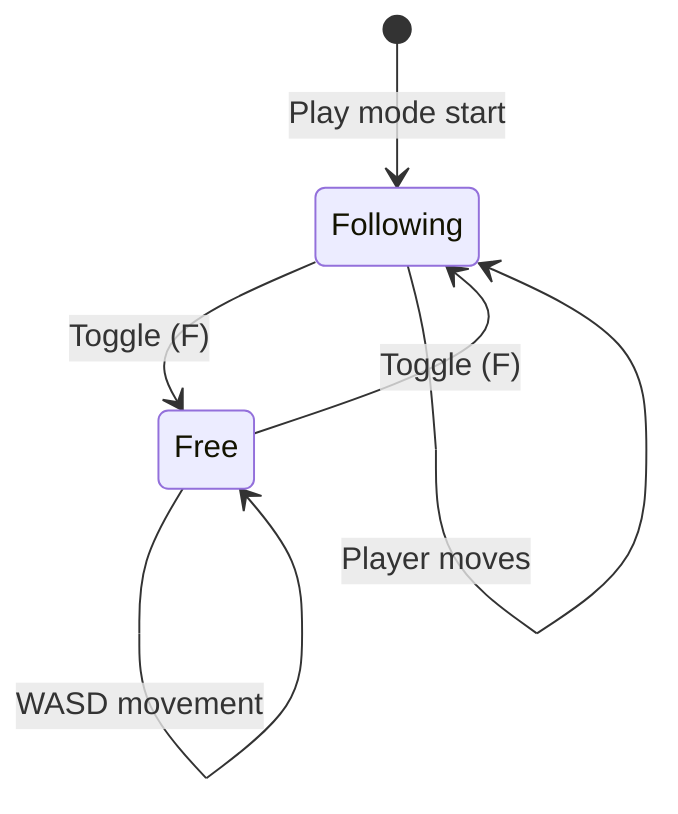

# Free Camera Toggle

Implement free-cam toggle for creative mode and debugging.

## Overview

Allow players to temporarily detach the camera from the player character to explore the world, then snap back to following.

## Tasks
- [ ] Add free-cam toggle keybind (F key or similar)
- [ ] Implement camera state transition (follow → free → follow)
- [ ] Preserve camera position when toggling to free mode
- [ ] Smooth transition when re-enabling follow mode
- [ ] Add visual indicator for current camera mode (debug UI)
- [ ] Prevent player movement input while in free-cam mode
- [ ] Add configurable free-cam speed (shift for boost)
- [ ] Save/restore camera zoom level across mode switches

## Controls

| Action | Input | Behavior |
|--------|-------|----------|
| Toggle free-cam | F key | Switch between follow and free modes |
| Free-cam move | WASD | Move camera in free mode |
| Free-cam boost | Shift | Speed up camera movement |
| Free-cam zoom | Scroll | Adjust zoom level |

## Camera States



## Technical Details

### State Management
```rust
enum CameraMode {
    Following { smoothness: f32 },
    Free { pos: Vec2, zoom: f32 },
}

#[derive(Resource)]
struct CameraState {
    mode: CameraMode,
    last_follow_pos: Vec2,  // For smooth re-entry
}
```

### Toggle System
```rust
fn toggle_free_cam(
    input: Res<ButtonInput<KeyCode>>,
    mut state: ResMut<CameraState>,
    mut camera: Query<&mut Transform, With<Camera>>,
) {
    if input.just_pressed(KeyCode::KeyF) {
        match &mut state.mode {
            CameraMode::Following { .. } => {
                // Save current camera pos and switch to free
                let pos = camera.single().translation.truncate();
                state.mode = CameraMode::Free { pos, zoom: 1.0 };
            }
            CameraMode::Free { pos, zoom } => {
                // Return to following
                state.last_follow_pos = *pos;
                state.mode = CameraMode::Following { smoothness: 0.1 };
            }
        }
    }
}
```

## References
- docs/implementation/plan.md (Phase 5.5)
- docs/todo/player-integration.md
- docs/todo/camera-follow-player.md
