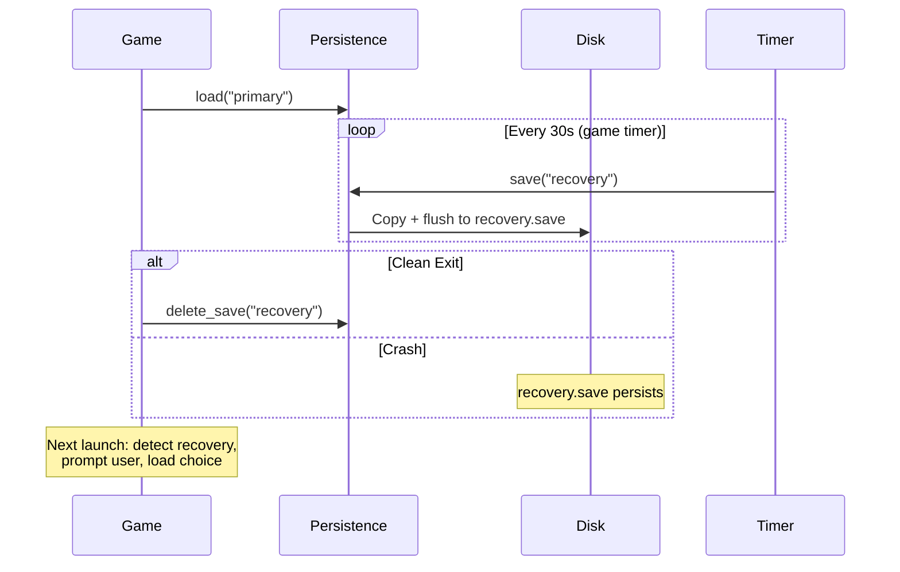

# Recovery Persistence System

Implement crash recovery with dual-save pattern and automatic recovery detection.

## Overview

Recovery persistence provides automatic backup saves that persist across crashes, enabling players to recover their progress if the game terminates unexpectedly.

## Completed

- [x] Basic autosave system (5-second interval via BasicPersistencePlugin)
- [x] Manual save hotkey (Ctrl+S)

## Tasks

- [ ] Implement dual-save pattern (write to recovery.save separate from primary)
- [ ] Add recovery save file management (write to `.recovery.save.tmp`, atomic rename)
- [ ] Implement clean exit detection (delete recovery file on normal shutdown)
- [ ] Add crash detection on startup (check for existing recovery file)
- [ ] Add recovery detection API (framework provides, game consumes)
- [ ] Implement recovery prompt UI (game responsibility)
- [ ] Handle recovery save corruption (fallback to primary)

## Current vs Target Behavior

**Current:** Autosave overwrites primary save every 5 seconds. Crash = lose up to 5 seconds.

**Target:** Autosave writes to recovery.save. Primary only updated on explicit save. Crash recovery prompts user to choose between recovery or primary.

## Recovery Pattern

## Implementation Notes

- Recovery saves use the same format as primary saves (complete snapshots)
- Use atomic rename pattern: write to `.recovery.save.tmp`, then rename to `recovery.save`
- Recovery file location: alongside primary save in saves directory
- UI for recovery selection is game responsibility (framework provides detection API)

## References

- docs/architecture/persistence/recovery-persistence.md
- docs/todo/named-saves.md
